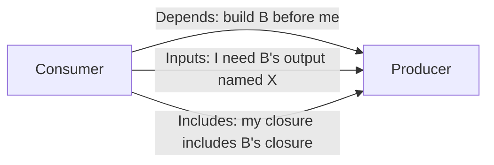
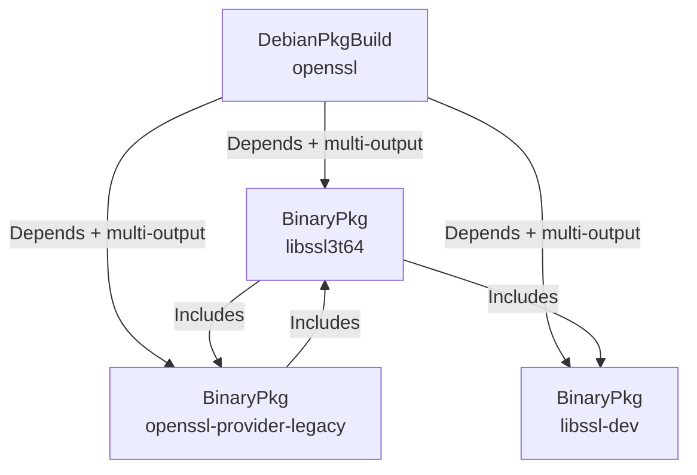

# The Artifact Model

Everything `gl-ng` builds is an *artifact*. The artifact is the system's only unit of work, the only unit of caching, and the only unit of dependency. The build engine has no idea what a Debian package is, what a rootfs is, or what `dpkg-buildpackage` does — it only knows how to walk a graph of artifacts.

## The interface, conceptually

An artifact answers five questions:

| Question | Answer |
|----------|--------|
| Who am I? | A `Key` (a stable string), used to identify the artifact within a graph |
| What is my content-derived identity? | A `Hash` derived from all my inputs |
| What must be built before me? | A list of *Depends* artifacts |
| Whose closure do I propagate? | A list of *Includes* artifacts |
| What outputs do I consume from my dependencies? | A list of *Inputs* — references into specific named outputs of dependency artifacts |
| What do I do? | A `Build()` method that produces a list of *Outputs* |

The exact Go interface lives at `internal/artifact/artifact.go:35-52`. From the outside, that's all there is. Concrete artifact types (`DebianPkgBuild`, `BinaryPkg`, `Rootfs`) implement the interface; the engine schedules them.

## Three different concepts of dependency

The single most subtle thing in `gl-ng`'s artifact model is that "depends" is split into three orthogonal concepts. Conflating them — as most build systems do — produces either over-building, under-building, or impossible cycles.

### `Depends` — build-order edges

`A.Depends(B)` means: "the engine must finish building B before it starts building A." This is the only edge that constrains scheduling. Cycles among `Depends` are forbidden and are rejected by the engine's cycle detector.

### `Inputs` — selected outputs

A single artifact can produce multiple outputs (a `glibc` source build emits `libc6.deb`, `libc6-dev.deb`, `libc-bin.deb`, …). `A.Inputs() = [{Source: B, Name: "libc6.deb"}]` says: "when you call `A.Build`, give it the blob hash of the output named `libc6.deb` from `B`." Inputs do *not* by themselves create build-order edges; they are consumed by `Build()` and presented in the `BuildContext`.

In practice, every `Inputs` reference is also reachable through some `Depends` edge — otherwise the engine couldn't know to build the source. But the relationship is one-way: `Depends` is the structural edge; `Inputs` is the selection within it.

### `Includes` — closure-only edges

`A.Includes(B)` means: "B is part of the runtime/install closure that A presents to its consumers, but A itself does not need B built before it." Cycles among `Includes` are *legal*. The engine's cycle detector ignores `Includes` edges entirely.

This sounds esoteric until you meet sibling Debian packages that runtime-depend on each other. `libssl3t64` and `openssl-provider-legacy` are co-produced by a single `dpkg-buildpackage` run on the `openssl` source. Each one's `Depends` field, as computed by `${shlibs:Depends}`, references the other. If both went into the artifact graph as `Depends`, the engine would (correctly) reject the cycle. What's actually true is:

- Both are built by the *same* parent source build (`openssl`), which *is* a `Depends`.
- Both contribute to the runtime install closure of any consumer.
- Neither needs to wait for the other to be "built", because they are co-produced atomically.

That's `Includes`.

### The consumer-side closure rule

`Includes` would not be very useful if it didn't propagate. The rule the engine actually applies is:

> If `A.Includes(B)` and some other artifact `C.Depends(A)`, then the engine adds an implicit ordering edge `C → B`.

So `Includes` does not order *the includer*, but it does order *consumers of the includer*. In the `openssl` example, a consumer of `libssl3t64` (say, `coreutils`) automatically waits for both `libssl3t64` and `openssl-provider-legacy` to finish building — even though neither of those waits for the other. The implementation of this rule lives in the engine's two-pass wiring; see [the artifact engine internals](../internals/build/artifact.md#consumer-side-closure-rule).

## Why this matters: the Debian binary package

A Debian source package emits *N* binary `.deb` files from a single `dpkg-buildpackage` run. Some of them are `-dev` headers, some are runtime libraries, some are documentation. In `gl-ng`:

- One `DebianPkgBuild` artifact represents the source build. It's expensive and runs once.
- Each named binary output is wrapped in a lightweight `BinaryPkg` artifact that *validates* (existence, installability, locality) but does not rebuild.

`libssl3t64` and `openssl-provider-legacy` `Include` each other (mutual runtime closure). Both `Depend` on the parent source build (the actual ordering constraint). `libssl-dev` is just another sibling.

This split achieves two distinct goals:

- **Compile once, validate per-binary**: the source build runs even if only one of its outputs is used downstream; validation runs only on outputs that have a downstream consumer.
- **Graph-driven elimination of unwanted binaries**: if no artifact ever references the `libssl-doc` binary, no `BinaryPkg` for it is ever created, and its (potentially broken) runtime dependencies are never checked. The graph is the spec of what matters.

## The Build() contract

When the engine calls `A.Build(ctx)`, it has already:

1. Walked `A.Depends()` recursively, built every reachable artifact (or hit cache for it).
2. Walked `A.Inputs()` and resolved each `Input{Source, Name}` to a concrete blob hash by consulting the source's stored manifest.
3. Packaged those resolved hashes into `ctx.Inputs` (a `map[string]objstore.Hash`).
4. Provided `ctx.Store` so `Build` can read blobs and store new ones.

`Build()` returns `[]Output`, where each `Output{Name, Hash}` is one logical result. The engine writes those out as a manifest blob (`<hash> <name>\n` per line) and records `map[A.Identity()] = manifestHash`. Future invocations short-circuit at that lookup.

## Identity propagation

Every artifact's identity is, fundamentally, "a hash of a tuple of strings". One element of that tuple is each direct dependency's identity. So if any leaf input changes, the change rolls up the graph: a new `glibc` source tree changes `glibc`'s identity, which changes `libc6`'s identity, which changes `coreutils`'s build identity (because `libc6` is one of `coreutils`'s `Depends`), which changes the rootfs identity.

This is what makes targeted rebuilds work without an explicit dependency-tracking database. The hash *is* the dependency ledger.

## Where to read more

- The full lifecycle from "graph constructed" to "all outputs in store": [End-to-End Pipeline](./pipeline.md).
- How identity is actually computed for each artifact type: [Identity, Inputs, and Caching](./identity.md).
- The engine's traversal algorithm and how it handles parallelism: [Depends, Includes, and the Graph](./graph.md).
- The Go implementation of the interface and engine: [`internal/artifact`](../internals/build/artifact.md).
