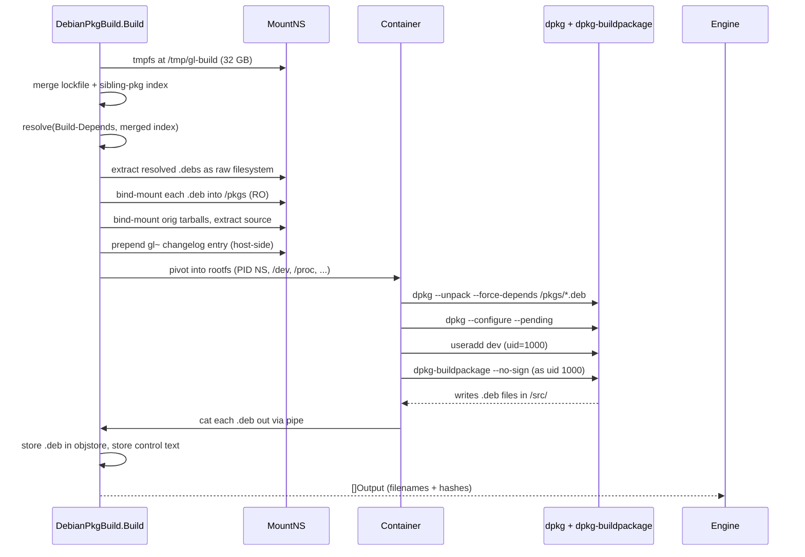
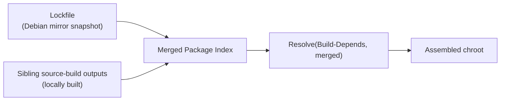
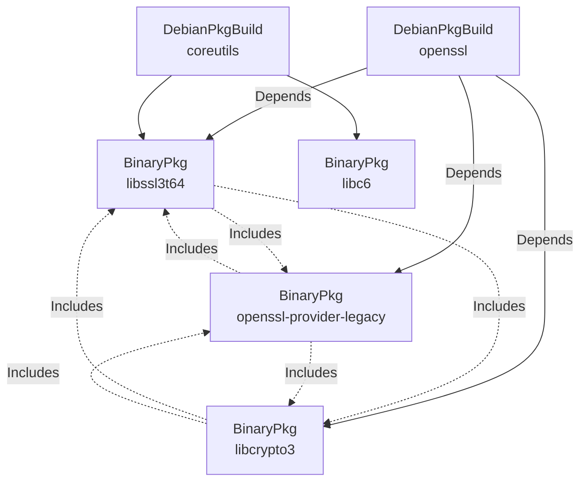

# Debian Source and Binary Artifacts

Debian packaging maps onto `gl-ng`'s artifact graph through two artifact types:

| Type | Implements | Role |
|------|-----------|------|
| `DebianPkgBuild` | The expensive part: `dpkg-buildpackage` for one source | Compile once, emit all binary `.deb`s |
| `BinaryPkg` | The cheap part: validate one named binary output | Check existence + installability + locality |

A single source package, e.g. `openssl`, produces *one* `DebianPkgBuild` artifact and *N* `BinaryPkg` artifacts (one per binary the source emits *and* that something downstream depends on).

## Why split

If a source produces 12 binaries but only 3 are used downstream, you do not want to:

- Rebuild the source for each consumer — it's the same compile, the same outputs.
- Be forced to satisfy the runtime dependencies of binaries nobody is going to use.

The second point is the one that quietly drives the entire design. Concrete example: the `glibc` source builds `libc-devtools` as one of its outputs. We never put `libc-devtools` in the rootfs, and nothing else in our package set references it. But `libc-devtools` runtime-depends on `libgd3` — a graphics library — which transitively pulls in an entire X11 / font-rendering stack. None of that is in our build universe, and we have no intention of building any of it from source.

If a source build had to produce a single fused artifact whose validation covered every emitted binary, glibc's manifest would be gated on us first building libgd3, and from there the X11 stack, recursively. The split makes the problem disappear: the glibc `DebianPkgBuild` runs and emits all 12 .debs into its manifest; only the binaries that something actually depends on (`libc6`, `libc6-dev`, `libc-bin`, …) get a `BinaryPkg` artifact instantiated, and only those get their runtime closure validated. `libc-devtools` is sitting in the manifest, untouched, with its broken-from-our-perspective `Depends:` on libgd3 doing nothing because no node in the graph ever asked for it.

The split makes each of those properties fall out cleanly:

- One source build, one cache entry, one set of `.deb` files in the manifest. Multiple consumers each select a different output.
- A `BinaryPkg` artifact is only created when something depends on it. Unreferenced binaries have no validation node — their `Depends:` field is never inspected, never resolved, never required to be locally satisfiable.
- Each `BinaryPkg` references the same parent source's manifest; no duplication.

## DebianPkgBuild

### Inputs to identity

The source build's identity rolls up:

- `dirhash(pkgs/<name>/)` — the on-disk source tree, including `src/`, `build.yml`, and (transitively, via the build-deps reference) the lockfile blob hash.
- `arch` — the target architecture string.
- The identity of every direct artifact dependency declared in `build.yml`'s `depends` field. (Their identities further roll up *their* dependencies, all the way down.)

If any one of those changes, the identity changes, and the build re-runs.

### Inputs to Build()

When the engine calls `Build()`, it has resolved:

- The set of `.deb` blob hashes from each dependency's manifest output.
- The blob hash of the lockfile's package index (from `pkgs/<name>/build-deps.yml`).

`Build()` itself orchestrates a multi-stage chroot construction inside a hermetic container.

### The build chroot

A `DebianPkgBuild` is the only artifact that materially uses the [build isolation runtime](./isolation.md). Its lifecycle:



A few details worth flagging:

- **Two-phase install.** `--unpack --force-depends` for everything, then `--configure --pending`. This handles the `Pre-Depends` cycles that exist in Debian's base set and matches the install pattern documented in `install/install.go` and `install/bootstrap.go`.
- **Separate build user.** `dpkg-buildpackage` famously breaks when run as root; `gl-ng` creates a `dev` user (uid 1000) inside the container and runs the build as that user. The user namespace makes this work even when the host build is unprivileged.
- **Blobs are bind-mounted, never copied.** A `.deb` from the objstore appears at `/pkgs/foo.deb` inside the chroot via `MS_BIND` against the blob path. This avoids duplicating hundreds of MB of `.debs` per build.
- **Outputs are `cat`-piped out.** The build is in a tmpfs that the host cannot reach without entering the namespace; the host pulls each output through a pipe into the host-side objstore.
- **The version `+gl~<hash>` suffix** is carried by a synthetic entry prepended to the top of `debian/changelog` *before* the build container is created — the prepend is done host-side, in the build's mount namespace, after the source tree has been copied into the rootfs. The existing changelog history is left untouched, including the previous top entry's version. The new entry is authored by `nobody <nobody@localhost>` and copies its trailer date from the existing top entry, so dpkg-buildpackage propagates the same `SOURCE_DATE_EPOCH` it would have used otherwise. The `<hash>` is the first 8 characters of the source tree's directory hash, so it changes if and only if the source changes. The `+gl~` prefix sorts above any unmodified Debian version of the same base, ensuring locally-built packages override mirror packages of the same name during installation. See [Concept: Package Versioning](#package-versioning) below.

### Merging local and mirrored package sets

The chroot is not assembled from the lockfile alone. At build time, the system *merges* two sources of `.deb`s:



The merge rule is "local overrides mirror": if `libc6` exists both in the lockfile and as a sibling source-build output, the locally built one wins. The merged index is then re-resolved against the package's `Build-Depends`, which can pull in *different* transitive packages now that local versions are available.

There is a subtlety here: when a build depends on, say, `pcre2:libpcre2-8-0` (a single binary), the merged index must include *all* of pcre2's outputs, not just the named one. Why? Because `libpcre2-dev` (a sibling) has an exact-version `Depends` on `libpcre2-8-0` — if only `libpcre2-8-0` is overridden locally, the lockfile's `libpcre2-dev` becomes unsatisfiable. So the merge step pulls every sibling from each unique source build's manifest. See the implementation in `internal/build/source.go` (`buildLocalIndexForBuild`) and the corresponding [internals page](../internals/build/build.md#building-the-merged-index).

### Outputs

A successful build produces:

- One `Output{Name, Hash}` per `.deb` file. `Name` is the **stable** form `<binary>.deb` (e.g. `libc6.deb`) — *not* the versioned filename. The full `libc6_2.40-7+gl~a3f7b2c1_amd64.deb` lives inside the .deb's control metadata; the artifact graph's input/output plumbing uses stable names so consumers can wire `Inputs()` without knowing the version.
- One `Output{Name, Hash}` per binary's `control` metadata, with `Name = "control:<binary>"`. This is the parsed `DEBIAN/control` text, stored as a separate blob so downstream `BinaryPkg` artifacts can read it without unpacking the `.deb`.

These get serialized into the manifest, the manifest is stored, and `map[id] = manifestHash` is set.

## BinaryPkg

A `BinaryPkg` is *not* a build, in the compilation sense. It does no compiling, does not invoke `dpkg-buildpackage`, and produces no fresh blob. Its `Build()` runs three checks:

1. **Existence**: the manifest of the parent source build must contain an output named `<binary>.deb`.
2. **Installability**: a synthetic chroot is assembled from the binary's locally-resolved deps + its `lockfile_deps`; `dpkg --install` (with the same two-phase pattern) must succeed against that chroot.
3. **Locality**: every runtime `Depends` and `Pre-Depends` of the binary must resolve to a package that is either in the binary's transitive local closure (other source-built artifacts) *or* explicitly listed in the binary's *own* `lockfile_deps` (allowlist for things we don't build, like `linux-libc-dev`, or for shlibs-introduced runtime libs like `libgcc-s1` that aren't wired into the explicit `depends:` graph). If a runtime dep would have to come from the mirror but isn't allowlisted on this specific binary, the artifact fails. `lockfile_deps` is **strictly per-binary**: a `lockfile_deps` entry on `libc6` does not cover a consumer whose closure includes `libc6`. Each binary stands on its own allowlist.

The locality check is what enforces the "from-source rootfs" property. By the time the rootfs artifact runs, every `BinaryPkg` it transitively depends on has passed this check, so the rootfs's runtime closure is fully local by construction.

### What about deps on packages we don't have sources for?

The locality check skips deps on packages that are not in the build universe at all. If `libc6-dev` declares `Depends: linux-libc-dev` but we never imported `linux-libc-dev` and have no source for it, the check ignores that edge — the binary is allowed to declare it, and the `lockfile_deps` allowlist ensures install validation can satisfy it. This avoids forcing us to import every long-tail leaf package while still preventing accidental dependence on mirror runtime libraries we *do* build sources for.

This is safe in practice because of *where* such allowlisted deps actually surface. `linux-libc-dev` is a dep of `libc6-dev`, and `libc6-dev` is a `-dev` package — it's only ever pulled into a build chroot to compile something against glibc's headers. The build chroot is ephemeral; it gets thrown away as soon as `dpkg-buildpackage` finishes, and nothing it contains makes it into any downstream artifact. The runtime rootfs only depends on `libc6` (the runtime library), not `libc6-dev`, so `linux-libc-dev` is never instantiated as a `BinaryPkg`, never validated, and never extracted into the final image. The same pattern holds for `rpcsvc-proto` and similar build-time-only entries: they live exclusively on the build-time side of the graph.

For runtime libraries that *are* in the rootfs (`libgcc-s1` is the canonical case — pulled in by shlibs from nearly every C/C++ binary), the allowlist works differently but the safety property is the same. The `lockfile_deps` entry only grants permission for the install-check resolver to satisfy the dep from the lockfile *if it's not already locally available*. The resolver explicitly skips lockfile-resolved packages whose name already exists in the binary's local index. So when the rootfs is finally assembled, `libgcc-s1` comes from the locally-built `gcc-N` source — never from the mirror — even though most consumer binaries name it under `lockfile_deps`. **No `lockfile_deps` entry ever causes a mirror-sourced package to land in the rootfs**: the rootfs's transitive closure only follows runtime `Depends:` edges of locally-built packages, and those have already passed the locality check end-to-end.

#### Why the allowlist is strictly per-binary

`lockfile_deps` does **not** cascade. A `lockfile_deps` entry on `libc6` only unlocks `libc6`'s own install-check; consumer binaries that pull `libc6` into their closure must declare their own `lockfile_deps` entry for any name they need from the lockfile. This is deliberate: each source's build-deps lockfile is independently SAT-resolved, and during a transition (e.g. gcc-15 → gcc-16) one source's lockfile may land on `gcc-15-base` while a sibling source lands on `gcc-16-base`. If `lockfile_deps` cascaded, a consumer's install-check would resolve `libgcc-s1` against *its own* lockfile and find a different `gcc-N-base` than the one its dependency was built against, producing spurious version-skew failures. Per-binary semantics keep each install-check pinned to the lockfile it was reasoned about with, so the resolver only has to satisfy what *that* binary declares.

### Inputs and outputs

`BinaryPkg.Inputs()` references its parent source build's outputs by name. `BinaryPkg.Build()` returns the same blob hash by name (no new content is produced) plus an output for the binary's `control` text. Storage is shared with the parent: no duplication.

## Package versioning

Every locally built Debian binary gets a synthetic version of the form:

```
<upstream>-<debian_revision>+gl~<8char_hash>
```

For example: `2.40-4+gl~a3f7b2c1`.

Properties:

- The `+gl` suffix sorts strictly *above* any unmodified Debian version of the same `<upstream>-<debian_revision>` (because `+` comes after `-` in Debian version ordering, and `~` sorts *before* the empty string, so `2.40-4+gl~xxx` is just barely greater than `2.40-4`).
- The 8-character hash is the first 8 hex characters of the source tree's directory hash. Same source → same hash → same version. No git metadata or wall-clock time involved.
- The synthetic changelog entry that carries this version is prepended at build time inside the chroot. No manual changelog edits.
- Upstream version constraints like `Depends: libc6 (>= 2.40-4)` remain satisfied because `2.40-4+gl~xxx` is greater than `2.40-4`.

## How they fit into the graph



Solid arrows are `Depends`; dotted arrows are `Includes`. Note how the sibling binaries form an `Includes`-cycle that the engine ignores for ordering — the actual ordering edge is each sibling → the parent source build.

## See also

- The CLI side: [`build.yml` reference](../guide/build-yml.md), [Building](../guide/build.md).
- The implementation: [`internal/build`](../internals/build/build.md).
- The locality check internals: [`BinaryPkg` validation](../internals/build/build.md#binarypkg-validation).
