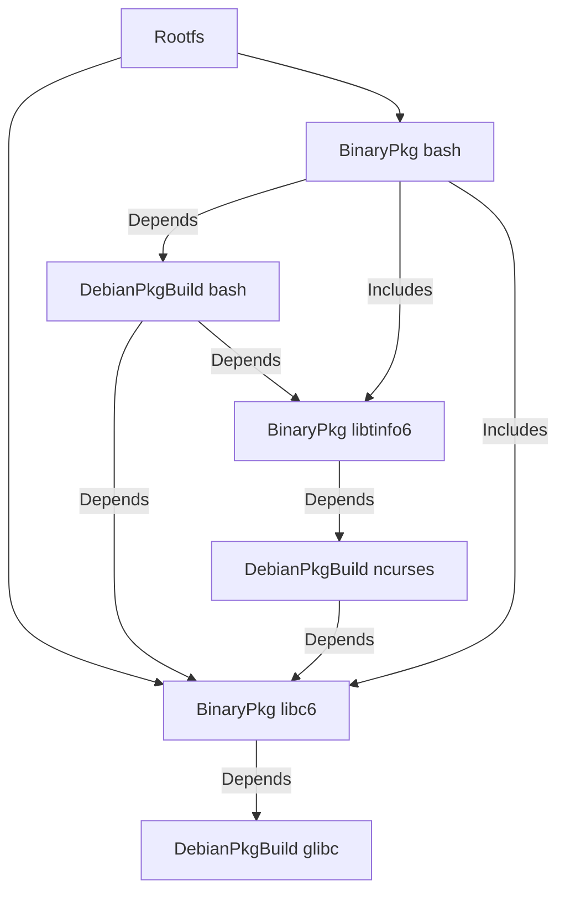
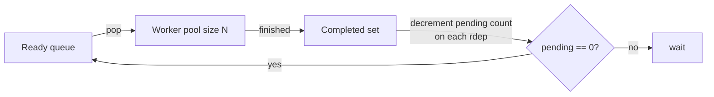

# Depends, Includes, and the Graph

The artifact graph is what `gl build` actually executes. This page explains how it is constructed, how it is traversed, and why the engine treats `Depends` and `Includes` differently.

## Construction

The graph is built from the top down, starting at a root artifact (typically the `Rootfs`):



The engine does this by repeated `Discover` passes. Starting from the roots, it queues each artifact, then enqueues its `Depends()` and `Includes()` neighbours, until no new artifacts appear. Every artifact is added to the graph exactly once, keyed by its `Key()`.

## The two-edge model in detail

A `Depends` edge has two effects:

1. **Build-order**: the engine cannot start building the consumer until the producer is complete.
2. **Closure propagation**: when the engine finalises edges, it walks each `Depends` target's `Includes` recursively and adds those to the consumer's pending set too.

An `Includes` edge has only one effect:

1. **Closure propagation when read by some other artifact's `Depends`**.

By itself, `Includes` does nothing. The engine's cycle detector explicitly ignores `Includes` edges. This is what allows the mutual-includes pattern in Debian sibling packages: `libssl3t64.Includes(legacy)` and `legacy.Includes(libssl3t64)` is a legal cycle that is invisible to scheduling because both are co-produced atomically by their parent source build (which *is* a `Depends`).

### Worked example

Suppose:

- `coreutils.Depends() = [libc6, libssl3t64, libpcre2-8-0]`
- `libssl3t64.Includes() = [openssl-provider-legacy]`
- `libpcre2-8-0.Includes() = [libpcre2-16-0]` (siblings co-produced from `pcre2`)

After the engine wires the graph, `coreutils`'s effective build-order pending set is:

```
libc6, libssl3t64, libpcre2-8-0,
openssl-provider-legacy,        // from libssl3t64.Includes
libpcre2-16-0                   // from libpcre2-8-0.Includes
```

`coreutils` waits for all five. Note that `libssl3t64` does *not* wait for `openssl-provider-legacy` — and vice versa — because `Includes` does not impose order on the includer. Both are sibling outputs of the `openssl` source build, which all of them `Depend` on; the parent source build is what actually orders them.

## Traversal

Once the graph is fully constructed, the engine performs a topological walk:



- A node is *ready* when its pending count is zero. All roots (artifacts with no incoming dependency edges) start ready.
- The engine pops ready nodes off a queue and dispatches them to a worker pool. Pool size is configurable; the default is `runtime.NumCPU()`.
- Each worker computes the artifact's identity, looks it up in the cache, and either short-circuits (cache hit) or runs `Build()`.
- When a worker finishes, every reverse-dependency has its pending count decremented; any that hit zero become ready.

Cycle detection runs once at construction time, on `Depends` edges only. If a cycle exists, the engine refuses to start.

## Identity does *not* feed into scheduling

A subtle point: identity hashing happens during traversal, not construction. The engine does not need identities to know the shape of the graph; it needs identities only to look up the cache and to compose downstream identities. This means an artifact's identity can depend on its dependencies' identities without circular-dependency problems — by the time the consumer's identity needs to be computed, the producer has already been resolved (built or cached) and its identity is known.

In code terms: `Identity()` is a method, called lazily, after `Depends()` are resolved.

## Cache hits and downstream propagation

A cache hit does not mean a node is "skipped"; it means its outputs are loaded from the manifest blob instead of being produced by `Build()`. From the engine's perspective, both paths produce the same `(identity, outputs)` pair. Downstream artifacts proceed normally and consume `Inputs` from the cached outputs.

This is why a partial cache hit is a cheap operation: the engine still walks the graph to discover what to load, but each loaded artifact is just a `map.Get` + `blobs.Open(manifest)` + `parse`. No `Build` runs.

## What happens when an artifact fails

If `Build()` returns an error, the engine:

1. Records the error against that artifact.
2. Stops dispatching new work that depended on it (the rdep pending counts never reach zero).
3. Continues to drain in-flight work for other branches.
4. Reports the error after all in-flight work completes.

There is no automatic retry, no partial commit. A failed artifact has no `map` entry; the next invocation will rebuild it from scratch.

## Closure rule, in pseudo-code

The engine's wiring step, in pseudocode, looks like:

```
for each artifact A in graph:
    for each B in A.Depends():
        addEdge(A → B)                       // ordering edge
        for each C reachable from B via Includes (transitively):
            addEdge(A → C)                   // closure edge
    // Includes edges from A itself are stored but not used for A's ordering;
    // they only matter when some other artifact has A as a Depends.
```

This is the rule referenced throughout the codebase as the "consumer-side closure rule". It is implemented in `internal/artifact/engine.go` (see [the engine internals page](../internals/build/artifact.md#consumer-side-closure-rule)).

## Visualizing graphs

`gl graph --conf-dir <dir> --output graph.md` writes a Mermaid graph of the artifacts that would be built. Include that in PRs that change `build.yml` files — it makes the propagation effect of a single edit visible at a glance.
