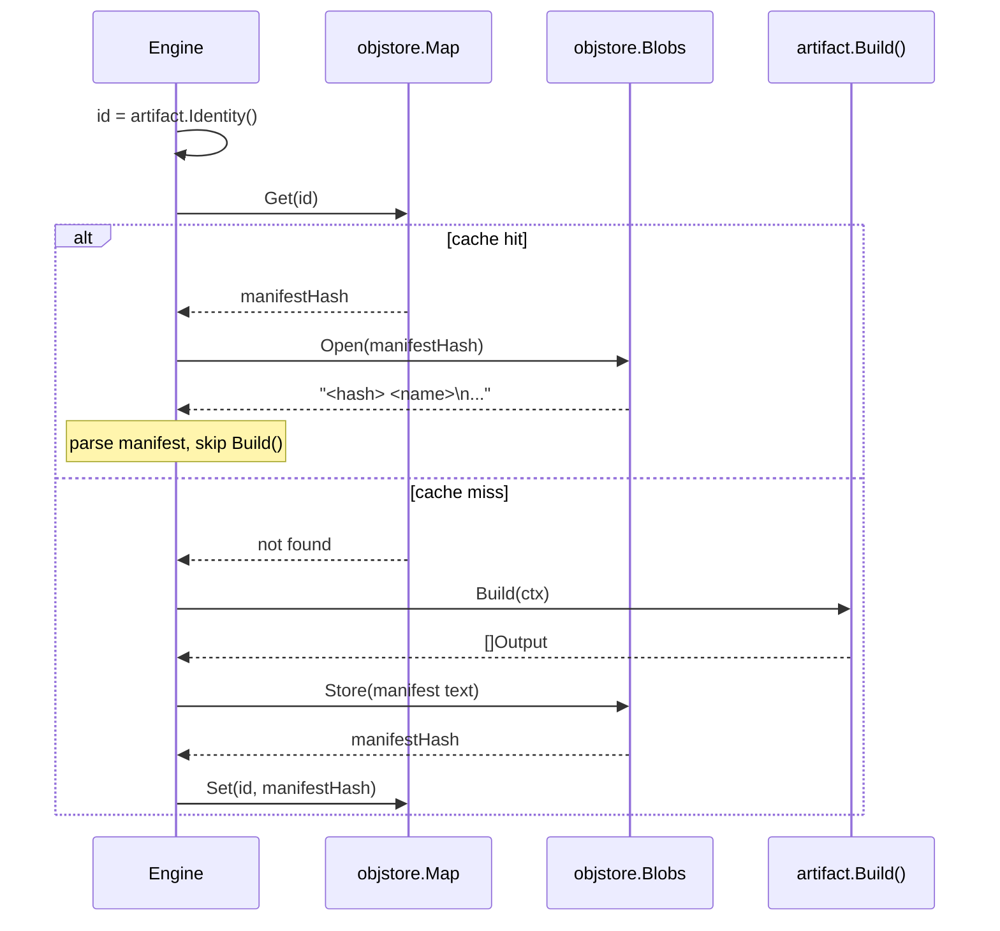

# Identity, Inputs, and Caching

An artifact's *identity hash* is the most important value in the system. It is the cache key. It is the proof that two builds are equivalent. If identity computation is wrong, caching is silently broken; if it is right, builds become deterministic by construction.

## What identity is

An identity is a 64-character lowercase hex SHA-256 digest. It is the hash of a *tuple of strings* that captures everything that should make this artifact different from any other.

The tuple is composed using a primitive called `ConcatHash`:

```
ConcatHash(s1, s2, ..., sN) = SHA256( SHA256(s1) ++ SHA256(s2) ++ ... ++ SHA256(sN) )
```

Each input string is independently hashed to 32 bytes; all 32-byte digests are concatenated; the concatenation is hashed again. This has two useful properties:

1. **Order matters.** `ConcatHash("a", "b") ≠ ConcatHash("b", "a")`.
2. **Length-extension safety.** Because each input is hashed to a fixed-size digest before concatenation, you cannot construct a collision by stuffing one input with what should be another.

The Go implementation is a few lines: see [`internal/objstore/concat_hash.go`](../internals/foundations/objstore.md#concathash). The same primitive is used at every level of the system.

## What goes into a typical identity

Different artifact types contribute different inputs, but the *shape* is always the same: a deterministic ordered list of strings. Concrete examples:

### Debian source build identity

```
ConcatHash(
    "debian-pkg-build",
    name,                      // "openssl"
    arch,                      // "amd64"
    dirhash(pkgDir),           // hash of the pkgs/<name>/ directory tree
    dep1.Identity(),           // identity of each Depends artifact, in order
    dep2.Identity(),
    ...
)
```

The directory hash is itself a deterministic SHA-256 of the on-disk content (see [`dirhash`](../internals/foundations/dirhash.md)). It changes if any file in the source tree changes — including `debian/changelog`, `debian/patches/`, `build.yml`, the lockfile reference. It does *not* change if file timestamps, ownership, or non-executable permission bits change.

### Binary package identity

A `BinaryPkg` is a validation gate over a named output of its parent source build. Its identity rolls up:

```
ConcatHash(
    "binary-pkg",
    sourceBuild.Identity(),
    binaryName,
    extraDep1.Identity(), ...    // optional cross-source runtime deps
)
```

If the parent source rebuilds (different identity), the binary's identity changes too — even though the binary's own logic hasn't changed. This is correct: a different source build *can* produce different bytes.

### Rootfs identity

```
ConcatHash(
    "rootfs",
    name,
    arch,
    rootfsLockfileBlobHash,
    transitiveDep1.Identity(), ...   // walked recursively over the runtime closure
)
```

The rootfs identity rolls up *every* transitive dependency, not just direct ones, because changing any binary in the runtime closure changes the rootfs.

## Why directory hashing has its own subsystem

Hashing a source tree sounds trivial — `tar c | sha256sum`, surely? — but tar's output depends on file order, file metadata, and tar quirks. `gl-ng` rolls its own algorithm with three guarantees:

1. **Lexicographic entry ordering**, not filesystem readdir order.
2. **No metadata leakage**: ownership and timestamps are ignored; only the executable bit on regular files matters.
3. **Symlink target hashing**: the symlink's target string is hashed, not the file it points to.

The serialization is type-tagged: each entry contributes `[type byte][SHA256 of name][SHA256 of content]` to the running directory hash. Type bytes: 0 = regular, 1 = executable regular, 2 = directory (content = recursive directory hash), 3 = symlink (content = SHA256 of target string), 4 = special (FIFO/socket/device — content = SHA256 of `mode.Type().String()`, the entry itself is not opened). See [`internal/dirhash`](../internals/foundations/dirhash.md) for the implementation, including the use of Go 1.24's `os.OpenRoot` to prevent symlink escape.

## How caching uses identity

The object store has two top-level directories:

- `blobs/` — content-addressed: `blobs/<2char>/<62char>` is a file whose content hashes to `<2char><62char>`.
- `map/` — keyed by *identity*: `map/<2char>/<62char>` is a tiny file containing the hash of a manifest blob.

A "cache hit" is just a file existence check on `map/`:



A cache hit is *exactly equivalent* to having performed the build. There is no "stale cache" failure mode. If the inputs changed, the identity changes, and the lookup misses. If the inputs didn't change, replaying the build would produce the same output.

## Manifests: how multiple outputs work

A single `Build()` returns `[]Output{Name, Hash}`. The engine serializes these as a small text manifest, using the **stable name** of each output (no version, no architecture):

```
0e8c...c34a libssl3t64.deb
9f12...77a3 libssl-dev.deb
4a55...91bb control:libssl3t64
4d77...3e0e control:libssl-dev
```

The manifest is itself stored as a blob (let's call its hash `M`). The map records `id → M`. To "look up output `X` of artifact `id`":

1. Get `M` from `map[id]`.
2. Open `M` in the blob store, parse the lines.
3. Return the hash whose line ends in `X`.

This indirection is what lets `Inputs` work. When `coreutils.Build` declares `Inputs() = [{Source: libssl3t64, Name: "libssl3t64.deb"}]`, the engine resolves that lookup before calling `coreutils.Build` and hands it the concrete blob hash. Lookups are exact — there's no fallback to versioned filenames, because there's nothing to fall back *to*: the manifest only records stable names.

## What is and isn't in the identity

| Included | Not included |
|----------|-------------|
| The hash of the source tree | File timestamps, ownership, group bits |
| The architecture string | Wall-clock time |
| Each direct dependency's identity | Hostname, build user, machine state |
| Lockfile blob hash (where applicable) | The contents of the build chroot, except indirectly via the lockfile and dep identities |
| Build profiles and options that flow into `dpkg-buildpackage` | Logs, intermediate scratch files, mtimes inside outputs |

That last bullet is important: once `dpkg-buildpackage` is launched inside the chroot, the chroot is a deterministic function of (lockfile, dep outputs, source tree). Anything inside it is reproducible only to the extent that the package itself is reproducible.

## Cross-cutting consequences

- **Sharing caches across machines is safe.** A `map` entry is meaningful only relative to the blob it points to; you can't "spoof" a cache hit because the identity is computed from inputs the verifier also has.
- **GC is simple.** Build the current checkout's artifact graph, collect the manifest blob and leaf blobs of every built node, then union that with every blob named by a pin (`pins/`, protecting local-only inputs like orig tarballs and lockfile `.deb`s). Mark everything else evictable — it is either a stale rebuildable output or a re-fetchable input. A blob is kept iff it is graph-reachable **or** pinned.
- **Targeted invalidation is just a delete.** `gl build --invalidate <key>` removes a single map entry; the next build recomputes that artifact. The blob it pointed to is untouched (it might still be reachable through another identity).

## Where to read more

- The blob/map/pins layout in detail: [The Object Store](./object-store.md).
- How `dirhash` produces a stable hash for a directory tree: [`internal/dirhash`](../internals/foundations/dirhash.md).
- The engine's resolve-then-build state machine: [`internal/artifact`](../internals/build/artifact.md).
