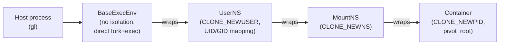

# Build Isolation Runtime

`gl-ng` runs every privileged or potentially-host-affecting operation inside Linux namespaces. There is no Docker, no Podman, no `systemd-nspawn`. Isolation is implemented in roughly 1,000 lines of Go (in `internal/container`, `internal/ipc`, and `cmd/exec_env_stub`), backed by the kernel's `clone(2)` flags and `pivot_root(2)`.

This page explains the isolation model conceptually. The exact wire protocol and Go API are in the [internals chapter](../internals/runtime/container.md).

## What "isolation" means here

Three orthogonal namespaces, applied in layers:

| Namespace | Effect | Why we need it |
|-----------|--------|----------------|
| `CLONE_NEWUSER` | Map host UIDs to subordinate UIDs inside the namespace; the calling user's UID 0 inside the namespace is some unprivileged UID outside | Lets us "run as root" inside a build chroot without actually being root on the host |
| `CLONE_NEWNS` | Mount namespace; mounts inside don't leak to the host | Lets us bind-mount, tmpfs-mount, and unmount freely without disturbing the host |
| `CLONE_NEWPID` | New PID namespace; the spawned process is PID 1 inside | Cleaner process tree; PID 1 is the build root, not init |

There is no `CLONE_NEWNET` (the build chroot can use the host's network — needed because lockfile fetches happen inside it). There is no cgroup namespace (out of Phase 1 scope; not strictly needed for correctness). There is no IPC, UTS, or time namespace — none of them buy correctness for `dpkg-buildpackage`.

## The ExecEnv abstraction

Every process the build system spawns goes through one interface:

```go
type ExecEnv interface {
    Exec(req *ExecRequest) (int, error)   // returns PID
    Wait(pid int) (int, error)             // returns exit code
    Close() error
}
```

The implementation is layered. Each layer is a thin wrapper around the layer below, adding one isolation property:



Each layer is a separate process — the *stub* binary, `exec_env_stub` — running in the appropriate combination of namespaces. The host-side Go code talks to each stub over a Unix `SOCK_SEQPACKET` socket, sending RPC requests like "exec this command", "mount this filesystem", "pivot_root into this directory".

When a build needs full container isolation (e.g. `DebianPkgBuild`), it stacks all the layers: `BaseExecEnv → UserNS → MountNS → Container`. The host then sends `Exec` requests through the entire chain; the request is forwarded down each layer's RPC channel until it lands in the innermost stub and is finally forked off as the actual build process.

## Why a stub binary?

Linux namespaces can only be entered at process creation time. To put a process in a new mount namespace, you must `clone(CLONE_NEWNS, ...)` it. If the orchestrator wants to do, say, *several* mounts in that namespace, the orchestrator either has to go in itself (dragging all of Go's runtime with it) or delegate to a child that's already there.

`exec_env_stub` is that child. It is a tiny Go program that:

1. Receives a Unix socket on FD 3 at startup.
2. Loops forever, reading RPC requests off the socket.
3. Dispatches each request to a handler: `mount`, `mkdir`, `pivot_root`, `umount`, `exec`, `wait`, …

Because the stub is *already in* the right namespaces, every operation it performs takes effect there. The host process never has to enter the namespace to do work in it.

The IPC wire format is [`SOCK_SEQPACKET`](../internals/runtime/ipc.md) for message-boundary preservation, with FD passing via `SCM_RIGHTS` so the host can hand the stub stdin/stdout/stderr file descriptors for each spawned process.

## User namespaces, in particular

User namespaces are the foundation of unprivileged isolation. The setup is:

1. The host process clones a child with `CLONE_NEWUSER`.
2. Before the child runs anything privileged-looking, the host writes UID/GID maps into `/proc/<pid>/uid_map` and `/proc/<pid>/gid_map`. These maps describe how UIDs inside the namespace correspond to UIDs outside.
3. To map a *range* of subordinate UIDs (the kind that lets you actually be UID 0 inside without being UID 0 outside), the writes have to come from a setuid helper: `/usr/bin/newuidmap` and `/usr/bin/newgidmap`. These read `/etc/subuid` and `/etc/subgid` to know what range you're entitled to.

`gl-ng` reads `/etc/subuid`/`/etc/subgid` itself (via `getsubids`), computes a mapping that includes:

- `0 → <calling user's real UID>` (so root inside maps to your UID outside, which is necessary for `pivot_root` and a few other operations)
- `1..<count> → <subordinate range start>..<...>`

…then invokes `newuidmap` to apply it. After that, any process running inside the namespace that thinks it's UID 0 can do everything UID 0 can do *with respect to the namespace's resources* — including create users, mount filesystems, and run `dpkg`.

## Mount namespaces

A `MountNS` is essentially a sandbox for `mount(8)` and `umount(8)`. Inside the namespace:

- `tmpfs` mounts can be made anywhere.
- Bind mounts (`MS_BIND`) attach a host path or another in-namespace path to a target.
- Mount propagation can be tuned (`MS_PRIVATE`, `MS_SLAVE`, etc.) to control whether mounts leak in or out.

`gl-ng` uses MountNS to give each build a private 32 GB tmpfs at `/tmp/gl-build` (or `/tmp/gl-rootfs`), into which `.deb` blobs from the object store are bind-mounted at fixed paths like `/pkgs/foo.deb`. This is far cheaper than copying the `.deb`s — they can be 100s of MB each.

## The Container layer: pivot_root

A `Container` adds:

- `CLONE_NEWPID` so the spawned process is PID 1 (cleaner; `dpkg`'s assumption of being launched by init is satisfied).
- A `pivot_root(2)` into a freshly assembled root filesystem, so the process's view of `/` is the build chroot.
- `/proc`, `/sys`, `/dev` mounts, plus device nodes (`null`, `zero`, `urandom`, …) and the `/dev/pts` tree.

`pivot_root` is more rigorous than `chroot`: it actually swaps the rootfs out of the process's mount table. The previous root is unmounted with `MNT_DETACH` so any host paths the process *might* have had open are eventually released.

## What does *not* go through ExecEnv

In Phase 1, [stream processing primitives](../internals/foundations/stream.md) (decompression, GPG verification, `tar` extraction) spawn subprocesses directly via `os/exec`. This is documented technical debt: those operations don't need isolation (they don't touch privileged operations or modify the chroot), and routing them through ExecEnv would add complexity without correctness gain.

The hard rule is: anything that changes filesystem state, runs maintainer scripts, or executes arbitrary user-package-defined code must go through ExecEnv. Stream processing is data-in-data-out and stays direct.

## The `--no-userns` escape hatch

In environments that already provide isolation (CI containers running with elevated capabilities, dedicated build VMs), the user namespace overhead is wasted: you can just stay as root and skip the userns layer. Phase 1 reserves the env var `GL_NO_USERNS` (and a `--no-userns` flag) for this, but it is not yet implemented end-to-end; see `AUDIT_REPORT.md` for the open item.

## See also

- The exact RPC protocol: [`internal/ipc`](../internals/runtime/ipc.md).
- The container Go implementation: [`internal/container`](../internals/runtime/container.md).
- The stub binary: [`cmd/exec_env_stub`](../internals/runtime/stub.md).
- How `Rootfs` and `DebianPkgBuild` use these layers in practice: [`internal/build`](../internals/build/build.md).
