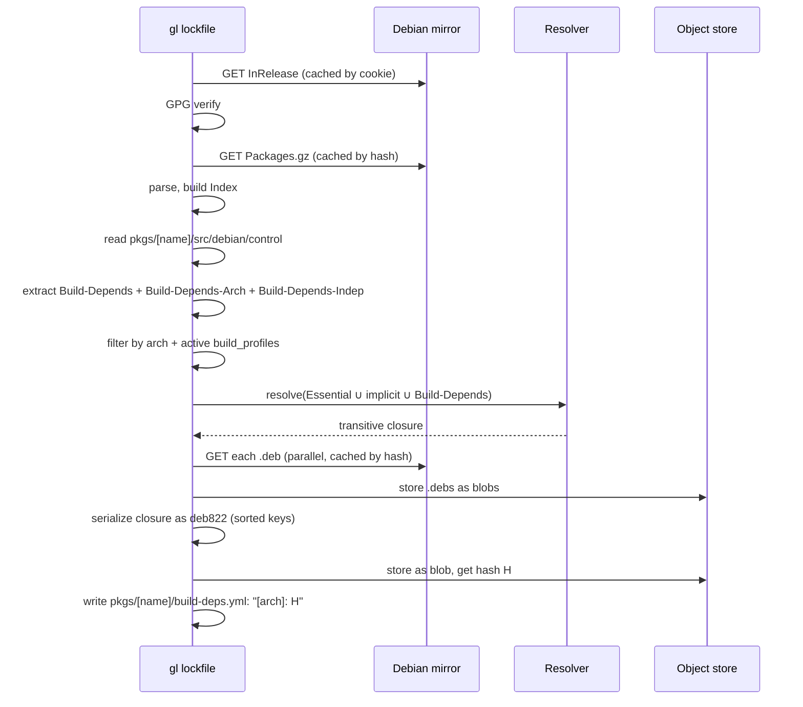

# Lockfiles and Build-Time Tooling

Two distinct populations of `.deb` files exist in `gl-ng`:

| Population | Source | Used by | Survives in image? |
|------------|--------|---------|-------------------|
| Build-time tooling | Debian mirror | The build chroot for a single `dpkg-buildpackage` | No |
| Output binaries | This system's own builds | Downstream artifacts, ultimately the rootfs | Yes |

The build-time tooling — `gcc`, `debhelper`, every library-`-dev` package the source needs, plus their transitive dependencies — must be pinned exactly. Otherwise a re-run on a different day, against a moved Debian testing snapshot, would produce a different chroot and likely a different output. The mechanism that pins them is the *lockfile*.

## What a lockfile is

For a single source package, the lockfile is the complete set of binary `.deb`s that should be installed in the build chroot, frozen at the version they were when the lockfile was generated. It is stored as a deb822-format `Packages` index — exactly the format Debian's mirrors serve under `dists/<dist>/main/binary-<arch>/Packages.gz`.

The index is written into the object store as a single blob. The file actually committed to the source tree is tiny:

```yaml
# pkgs/openssl/build-deps.yml
amd64: 9209690faf8b2b09cb02be917387a121be291af320548a1600b5105bc646be53
arm64: fb81856a93eb6572d2c9e43c06a52c7cc17f47506dee98059ab90c8240444abb
```

Each value is the SHA-256 hash of the deb822 index blob for that architecture. The actual content lives in `<store>/blobs/<hash>`.

This separation matters because:

- The index blob can be tens of thousands of lines (a full Debian build environment is large). Putting it in Git would inflate the repo unhelpfully.
- The blob is content-addressed, which means it is its own integrity check.
- Multiple packages with similar build dependencies *might* share the same blob, but in practice each package's lockfile is its own minimal slice.

When a build runs, the engine fetches `<store>/blobs/<hash>` for the right architecture, parses it as a deb822 `Packages` file, and uses it as one input to the build chroot.

## How a lockfile is generated



A few things this diagram glosses over:

- **Active build profiles** matter for filtering. A package's `Build-Depends` may include atoms like `libfoo-dev <!nobiarch>` (only when `nobiarch` is *not* active). The lockfile generator reads `build_profiles:` from `build.yml` to know what's active, then filters dependency atoms accordingly. The same filter must run identically at build time, so the lockfile and the build are consistent.
- **Architecture restrictions** matter too. `hurd-dev [hurd-any]` is dropped on `amd64`. Architecture wildcards (`linux-any`, `any-cpu`) are honoured.
- **Implicit dependencies** are added unconditionally: `build-essential`, `fakeroot`, `debconf`. These are the assumed-present base of any `dpkg-buildpackage`.
- **`.deb` blobs are fetched at lockfile time, not build time.** This was a deliberate change from earlier designs. Per [the architecture blueprint Section 3.4](https://github.com/gardenlinux): "no dependency fetching occurs at build time." Once the lockfile is generated, every `.deb` it references is already in the object store.

## Determinism

A lockfile is the output of a function: `(source's debian/control, active build profiles, current Debian mirror state) → lockfile blob`. For caching to work, the function must be deterministic.

There are two non-trivial sources of nondeterminism the implementation handles:

1. **Resolver ranking.** When a virtual package can be satisfied by multiple providers, the resolver must pick deterministically. The implementation sorts candidates by a stable rule (already-selected first, then direct name match, then alphabetical). See [`internal/resolver`](../internals/debian/resolver.md).
2. **deb822 stanza emission.** Go map iteration order is randomized, so naïvely emitting stanzas would produce a different blob on each run. The lockfile generator sorts each stanza's keys before writing (see the entry in `CLAUDE.md` decision log: *"Non-deterministic lockfile generation was a caching bug"*).

If you re-run `gl lockfile` against the same Debian mirror state, you should get the same blob hash. If the mirror has moved on (testing is a rolling release), the result is whatever the mirror currently serves.

## The cookie-based fetch cache

`gl lockfile` and `gl import` both fetch `InRelease`, `Sources.gz`, and `Packages.gz` from the same Debian distribution. Within a single session — say, importing 20 packages — those large files should not be downloaded 20 times.

The mechanism is a *cookie*: an opaque string the user supplies (`--cookie <uuid>`). Internally, the cookie participates in the cache key:

```
identity = ConcatHash("inrelease-cookie", cookie, repoURL, dist)
```

The first fetch of a session populates `map[identity]`; subsequent fetches with the same cookie hit the cache. `prepare_staging.sh` generates a cookie via `uuidgen` at the top and threads it through every `gl import` and `gl lockfile` invocation.

Without `--cookie`, every fetch goes to the network — which is sometimes what you want (e.g. picking up an upstream update).

## The rootfs lockfile

Phase 1 also has a rootfs-scope lockfile, generated via `gl lockfile-rootfs`. It captures the *Debian tooling* used during rootfs configuration — `dpkg`, `perl`, `mawk`, etc. These are *not* part of the final rootfs (they live in the throwaway Layer 1; see [Rootfs Assembly](./rootfs.md)). They exist purely to run maintainer scripts during rootfs assembly.

The rootfs lockfile lives at `<conf-dir>/rootfs-deps.yml` with the same `<arch>: <blob-hash>` shape. Its content is intentionally minimal: essential packages, plus `perl-base`, plus `mawk`. APT is excluded — rootfs assembly is dpkg-only.

## What is *not* in a lockfile

- Output `.debs` from previous source builds. Those come from the artifact graph at build time.
- Anything from outside the Debian mirror. Non-Debian sources (kernel, Go-vendored binaries) flow through the artifact graph directly.
- Build configuration (`build_profiles`, `build_options`, `extra_build_env`) — that lives in `build.yml`.

The lockfile is a pure capture of "what came from the mirror".

## When a lockfile won't resolve

Most often a lockfile regenerates without drama: Debian testing has the packages our `Build-Depends` needs, the resolver finds a satisfying set, the new blob lands in the store. Sometimes it doesn't. The interesting case is when an artifact dependency we ourselves built has drifted out of step with the tooling lockfile — most commonly when a build tool's runtime dependency on a newer `libc` forces a higher floor than the artifact graph targets.

There is no automatic fix. The recommended courses of action, ranked from most to least preferred:

1. **Bump the local source dependency.** Update the artifact dependency to a newer version whose outputs are compatible with the lockfile's tooling set. This resolves the conflict within the normal model and is the right answer in most cases.

2. **Defer the dependency to binary validation only.** Remove the artifact dependency from the source build stage so it does not enter the chroot, and rely on the binary package's installability check to catch problems. This works when the source build does not actually link against newer symbols — the produced binary remains compatible with the older library at runtime even though a newer version was used at build time. Whether this works is highly per-package.

3. **Replace the lockfile with an older snapshot.** Manually generate a lockfile from a Debian snapshot timestamp where the required tooling existed with compatible library versions, when such a point in time exists and the older tooling still supports the package's build requirements. If the `Build-Depends` set did not actually change between upstream versions, the previous lockfile can usually be reused as-is.

4. **Per-case build environment workaround.** Inject `LD_LIBRARY_PATH` or modify `RPATH` to allow two library versions to coexist in the chroot. This is a last resort. Before pursuing it, reconsider whether the local source dependency can be bumped — accepting the newer dependency is almost always preferable to maintaining environment hacks that age badly.

The order matters. Reaching for option 4 when option 1 was available accumulates fragile state that is expensive to clean up later.

## Lifecycle

A lockfile changes when:

- The package's `Build-Depends` changes (because we imported a new upstream version that needs different tooling).
- The active `build_profiles` change.
- The Debian mirror state changes and someone re-runs `gl lockfile`.

The first two are intentional, recorded in Git via a new `build-deps.yml`. The third is opportunistic — Phase 1's automation deliberately does not auto-refresh lockfiles on every mirror tick, because that would generate noise.

## See also

- CLI usage: [Generating Lockfiles](../guide/lockfile.md).
- The resolver internals: [`internal/resolver`](../internals/debian/resolver.md).
- The lockfile generator implementation: [`internal/lockfile`](../internals/build/lockfile.md).
- Phase 2 source management: [Source Management](./sources.md).
