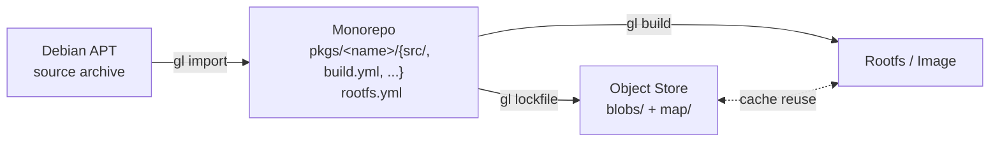

# What gl-ng Is

`gl-ng` is a build system that turns version-controlled Debian source packages into immutable, reproducible Linux system images. It is the next-generation rewrite of the GardenLinux build pipeline, written in Go, with no dependency on Docker, Podman, or any third-party container runtime.

Three properties define it:

1. **From-source**: every binary that lands in a final image was compiled from a Debian source package by this build system. The output rootfs contains zero mirrored binaries.
2. **Reproducible**: identical inputs produce bit-identical outputs, regardless of when or where the build runs. A second build of the same configuration is a cache lookup, not a rebuild.
3. **Hermetic**: builds run inside Linux user/mount/PID namespaces with only their declared inputs visible. The host system is shielded from the build, and the build is shielded from the host.

These three properties are not aspirations — they are enforced by the architecture. The chapters that follow explain *how*.

## Where gl-ng sits

- **Upstream**: the Debian APT source archive. `gl-ng` does not pull from Salsa, Git, or anywhere else — only the APT archive is the source of truth for Debian packages.
- **The monorepo** (also called the *conf-dir* in CLI parlance, or the *staging repo* when versioned in Git): one directory per source package, plus a top-level `rootfs.yml` describing what to assemble.
- **The object store**: a content-addressed file tree under `~/.cache/gl-ng/` (by default) holding every blob the system ever produced or fetched, indexed by hash.
- **`gl`**: a single Go binary that does everything — `gl import`, `gl lockfile`, `gl build`, `gl exec-chroot`, …

## The mental model in one sentence

> `gl build` walks a graph of *artifacts*; each artifact has an *identity hash* derived from its inputs; the engine looks the identity up in the object store, builds it inside a hermetic container if missing, and stores its outputs back under that identity.

Every other chapter is unpacking some part of that sentence: what an artifact is, how identities are computed, how the object store is laid out, what "build inside a hermetic container" means, and how a graph of these things assembles into a rootfs.

## Audiences for the rest of this part

The Concepts chapter is written to be read in order. If you are:

- **Evaluating** the project: read at least [Vision](./vision.md), [The Artifact Model](./artifacts.md), and [End-to-End Pipeline](./pipeline.md).
- **About to use** the system: skim everything here, then jump to the [User Guide](../guide/getting-started.md).
- **About to contribute** to the codebase: read everything here, then go to [Internals](../internals/overview.md).
