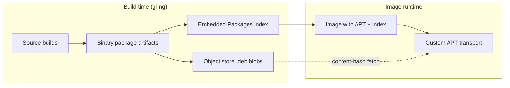

# The Derived Package Index

> **Planned — does not yet describe current behavior.** This page describes a Phase 2 / Phase 3 vision of the system. Phase 1 does not generate a derived package index, does not embed APT into images, and does not serve `.deb` blobs from the object store at image runtime. It is included in this book so the conceptual model is visible to readers planning around the future shape; the [Rootfs Assembly](./rootfs.md) and [Object Store](./object-store.md) pages describe what actually ships today.

Most images that gl-ng produces are immutable — built once and run as a sealed artifact, with no package manager included at runtime. For that majority case nothing on this page applies. Some images are different: container base images intended to be `apt-get install`-able by downstream users, or developer images that need to evolve after deployment. This page is about what the build system produces *for those images*.

## Why an embedded index, not a remote one

A traditional Debian system at runtime runs `apt-get update` to fetch a `Packages` index from a mirror, then `apt-get install` consults that index to plan installs. The index changes over time as the mirror updates; an image built today and an image built tomorrow can resolve the same `apt-get install` differently.

For images that aim to be reproducible end-to-end — including any downstream package installations — that drift is a problem. gl-ng's solution: bake the `Packages` index into the image at build time, exactly capturing the set of packages available for that image version. No `apt-get update` runs at runtime; the index is already there, immutable, identical across every instance of that image.

The index baked into the image lists every binary package that was validated for that build, with each entry's `SHA256` field pointing at a content-addressed blob. There is no separate mirror to maintain.

## How runtime installs work

When a user runs `apt-get install foo` on an image built this way:

1. APT reads the locally-embedded `Packages` index. No network request, no `apt-get update`.
2. The dependency solver runs entirely against this local index — exactly the same package universe that was visible at build time.
3. For each `.deb` to install, APT invokes a custom transport method shipped with the image. That transport fetches the blob from the gl-ng object store by its content hash.

The object store is the same one that serves the build pipeline. There is no second copy of the data. The hash in the embedded index is the hash that addresses the blob in the store.

This eliminates the conventional APT mirror infrastructure (`pool/` layout, `dists/`, separate signing of the `Release` file) entirely. The signing story collapses into the image-signing story: if you trust the image, you trust the index it carries; the blobs it points at are already content-addressed.

## What the index actually is

A standard deb822 `Packages` file. The same format that `apt-get update` would have downloaded, generated from the control metadata of the binary package artifacts validated for this image. The only thing that distinguishes it from a Debian mirror's index is that the `SHA256` field is the canonical addressing key (rather than a verification check on a path-addressed blob), and the URL scheme is whatever the embedded transport understands rather than `http://`.

## Scope of the index

Each derived index is scoped to a specific gl-ng repository state — the set of packages built and validated against a given snapshot of the source tree, lockfiles, and `build.yml` files. Two images built from the same repository state carry the same index; an image rebuilt after a repository change carries a different one. Drift between the index and what is in the store is structurally impossible: the index is generated *from* the validated artifact set.

## Relationship to the rest of the system

The derived index is downstream of everything else in this chapter. It is not part of the artifact graph — it is a packaging step that runs after the rootfs is finalized, consuming what the artifact graph produced. The same content-addressed object store described in [The Object Store](./object-store.md) does double duty: feeding the build pipeline at build time, and feeding runtime APT for the small set of images that opt into a package manager.
