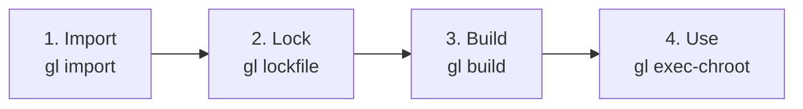
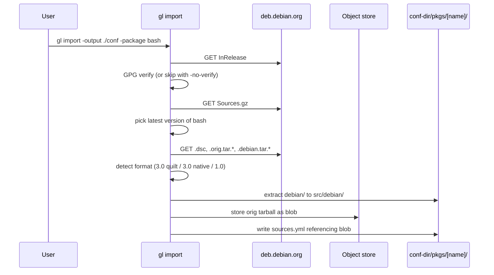
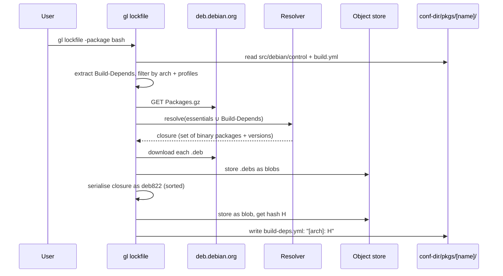
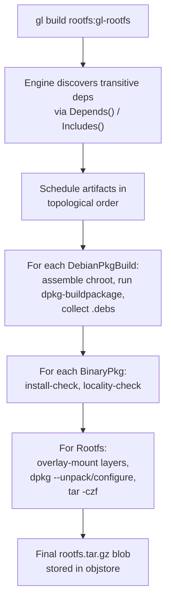
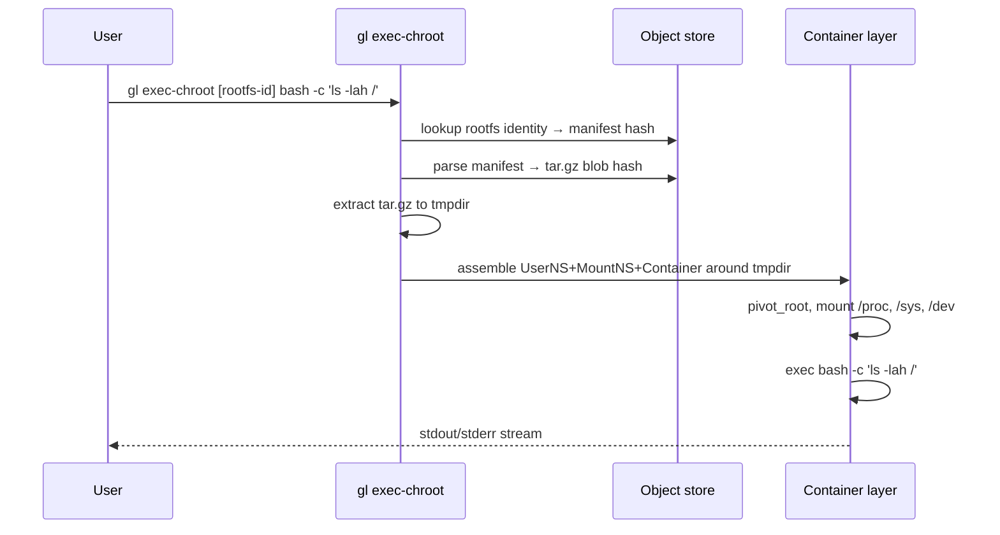
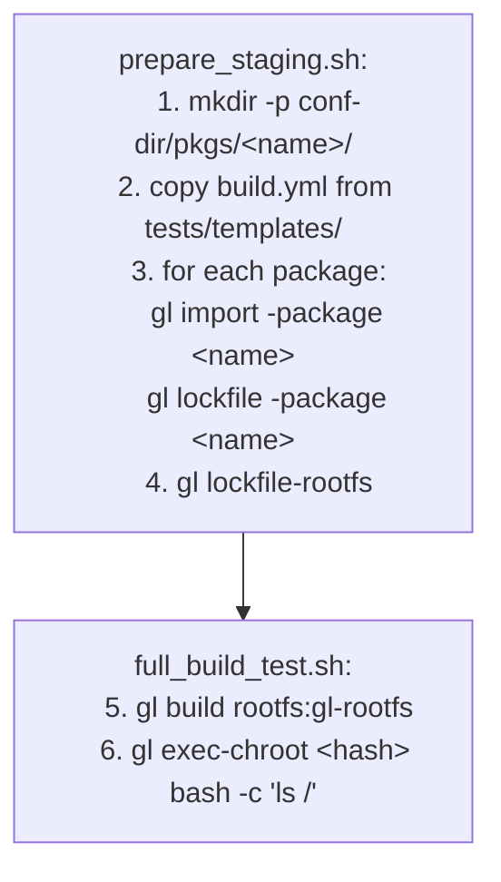

# End-to-End Pipeline

This page ties the previous concept pages together by walking the full pipeline that produces a usable rootfs from nothing.

## The four phases



Each phase is independently invokable. Each writes its outputs into the conf-dir or the object store; the next phase reads from there. There is no implicit shared state between phases except the on-disk artifacts.

## Phase 1: Import

Goal: get the sources for one Debian package into the conf-dir.



What's on disk after import:

```
conf-dir/pkgs/bash/
├── sources.yml          # references orig tarball blob
└── src/
    └── debian/          # control, rules, patches, changelog, ...
```

Plus, in the object store: one or more `orig.tar.*` blobs.

## Phase 2: Lock

Goal: pin the *build-time* dependencies for one package.



What's on disk after lock:

```
conf-dir/pkgs/bash/
├── ...
├── build.yml            # was already there (hand-edited)
└── build-deps.yml       # new — references the lockfile blob
```

Plus: every binary `.deb` referenced by the lockfile is now in the object store.

The lockfile is what makes the build phase hermetic: every byte that goes into the build chroot from "the Debian mirror" was fetched at lock time.

## Phase 3: Build

Goal: produce, from `pkgs/<name>`, a set of locally-built `.deb`s — and recursively, do this for everything anyone in the rootfs depends on.

This is the only phase that exercises the artifact graph engine. The CLI receives a top-level target — typically `rootfs:gl-rootfs` — and the engine walks its dependency closure, producing each `DebianPkgBuild` and `BinaryPkg` artifact in order.



Two ideas to keep in mind from the previous pages:

- **Caching is by identity**, so a re-run with no input change is a no-op. The engine touches the cache once per artifact, sees `map[id]` already populated, and skips straight to the output manifest.
- **Locality is checked at the binary level**, not at the rootfs level, so the moment you accidentally introduce a runtime dependency you don't build from source, the offending `BinaryPkg.Build()` fails. The rootfs is implicitly local because all its transitively-depended `BinaryPkg` artifacts had to pass.

What the build phase produces:

- One `.deb` blob per binary output of every source build.
- One control-text blob per binary.
- One manifest blob per source build (mapping name → blob hash).
- One manifest blob per `BinaryPkg` (a tiny pointer to the parent's outputs).
- One `rootfs.tar.gz` blob.
- One identity-mapped manifest entry for the rootfs.

## Phase 4: Use

Goal: do something with the rootfs.

The simplest "use" is `gl exec-chroot`:



This proves the rootfs is functional — bash starts, `ls` works, and (in the integration test) there are zero non-locally-built binaries on disk.

Other "uses" — packing as a disk image, an OCI image, or installing via PXE — fit on top of this same starting point. Phase 1 ships only the tar.gz form and the exec-chroot reuse.

## A complete worked example

The `tests/full_build_test.sh` script is exactly this pipeline, from scratch:



The whole thing — bash, glibc, coreutils, gcc-16's libgcc-s1, openssl, systemd, gmp, zlib, libzstd, libcap2, base-files, base-passwd — runs unattended in a few minutes on the development VM (64 cores, ample RAM). The output is a rootfs tarball whose every `.deb` was built locally inside our own container infrastructure.

## What the next chapter covers

Everything above is at the conceptual level. The next chapter — User Guide — walks the same pipeline as a sequence of CLI invocations, with concrete file syntax, flags, and the conventions for setting up a conf-dir.

## See also

- The CLI walkthrough: [End-to-End Walkthrough](../guide/e2e.md).
- The implementation: [Build System internals](../internals/build/index.md).
- Source management beyond Phase 1: [Source Management and the Staging Repo](./sources.md).
