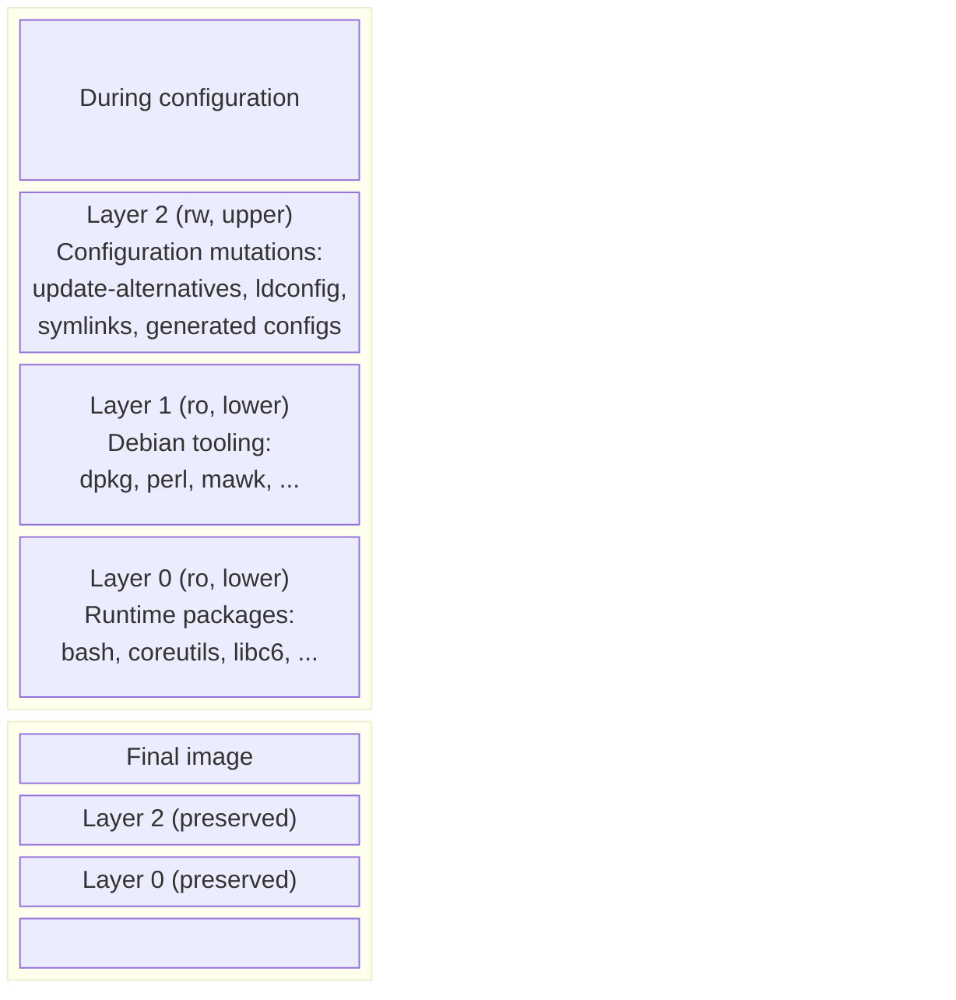
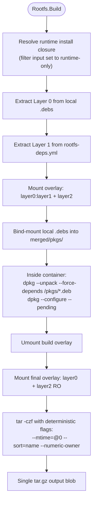

# Rootfs Assembly

The `Rootfs` artifact is the top of the build graph. It consumes the runtime closure of one or more named binary packages, installs them into a synthetic root filesystem, and packages the result as a deterministic `.tar.gz` blob.

Two things are subtle here, and the rest of this page is mostly about them:

1. **The Debian tooling problem.** Debian's `postinst` scripts assume a live Debian environment with `dpkg`, `apt`, and `perl` available. We need those tools *during configuration* but not *in the final image*. A naive solution would install them and then strip them; `gl-ng` uses overlays to avoid that.
2. **The dynamic-input problem.** A rootfs's transitive runtime closure is not statically known from `rootfs.yml` — it depends on every binary's recursive `Depends`. This is what `Includes` and the consumer-side closure rule are designed to express.

## The three-layer overlay model

Rootfs assembly mounts a 3-layer OverlayFS:



- **Layer 0** — locally-built `.deb`s, extracted raw. The packages that *belong* in the final image. This is what we want to ship.
- **Layer 1** — the rootfs lockfile's packages, also extracted raw. `dpkg`, `apt`, `perl`, `mawk`. We want these *available* during configuration so `postinst` scripts can run, but absent from the final output.
- **Layer 2** — an initially empty writable overlay. All filesystem mutations during configuration land here: ldconfig's cache, `update-alternatives` symlinks, regenerated configs.

During configuration, all three layers are mounted together. The environment looks like a complete Debian system. After configuration finishes, **Layer 1 is discarded**, and a *second* read-only overlay is mounted with just Layer 2 over Layer 0. That overlay is what gets tarred up.

The output is therefore: every file we built (Layer 0) plus every mutation configuration produced (Layer 2), with *none* of the Debian tooling that produced them.

## Build flow



A few notes:

- **The runtime closure is computed at Build time.** The rootfs's `Inputs()` walks the full transitive closure of binary package outputs (every package every transitive dependency exposes, via the `Depends`+`Includes` closure rule). That closure is then narrowed to a runtime install set via `install.Resolve` (which walks the actual `Depends`/`Pre-Depends` from each `.deb`'s control), dropping `-dev`/`-static` siblings. The narrowed set is what's actually extracted into Layer 0.
- **Layer 1 is filtered against the install set, not the build closure.** Any package whose name appears in Layer 0 is removed from Layer 1, so the lockfile cannot duplicate something we already extracted. Crucially, the filter uses the *narrowed install set* — packages that exist in the build closure as sibling-includes (e.g. `libc-bin` cross-pinned from `libc6` for source-build install-check coupling) but are not part of the rootfs's runtime install set must still come from the lockfile mirror in Layer 1; the filter does not shadow them.
- **Inside the container, `dpkg` runs as PID 1 in a tmpfs-backed namespace.** It uses Layer 1's tools to configure Layer 0's content; the writes land in Layer 2.
- **Determinism flags on tar.** `--mtime=@0` resets timestamps, `--sort=name` ensures lexicographic ordering, `--numeric-owner` strips username/groupname lookups. Without these, the rootfs hash would drift across hosts and over time.

## Identity

A `Rootfs` artifact's identity is:

```
ConcatHash(
    "rootfs",
    name,                            // e.g. "gl-rootfs"
    arch,                            // e.g. "amd64"
    rootfsLockfileBlobHash,
    binaryDep1.Identity(),
    binaryDep2.Identity(),
    ... full transitive closure ...
)
```

The closure is walked recursively at identity time so that any change anywhere in the runtime tree changes the rootfs identity. This is what makes "rebuild only if something actually changed" work end-to-end.

## What `rootfs.yml` declares

The user-facing input is a small file:

```yaml
packages: [base-files:base-files, base-passwd:base-passwd, coreutils:coreutils, bash:bash, gcc-16:libgcc-s1, dpkg:dpkg]
```

Each entry is `<source-package>:<binary-package>`. The rootfs depends only on these *direct* binaries; the transitive closure is computed by the engine via `Depends`/`Includes`.

There is no second list for "implicit base packages" — `base-files`, `base-passwd`, `glibc`'s `libc6`, etc. all appear because something asks for them or because they're co-produced as `Includes` siblings of something asked for. If a base package would be missing from the closure, the build either fails the locality check or fails to install — both deterministic, neither silent.

## What's *not* in the final image

- `dpkg`, `apt`, `perl`, `mawk`, `debconf` — these are Layer 1.
- Any "build-time" residues. Layer 0 is raw `dpkg-deb -x` extraction; nothing has been compiled into it.
- Maintainer-script source code (`postinst`, etc.) is on Layer 0 (because it ships in the `.deb`), but it has been *executed* against Layer 1 + Layer 2 during configuration; whatever it produced is in Layer 2.
- Anything from the host. The container's view of `/` is the overlay — it has no access to the host filesystem outside of what was bind-mounted.

## What about APT in the final image?

The architecture blueprint envisions image-flavours that *do* include APT — for container base images intended to support `apt-get install` at runtime. That is out of Phase 1 scope. The current Phase 1 rootfs is APT-free.

## Future work

Phase 1's `Rootfs.Build()` is intentionally simple:

- One feature/configuration mechanism (`configure.exec` mocked); no full GardenLinux feature-composition system.
- One overlay layer for configuration; no per-feature layering.
- One output format (`.tar.gz`); no disk-image, no VM image, no OCI image.

The blueprint's [feature-based composition model](https://github.com/gardenlinux/builder) and image-format multiplexing fit into the same artifact-and-overlay frame; they are extensions, not redesigns. They land after Phase 1.

## See also

- The implementation: [`internal/build/rootfs.go`](../internals/build/build.md#rootfs-implementation).
- The CLI side: [`gl build`](../guide/build.md), [`gl exec-chroot`](../guide/exec-chroot.md).
- How the install actually runs (two-phase `dpkg`): [`internal/install`](../internals/build/install.md).
