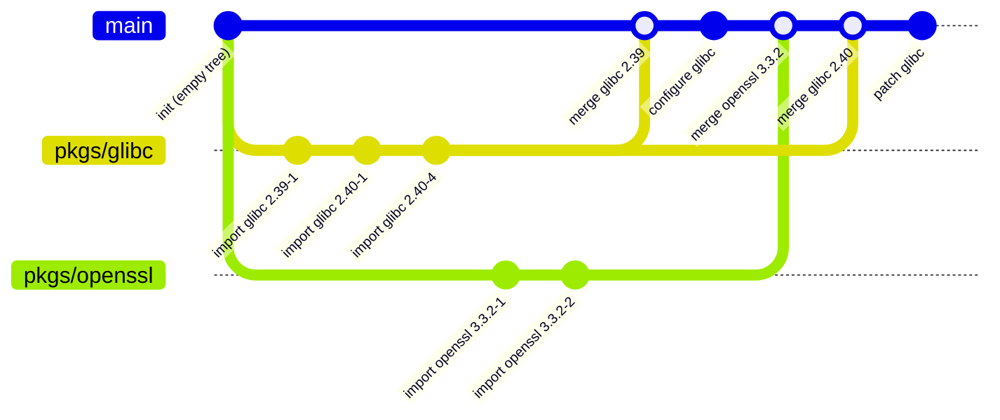
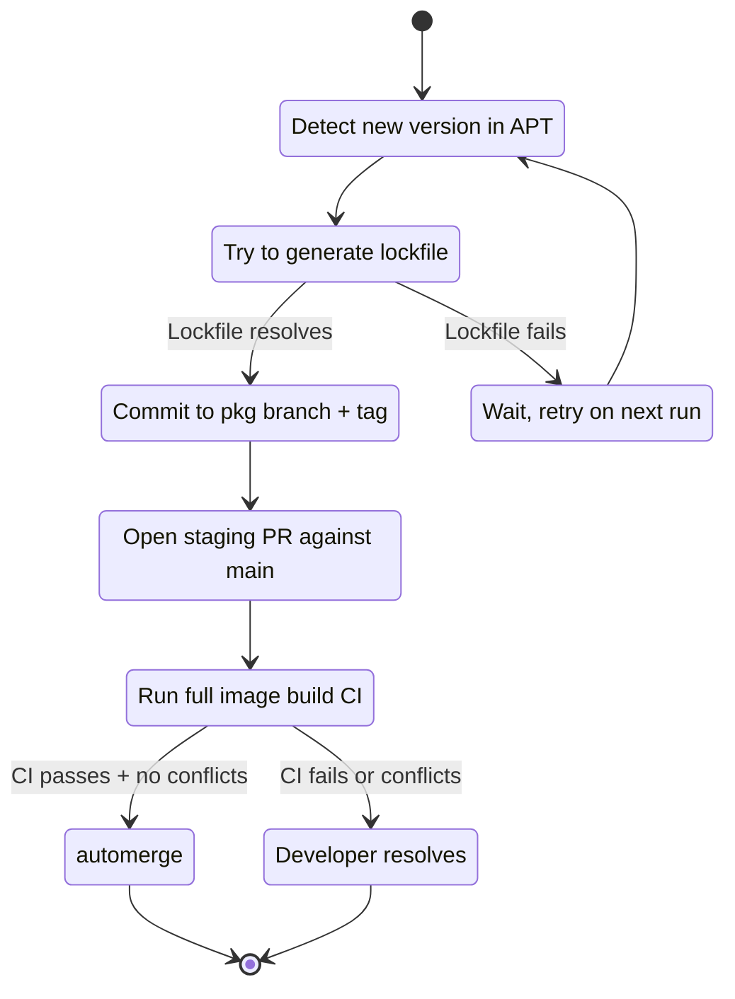

# Source Management and the Staging Repo

The build system needs Debian source packages to build from. This page describes where they come from, how they get into the monorepo, and what the longer-term Git-based versioning plan looks like.

## Source of truth: the APT source archive

`gl-ng` imports sources from the Debian APT archive — `deb.debian.org/debian` and equivalents. Specifically, for a given distribution and component (`testing`, `main` by default), the import process consults the archive's `Sources` index, picks the latest version of the requested package, and downloads the source files referenced by that index entry.

It does *not* import from Salsa (Debian's GitLab) or any package's upstream Git. The reason is consistency: not every Debian package is on Salsa; even when it is, the contents can diverge from the archive (different patches, different versions, no clean tagging convention, ~1,600 source packages with no known upstream Git location at all). The archive is the only source of truth that is consistent across the entire Debian ecosystem.

## What gets imported

For one package, the import produces:

| Artifact | Where it goes |
|----------|---------------|
| `debian/` directory (control, rules, patches, changelog, …) | `pkgs/<name>/src/debian/` (or for native packages, the full source tree at `pkgs/<name>/src/`) |
| `orig.tar.*` (one or more) | Stored as blobs in the object store, marked as source-type |
| `sources.yml` referencing those blobs by hash | `pkgs/<name>/sources.yml` |

The `debian/` directory is unpacked into the working tree because it's small, hand-edited, and benefits from version control. The orig tarballs are not unpacked into the working tree because they're large and binary; they live in the content-addressed object store, referenced by hash.

A `pkgs/<name>/sources.yml` looks like:

```yaml
sources:
  - name: glibc_2.40.orig.tar.xz
    hash: 0b89b8c058eaa0f1121a814be6196ce2048235b43d95714ce8278fe72c7cc34a
```

At build time, `DebianPkgBuild` retrieves each orig tarball from the object store by hash and extracts it next to the `debian/` directory to reconstruct the full source tree for `dpkg-buildpackage`.

## The three Debian source formats

The importer understands three Debian source formats:

| Format | Layout | Importer behaviour |
|--------|--------|-------------------|
| `3.0 (quilt)` | orig tarball + `.debian.tar.*` | Extract `.debian.tar.*` into `pkgs/<name>/src/debian/`. Orig is stored as a blob. |
| `3.0 (native)` | single tarball, not "orig" | Extract the entire tree into `pkgs/<name>/src/`. No orig. |
| `1.0` | orig + `.diff.gz` (or no diff for native-1.0) | Extract orig, apply `.diff.gz` via `patch(1)`, take the resulting `debian/` directory. Orig is stored as a blob. |

Format 3.0 quilt is by far the most common in modern Debian; format 1.0 still exists for some legacy packages. Native packages are rare but supported.

For format 1.0 packages with patches that touch files outside `debian/`, the importer can synthesise a quilt-style patch under `debian/patches/` so subsequent build runs use the modern toolchain.

## The conf-dir layout (Phase 1)

Phase 1 ships a flat layout — one directory per source package, no Git automation:

```
<conf-dir>/
├── pkgs/
│   ├── bash/
│   │   ├── sources.yml
│   │   ├── build.yml
│   │   ├── build-deps.yml
│   │   └── src/
│   │       └── debian/
│   ├── glibc/
│   │   └── ...
│   └── ...
├── rootfs.yml
└── rootfs-deps.yml
```

Each package directory has:

- `sources.yml` — orig tarball references (written by `gl import`).
- `src/` — source tree (extracted by `gl import`).
- `build.yml` — build configuration: artifact dependencies, build profiles, options, environment overrides. Hand-edited (see [build.yml reference](../guide/build-yml.md)).
- `build-deps.yml` — per-arch lockfile blob hash (written by `gl lockfile`).

The top-level `rootfs.yml` lists the packages in the rootfs, and `rootfs-deps.yml` is the corresponding rootfs lockfile.

This is the shape `prepare_staging.sh` constructs from `tests/templates/` for the e2e test, and it is the shape any user-supplied conf-dir takes.

## Phase 2 vision: the staging repo

The longer-term plan (not in Phase 1) replaces the flat conf-dir with a Git repository structured around per-package branches:



The structure:

- An **empty `init` commit** at the root, tagged `init`. This is the common ancestor for *every* branch — main, all package branches, all release branches.
- One **package branch** per source package, named `pkgs/<name>`, forked from `init`. Each commit on the package branch is one upstream import — purely the imported `debian/` tree, the orig tarball reference, and a lockfile. No build configuration, no local patches.
- Each package version is **tagged** as `pkgs/<name>/<version>`.
- The **main branch** is the integration point. It carries every package as a subdirectory (`pkgs/<name>/`), built up by merging package branches in. The `build.yml` files and any local patches live only on main.
- **Release branches** (`rel-<version>`) fork from main and diverge independently. Backports come in by merging package-branch tags directly into the release branch.

The empty `init` commit is critical: without a shared ancestor, Git would treat package-branch merges into main as merges of unrelated histories and produce spurious deletion conflicts.

## Phase 2 vision: import automation

The intended flow when a new upstream version appears in Debian:



A few notes:

- **Lockfile generation gates the import.** If `Build-Depends` cannot be resolved against current Debian testing (because testing is mid-migration), no commit is placed on the package branch. The next automation run retries.
- **Merges, not rebases.** Package-branch updates merge into main. Rebasing would destroy the ancestor relationship and break future merges.
- **Auto-merge requires CI passing on the full image build**, not just the package itself — because a successful per-package build doesn't prove the package works as part of the assembled rootfs.

## Patch management (also Phase 2)

Phase 2 adds a Git-native patch workflow that opens `debian/patches/series` as a synthetic Git repository: one commit per patch, on top of the orig tarball as a base. Developers edit patches with normal `git rebase -i`, `git commit --amend`, etc. Closing the workflow exports the modified commit stack back to `debian/patches/`. No `quilt` invocation, no patch-file editing in a text editor.

This is an editor-side ergonomics improvement; it does not change anything on the build side. Build continues to consume `debian/patches/` as standard Debian quilt format, regardless of how the patches were authored.

## What Phase 1 actually ships

Phase 1's import flow is:

```bash
gl import --output <conf-dir> --cookie <uuid> <package-name>
```

It writes the package directory as documented above. There is no Git interaction; the conf-dir may or may not be a Git repo, and `gl-ng` doesn't care. Tests use a tmpdir.

Phase 2's branch automation, patch tooling, release-branch model, and snapshot-based history are deferred. The conceptual sketches above describe where the system is headed; reading the code in `internal/importer` will give you what works today. They are consistent — Phase 2 fills in shape, not direction.

## See also

- CLI usage: [Importing Sources](../guide/import.md).
- The implementation: [`internal/importer`](../internals/build/importer.md).
- The runtime APT vision for package-manager-enabled images: [The Derived Package Index](./package-index.md).
