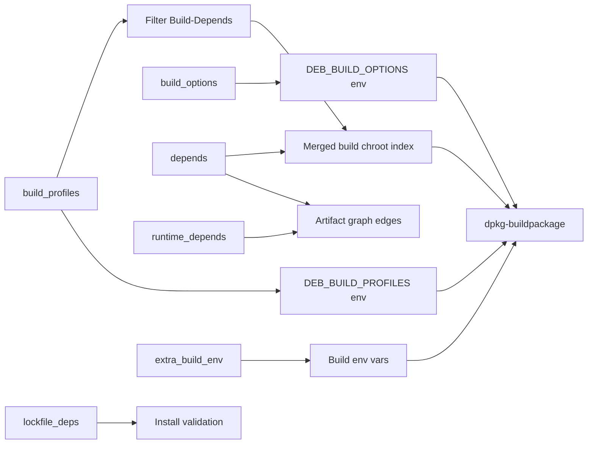

# Writing `build.yml`

Each source package directory in the conf-dir has a `build.yml`. This is the only file in the conf-dir that you hand-edit per package. It controls the build chroot, the build environment, the runtime-dependency edges in the artifact graph, and the install-validation allowlist.

## Quick example

```yaml
build_profiles: [nocheck, noudeb]
build_options: [nocheck]
depends: [glibc:libc6-dev, zlib:zlib1g-dev, libzstd:libzstd-dev]
runtime_depends:
  libssl3t64: [openssl:openssl-provider-legacy]
  openssl-provider-legacy: [openssl:libssl3t64]
  libssl-dev: [openssl:libssl3t64]
extra_build_env:
- "DEB_CFLAGS_APPEND=-Wno-error"
lockfile_deps:
  openssl: [libgcc-s1]
  libssl3t64: [libgcc-s1]
  openssl-provider-legacy: [libgcc-s1]
  libssl-dev: [libgcc-s1, linux-libc-dev, rpcsvc-proto]
```

That's openssl. Five fields, each independent.

## Fields

### `build_profiles:`

A list of [Debian build profiles](https://wiki.debian.org/BuildProfileSpec) that are *active* for this package. The lockfile generator and the source builder both filter `Build-Depends` atoms against this list.

Common entries:

| Profile | Effect |
|---------|--------|
| `nocheck` | Skip test suites |
| `noudeb` | Skip `.udeb` (debian-installer) outputs |
| `nobiarch` | Skip multilib (32-bit-on-64-bit) outputs |
| `nodoc` | Skip docs |
| `pkg.<name>.<flag>` | Per-package flag (rare) |

### `build_options:`

Translates directly to `DEB_BUILD_OPTIONS` inside the build chroot. The most common entry, mirroring `build_profiles:`, is `nocheck`. Note that profiles affect *what dependencies are pulled in*; options affect *how the build behaves*. They overlap, but they are not the same.

### `depends:`

A list of `<src-pkg>:<binary-pkg>` pairs naming binaries that this build needs at chroot-assembly time *and* whose presence implies a runtime-graph edge.

Concretely:

- The build chroot's package set is `lockfile ∪ {dep.binary | dep ∈ depends}`. Locally-built binaries override the lockfile's mirror copies.
- Each entry creates a `Depends`/`Includes` edge in the artifact graph from this source build's `BinaryPkg`s to the named binary's `BinaryPkg`. Downstream rootfs assembly walks these to compute the runtime closure.

If a build needs a binary at chroot time *only* (no runtime relevance), this is the wrong field — but in Phase 1 the simplification is "build-time and runtime overlap is enough." In practice most build-deps that are libraries ARE runtime deps too, because the linker creates a `.so` reference that gets followed.

When a source produces multiple sibling binaries that are version-pinned to each other (e.g. `libpcre2-dev` Depends `libpcre2-8-0 (= same-version)`), the engine does *not* automatically pull all siblings in when you name one in `depends:`. You have to wire the cross-pin edges yourself via `runtime_depends:` so the local build chroot sees consistent versions across the sibling set. See [Dependency Locality](../guidelines/dependency-locality.md) for the rule and the common shapes (`-dev → runtime-lib`, `-dev → CLI`, mutual cycles).

### `runtime_depends:`

A map from binary package name to a list of `<src-pkg>:<binary-pkg>` pairs naming runtime dependencies of that *specific* binary. This is the field that handles cycles and per-binary differentiation.

Use it when:

- Two siblings have a mutual runtime dependency (e.g. `libssl3t64` ↔ `openssl-provider-legacy`).
- A `-dev` package depends on its corresponding runtime lib at exact version (e.g. `libc6-dev` → `libc6`).
- A binary needs a runtime that isn't a standard `Depends:` field — e.g. a plugin loaded by name.

The engine treats these as `Includes` edges (consumer-side closure) in addition to `Depends`. See [Concept: Artifacts](../concepts/artifacts.md#includes-cycles).

### `lockfile_deps:`

A map from binary package name to a list of bare package names that are allowed to come from the *lockfile* (i.e., from the Debian mirror) during that binary's install-validation check.

This exists for two reasons:

1. **Long-tail leaf packages we don't build from source** — typically `linux-libc-dev`, `rpcsvc-proto`, `tzdata`, etc. These are not safety-relevant for the from-source property (they're effectively config or header data), and forcing the user to import them all would be tedious.
2. **Runtime libraries pulled in by `${shlibs:Depends}` that aren't in this binary's explicit `depends:` / `runtime_depends:` graph.** The classic case is `libgcc-s1`: nearly every C/C++ binary picks up a `Depends: libgcc-s1` from shlibs, but very few list `gcc-N:libgcc-s1` in their explicit graph. Listing it under `lockfile_deps:` lets install-check resolve it without forcing every package to grow an explicit edge to gcc.

`lockfile_deps:` is the explicit allowlist. Any `Depends` *not* in the locality closure *and* not in `lockfile_deps:` causes `BinaryPkg` validation to fail.

**Strictly per-binary, not inherited.** Each binary's install-check resolves *only* against its own `lockfile_deps:` entry, never against entries declared by binaries it depends on. If `libc6` lists `lockfile_deps: { libc6: [libgcc-s1] }`, that does **not** propagate to consumers — every binary whose closure pulls in `libgcc-s1` (because shlibs added it) must declare `libgcc-s1` in its own `lockfile_deps:`. This avoids version skew across independently SAT-resolved per-source lockfiles (a real failure mode during gcc-N transitions, where one source's lockfile lands on `gcc-15-base` and another lands on `gcc-16-base`). See [the install-check internals](../internals/build/install.md#the-install-check-flow-in-detail).

Locally-built packages are never shadowed by `lockfile_deps:`. The resolver walks lockfile entries transitively but only adds packages that aren't already in the binary's local index, so naming `libgcc-s1` in a binary that has `gcc-16:libgcc-s1` in its closure is a no-op (the local copy wins).

### `extra_build_env:`

A list of `KEY=value` strings exported into the environment when `dpkg-buildpackage` runs. The most common usage is appending compiler flags:

```yaml
extra_build_env:
- "DEB_CFLAGS_APPEND=-Wno-error"
```

This is the right place for build-version-specific workarounds. (E.g., glibc imported at version X needs `-Wno-error` because newer kernel headers redefine a macro.) Don't put domain knowledge in Go code; put it here.

## Field interactions



## What `build.yml` does *not* contain

- **No upstream version pin.** The version is derived from `pkgs/<name>/src/debian/changelog` (the imported source). To bump the version, re-import.
- **No Debian source format.** The format is detected automatically by the importer.
- **No source patches.** Patches live in `pkgs/<name>/src/debian/patches/` (standard quilt).
- **No mirror or distribution choice.** Those are passed to `gl import` and `gl lockfile` at the CLI.
- **No build commands.** `dpkg-buildpackage` is the build command, full stop.

## Patterns

### A simple library

```yaml
# pkgs/libfoo/build.yml
build_profiles: [nocheck, noudeb]
build_options: [nocheck]
depends: [glibc:libc6-dev]
```

### A library with sibling cycles

```yaml
# pkgs/openssl/build.yml — libssl3t64 and openssl-provider-legacy
# co-emit with mutual ${shlibs:Depends}
build_profiles: [nocheck, noudeb]
build_options: [nocheck]
depends: [glibc:libc6-dev, zlib:zlib1g-dev]
runtime_depends:
  libssl3t64: [openssl:openssl-provider-legacy]
  openssl-provider-legacy: [openssl:libssl3t64]
```

### A package with leaf-package allowlist

```yaml
# pkgs/glibc/build.yml — libc6-dev's deps include linux-libc-dev,
# which we don't build from source. libc6 picks up libgcc-s1 via
# shlibs and gcc-N-base via libgcc-s1's own Depends chain.
build_profiles: [nocheck, noudeb, nobiarch]
build_options: [nocheck]
extra_build_env:
- "DEB_CFLAGS_APPEND=-Wno-error"
runtime_depends:
  libc6: [glibc:libc-gconv-modules-extra]
  libc-dev-bin: [glibc:libc6]
  libc6-dev: [glibc:libc6, glibc:libc-dev-bin]
lockfile_deps:
  libc6: [libgcc-s1]
  libc-dev-bin: [libgcc-s1]
  libc-gconv-modules-extra: [libgcc-s1]
  libc6-dev: [linux-libc-dev, rpcsvc-proto, libgcc-s1]
```

Note that every binary that picks up `libgcc-s1` via shlibs declares its own `lockfile_deps` entry — `libc6`'s allowlist does not cascade to `libc-dev-bin` or `libc6-dev`. The same pattern repeats across most leaf libraries in the build set.

### A trickier package: gcc-16

GCC builds 100+ binaries from one source. Phase 1 only cares about `libgcc-s1`, which gets pulled into the rootfs by glibc. The build skips most of the cross-toolchain work via build profiles:

```yaml
# (sketch — actual template is more verbose)
build_profiles: [nostrap, nocheck, nolang_d, nolang_obj, ...]
build_options: [nocheck]
```

`nostrap` says "use the system's gcc-15 to bootstrap" — we don't need full self-bootstrap for libgcc-s1. The various `nolang_*` profiles drop language frontends we don't ship.

## See also

- [Concept: Artifacts](../concepts/artifacts.md) — how `depends:` and `runtime_depends:` translate to graph edges.
- [Concept: Debian Artifacts](../concepts/debian-artifacts.md) — what runs inside the build chroot.
- [The conf-dir layout](./conf-dir.md) — where `build.yml` sits.
- The templates at `tests/templates/<pkg>/build.yml` for working examples.
