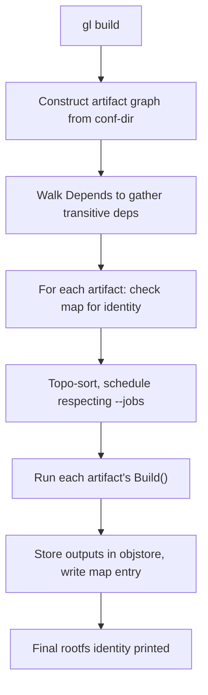
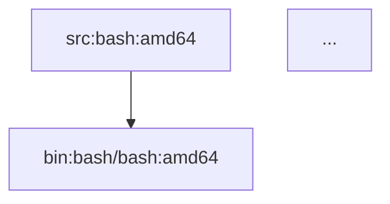

# Building

`gl build` is the main command. Given a conf-dir and a target, it builds every artifact in the target's transitive dependency closure and produces the final output.

## Usage

```text
gl build [flags]

Flags:
  --conf-dir string   Configuration directory (auto-discovered if omitted)
  --arch string       Target architecture (default "amd64")
  --jobs int          Parallel jobs (default sqrt(NumCPU))
  --cache string      Object store directory (default ~/.cache/gl-ng)
  --stub string       Path to exec_env_stub binary (default: alongside gl)
  --invalidate string Delete the map entry for the named target's identity, then exit
```

## What it builds

In Phase 1 there is one top-level target: the rootfs declared by `rootfs.yml`. The graph is built, the engine schedules every artifact in topological order, and at the end the rootfs identity is printed.

```bash
gl build --conf-dir ./staging --jobs 32
```

Output:

```
graph: 47 nodes
[interactive task UI showing per-artifact progress]
rootfs identity: 8a23bf1c...
```

The rootfs identity is what you pass to `gl exec-chroot` to enter the built rootfs.

## Parallelism

`--jobs` controls how many artifacts the engine schedules in parallel. The default is `sqrt(NumCPU)` — chosen because each individual artifact is itself a multi-process build (`dpkg-buildpackage` typically uses all cores), and oversubscribing the host with `NumCPU × NumCPU` parallel compilers thrashes badly.

On the development VM (64 cores, ample RAM), `--jobs 8` (the default) works well. For larger graphs or tighter machines, tune lower.

## What happens during a build



The cache check is per-artifact: any artifact whose identity is already in `map/` skips straight to its stored manifest. This means a re-run with no input changes is a no-op (just identity computation), and a re-run after touching one source rebuilds only that source and any descendants.

## The interactive UI

When stderr is a terminal, `gl build` shows a live task overview — one row per in-flight artifact, showing elapsed time, status, and (on entry) live log streaming. The keys are:

- ↑/↓ — navigate artifacts.
- Enter — show the live log for the selected artifact.
- q — return to the overview.

On non-terminal stderr (CI, redirected output), it falls back to plain log printing.

## Invalidating one artifact

Sometimes you've changed something the cache doesn't notice (e.g., a system tool used during build), and you want to force a single artifact to rebuild without nuking the whole cache:

```bash
gl build --conf-dir ./staging --invalidate rootfs:gl-rootfs:amd64
```

This computes the named target's identity, deletes its `map/` entry, and exits. The next `gl build` will recompute that artifact from scratch (and, transitively, anything downstream of it). Other artifacts stay cached.

The Key for an artifact follows a stable convention:

- Source build: `src:<name>:<arch>` (e.g. `src:bash:amd64`).
- Binary package: `bin:<src>/<bin>:<arch>` (e.g. `bin:bash/bash:amd64`).
- Rootfs: `rootfs:<name>:<arch>` (e.g. `rootfs:gl-rootfs:amd64`).

`gl graph` (see below) prints a graph with these Keys as node labels.

## Visualising the graph

```bash
gl graph --conf-dir ./staging --output graph.md
```

Writes a Mermaid-formatted dependency graph to `graph.md` (or stdout if `--output` is omitted). Useful for understanding why something depends on something else.

```text
# Build Dependency Graph

Nodes: 47



## Build outputs

After a successful build, the object store contains:

- `blobs/<2>/<62>` — each `.deb` blob, each manifest, the rootfs `.tar.gz`, etc.
- `map/<2>/<62>` — entries `identity → manifest_hash` for every built artifact.

The conf-dir is unchanged; nothing is written back to it during `gl build`. (This is what makes the conf-dir cleanly version-controllable.)

## Failures

When an artifact fails:

- The error message names which artifact, with its Key.
- The interactive UI marks the artifact red; logs are saved.
- The engine continues building independent artifacts (so failures don't cascade unnecessarily).
- At the end, the build exits non-zero with a summary.

For deeper investigation, see [Inspecting and Debugging Builds](./inspect.md).

## See also

- [Inspecting and Debugging Builds](./inspect.md) — `gl graph`, log review, the cache-debug subcommands.
- [Running Commands in a Built Rootfs](./exec-chroot.md) — `gl exec-chroot` for verifying the output.
- [Concept: Identity](../concepts/identity.md) — what determines whether a cache hit happens.
- [Concept: End-to-End Pipeline](../concepts/pipeline.md) — where `gl build` sits in the workflow.
