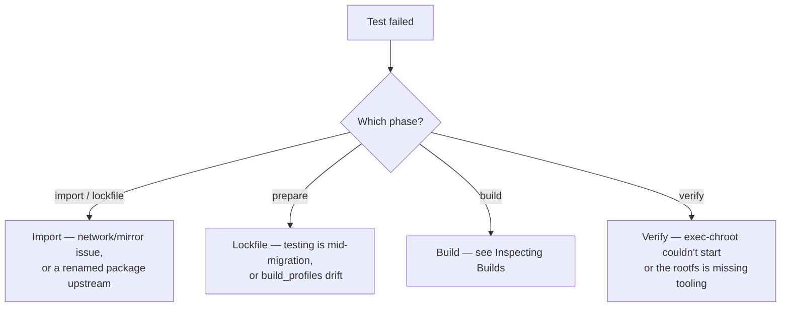

# End-to-End Walkthrough

This page walks through the integration test — the single command that takes you from "freshly cloned repo" to "working rootfs you can `exec-chroot` into."

## The script

`tests/full_build_test.sh` orchestrates the entire pipeline. Phases:

| Phase | Effect |
|-------|--------|
| `import` (alias `lockfile`) | Build binaries, import all sources, copy templates, generate all lockfiles |
| `graph` | Above + write the dependency graph as Markdown/Mermaid |
| `build` | Above + run `gl build` |
| `verify` (alias `all`) | Above + run `gl exec-chroot` and assert output |

Run with:

```bash
cd the repository root
./tests/full_build_test.sh           # all phases
./tests/full_build_test.sh build     # stop after build
./tests/full_build_test.sh import    # just prepare staging
```

## What the test builds

The packages, defined by templates in `tests/templates/`:

- **base-files**, **base-passwd** — Debian skeleton.
- **glibc** — produces `libc6`, `libc6-dev`, `libc-dev-bin`, `libc-gconv-modules-extra`.
- **gcc-16** — produces `libgcc-s1` (and many others; only `libgcc-s1` is in `rootfs.yml`).
- **bash**, **coreutils** — the headline binaries the rootfs is verifying.
- **dpkg** — the package manager itself, shipped in the rootfs (Layer 0). Its source build also produces `dpkg-dev`, `dselect`, `libdpkg-perl`, `libdpkg-dev`; only `dpkg` is in `rootfs.yml`, the rest are byproducts the engine never instantiates as `BinaryPkg` artifacts.
- **tar**, **bzip2**, **xz-utils**, **libmd** — added alongside dpkg to satisfy its runtime closure (`tar`, `libbz2-1.0`, `liblzma5`, `libmd0`) entirely from local source builds rather than the mirror.
- **mawk**, **debianutils**, **cdebconf** — small base utilities pulled in by the closure.
- **ncurses** — readline backbone for bash.
- **acl**, **attr**, **libcap2**, **libselinux** — coreutils' security/permissions deps.
- **gmp**, **openssl**, **systemd**, **libzstd**, **zlib**, **pcre2** — coreutils' transitive deps (libsystemd0, libssl3t64, libgmp10).

The rootfs declares only the top of the cone:

```yaml
packages: [base-files:base-files, base-passwd:base-passwd, coreutils:coreutils, bash:bash, gcc-16:libgcc-s1, dpkg:dpkg]
```

…and the engine works out the rest.

## Environment

The script honours these environment variables:

- `GL_CACHE_DIR` — object store location (default `/tmp/gl-e2e-cache`).
- `GL_WORK_DIR` — work directory (default: a fresh tmpdir, deleted on exit).
- `GL_KEEP_WORK=1` — keep the work dir on exit (useful for debugging).

The script clears `$CACHE_DIR/map` at the start, but leaves blobs in place. This forces the engine to re-walk the artifact graph on every run while reusing already-fetched orig tarballs and lockfile blobs.

## Phase walkthrough

### 1. Build binaries

The script first builds `gl` and `exec_env_stub` into `$WORK_DIR/.bin/`. If they exist, this step is a no-op — convenient for repeated runs during development.

```bash
go build -o $WORK_DIR/.bin/gl ./cmd/gl
go build -o $WORK_DIR/.bin/exec_env_stub ./cmd/exec_env_stub
```

### 2. Generate a session cookie

```bash
COOKIE="$(uuidgen)"
```

Threaded into every subsequent `gl` invocation so they share one HTTP fetch of `InRelease`/`Sources`/`Packages`.

### 3. Import all packages

For each subdirectory of `tests/templates/`:

```bash
gl import --cookie "$COOKIE" --output "$WORK_DIR" --no-verify <pkg>
```

`--no-verify` is fine here because the test environment doesn't ship the Debian keyring. In production use you would not skip verification.

Skipped if the package's `src/` already exists.

### 4. Apply template patches

> **Not the canonical workflow.** In normal development you import a
> package and then edit the files in `pkgs/<pkg>/src/` directly — the conf
> dir is just a directory tree on disk. The patch step described here
> exists only because the e2e test re-creates a clean staging dir on each
> run and needs a way to script the equivalent of "import, then make a few
> edits." Don't treat `tests/templates/<pkg>/patches/` as a general
> mechanism for shipping source modifications.

If a template includes a `patches/` subdirectory, each `*.patch` is applied
with `patch -p1` from the package source root, in lexical order (`0001-…`,
`0002-…`, …). A `.gl-patches-applied` stamp prevents double-application on
re-runs. Skipped if the stamp already exists.

This is how `tests/templates/gcc-16/` ships a few small toolchain tweaks
(extra `DEB_BUILD_OPTIONS` toggles like `nosan`, `noatomic`) that aren't
part of upstream Debian's gcc source — emulating a developer who imported
the package and then edited `debian/rules.defs` by hand.

### 5. Copy templates

For each package:

```bash
cp tests/templates/<pkg>/build.yml $WORK_DIR/pkgs/<pkg>/build.yml
```

Plus the rootfs template:

```bash
cp tests/templates/rootfs.yml $WORK_DIR/rootfs.yml
```

### 6. Generate lockfiles

Per-package:

```bash
gl lockfile --cookie "$COOKIE" --output "$WORK_DIR" <pkg>
```

Plus the rootfs lockfile:

```bash
gl lockfile-rootfs --cookie "$COOKIE" --output "$WORK_DIR"
```

After this, the work dir is a complete conf-dir. (At this point you could run `gl build` manually.)

### 7. Graph

```bash
gl graph --conf-dir "$WORK_DIR" --stub "$STUB_BIN" --output graph.md
```

Writes a Mermaid graph for inspection. The script `cat`s the result so you see it in the test output.

### 8. Build

```bash
gl build --conf-dir "$WORK_DIR" --stub "$STUB_BIN"
```

This is the long step (15–30 minutes on a reasonable machine). It builds every package from source, validates each binary, and assembles the rootfs.

The script then re-runs `gl build` with output captured, just to extract the rootfs identity from the (now cached) build output:

```bash
ROOTFS_ID=$(echo "$BUILD_SUMMARY" | grep "rootfs identity:" | awk '{print $NF}')
```

### 9. Verify

```bash
gl exec-chroot --cache "$CACHE_DIR" "$ROOTFS_ID" bash -c 'echo PHASE1_OK && ls /usr/bin/cat && id'
```

The test asserts that `PHASE1_OK` appears in stdout. If it does, every preceding step worked: binaries built, validation passed, rootfs assembled, container started, bash exec'd, coreutils' `ls` ran, `id` returned a valid result.

## Diagnosing failures



Run individual phases (`./tests/full_build_test.sh build`) to isolate which step broke. Use `GL_KEEP_WORK=1` to inspect the conf-dir after a failure.

## See also

- [Inspecting and Debugging Builds](./inspect.md) — what to do when a build fails.
- [Concept: End-to-End Pipeline](../concepts/pipeline.md) — the same flow at a higher abstraction level.
- [Building](./build.md), [Running Commands](./exec-chroot.md) — the underlying CLI commands.
