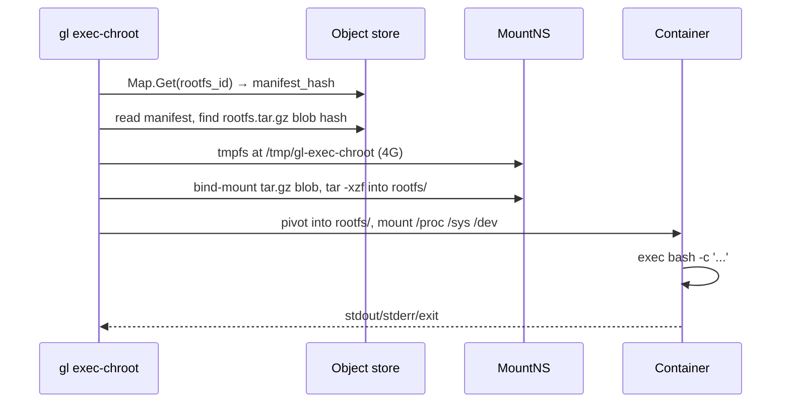

# Running Commands in a Built Rootfs

`gl exec-chroot` takes a rootfs identity and runs a command inside the rootfs as if it were the system root. It's the primary way to verify a built rootfs is functional, and the heart of the integration test.

## Usage

```text
gl exec-chroot [--cache <dir>] [--explore] <rootfs-hash> <cmd> [args...]
```

- `<rootfs-hash>` — the rootfs identity, as printed by `gl build` (or recovered from `gl cache map list`).
- `<cmd> [args...]` — the command to execute inside.
- `--cache <dir>` — override object store location (also reads `GL_CACHE`).
- `--explore` — skip the final container layer; just exec inside the MountNS where the rootfs is extracted. Useful when something in the rootfs makes the container fail to start.

## Example

```bash
gl exec-chroot 8a23bf1c... bash -c 'ls -lah /'
```

Or, more probing:

```bash
gl exec-chroot 8a23bf1c... bash -c 'echo PHASE1_OK && ls /usr/bin/cat && id'
```

The integration test (`tests/full_build_test.sh verify`) runs exactly this.

## What it does



The rootfs tarball is *bind-mounted* (not copied) from the object store, then extracted onto the MountNS-private tmpfs. When `exec-chroot` exits, the tmpfs is unmounted and everything disappears — the host's view of the world is unchanged.

## The `--explore` flag

Sometimes the rootfs is broken in a way that prevents the container layer from starting (e.g. a missing init helper, a broken `/proc` mount). `--explore` skips the Container layer and execs your command inside the MountNS instead, with the rootfs accessible at `$GL_ROOTFS`:

```bash
gl exec-chroot --explore 8a23bf1c... ls -la
# → lists the host's CWD; $GL_ROOTFS is the rootfs path on tmpfs
```

You can then `ls $GL_ROOTFS/bin/` etc. without the chroot semantics getting in the way.

## Environment inside the chroot

The container layer sets:

- `PATH=/usr/local/sbin:/usr/local/bin:/usr/sbin:/usr/bin:/sbin:/bin`
- `HOME=/root`
- `TERM=xterm`

Other variables (e.g. `LANG`) are not propagated. If you need them, set them in your command: `env LANG=C.UTF-8 ...`.

## Networking

The container does *not* unshare the network namespace, so it has the same network access as the host. The mount namespace doesn't include `/etc/resolv.conf` from the host though, so DNS may not work unless the rootfs has its own. (For Phase 1, this rarely matters — exec-chroot is for verification, not for network operations.)

## Limitations

- **No persistent state.** Every invocation is a fresh extraction. Files you write inside disappear when `exec-chroot` exits.
- **No write-back.** There is no mechanism to capture changes from inside the chroot back into the rootfs blob.
- **Single command only.** The first argument after the hash is `argv[0]`; there's no shell wrapping. To run a pipeline, do `bash -c 'a | b'`.

These are intentional. `exec-chroot` is for verification; for building, use `gl build`; for development inside a Debian system, run the rootfs in a real VM.

## When something goes wrong

| Symptom | Likely cause |
|---------|--------------|
| `map lookup ... not found` | The rootfs identity isn't in the cache. Run `gl build` first. |
| `rootfs.tar.gz not found in manifest` | The manifest blob points at something other than a rootfs. Wrong identity? |
| `pivot_root: invalid argument` | The rootfs doesn't have a `/` (extraction failed). Check the tar with `--explore`. |
| `exec: bash: not found` | The rootfs has no `/bin/bash`. Either `bash` wasn't in `rootfs.yml`, or the rootfs is incomplete. |
| `cannot create symlink: Permission denied` (during extract) | Subuid range exhausted. Check `/etc/subuid`. |

For deeper investigation, `--explore` is your best tool.

## See also

- [Building](./build.md) — produces the rootfs identities `exec-chroot` consumes.
- [Concept: Isolation](../concepts/isolation.md) — what the namespaces actually do.
- [Concept: Rootfs](../concepts/rootfs.md) — what's inside the tarball.
