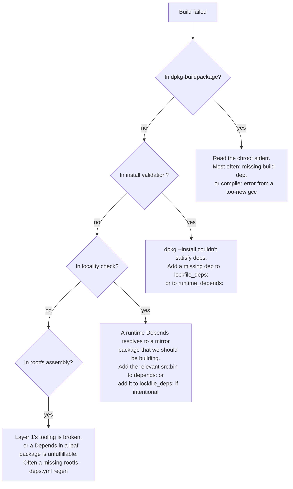

# Inspecting and Debugging Builds

When a build doesn't produce what you expected — wrong outputs, mysterious cache hits, dependency cycles — there are a few CLI commands and conventions for digging in.

## Visualising the graph

```bash
gl graph --conf-dir ./staging --output graph.md
```

Writes a Mermaid-formatted dependency graph as a Markdown file. Open in any Mermaid-aware viewer (e.g. VSCode's Markdown preview with the Mermaid extension, or Mermaid Live Editor).

For a focused view, edit the resulting `.md` to keep only the subgraph you care about — every node has a stable Key.

## Per-artifact identity

Every artifact has an identity hash. To see what it is for a given Key:

```bash
# (Phase 1 has no direct CLI for this; the workaround is to inspect the cache.)
gl cache map list | head
```

The `--invalidate` flag of `gl build` computes and prints the identity for a given Key as part of deleting it:

```bash
gl build --conf-dir ./staging --invalidate src:bash:amd64
# → "invalidated src:bash:amd64 (identity 8a23bf1c...)"
```

## Cache subcommands

```text
gl cache status                     # Summary: blobs, map entries, sources
gl cache blobs list                 # All blob hashes
gl cache blobs check <hash>         # Whether a specific blob exists
gl cache blobs path <hash>          # Filesystem path of a blob
gl cache map list                   # All identity → manifest_hash entries
gl cache map get <identity>         # Manifest hash for one identity
gl cache map check <identity>       # Whether a map entry exists
gl cache map delete <identity>      # Remove one map entry (force rebuild)
gl cache gc [--dry-run]             # GC unreachable blobs
```

A useful pattern when inspecting "what did this build produce":

```bash
# Look up rootfs identity in the map
ROOTFS_ID=8a23bf1c...
MANIFEST_HASH=$(gl cache map get "$ROOTFS_ID")

# Read the manifest (text format: "<hash> <name>" per line)
gl cache blobs path "$MANIFEST_HASH"
cat $(gl cache blobs path "$MANIFEST_HASH")
```

## Log review

If you ran a build and the live UI is gone but you want to revisit logs:

```bash
gl build --view-logs <log-file>
```

Replays a serialised task tracker (the `.taskui` file written by previous runs) into the same interactive UI, with arrow-key navigation and per-task log viewing.

In the live UI itself: ↑/↓ to select an artifact, Enter to view live logs, q to return, Ctrl-C to exit.

## Forcing a rebuild

Three escalating options:

1. **One artifact**: `gl build --invalidate <Key>` — deletes one map entry, rebuilds that artifact and downstream.
2. **All map entries** (keep blobs): `rm -rf ~/.cache/gl-ng/map/` — every artifact rebuilds from scratch but sources/lockfile blobs stay.
3. **Everything**: `rm -rf ~/.cache/gl-ng/` — full rebuild including re-fetch of orig tarballs from mirror. Slow.

Option 2 is the right hammer for "I changed something the cache should have noticed but didn't." Option 3 is for diagnosing cache layer bugs.

## When a build fails — checklist



## Build chroot drift

If the same source produces different `.deb`s on different runs, the most likely causes are:

1. **Lockfile drift** — re-run `gl lockfile <pkg>`; if the blob hash changed, the mirror moved on.
2. **Build profile mismatch** — the lockfile was generated with profiles that differ from the current `build.yml`. Re-run lockfile.
3. **A non-deterministic build** in the package itself (uses `__DATE__`, embeds a hostname, etc.). This is a Debian-policy bug in the upstream package; fix at source or accept.

## Reading the manifest

Each source build's manifest is a text blob with one entry per line:

```text
<hash> libc6.deb
<hash> libc6-dev.deb
<hash> control:libc6
<hash> control:libc6-dev
...
```

Manifest entries use **stable names** — `<binary>.deb` and `control:<binary>` — not version-decorated filenames. The version (`2.40-7+gl~a3f7b2c1`) lives inside the `.deb` archive itself, in `DEBIAN/control`. Stable names mean a consumer can ask for `libc6.deb` without first knowing what version was built.

The `control:<binary>` entries are the parsed `DEBIAN/control` text from each `.deb`, stored as separate blobs so `BinaryPkg` artifacts can read them without unpacking the `.deb`.

For a rootfs, the manifest is simpler:

```text
<hash> rootfs.tar.gz
```

## See also

- [Building](./build.md) — the main build command and its flags.
- [Managing the Cache](./cache.md) — broader cache administration.
- [Resolving Dependencies](./resolve.md) — `gl resolve` for ad-hoc resolver experiments.
