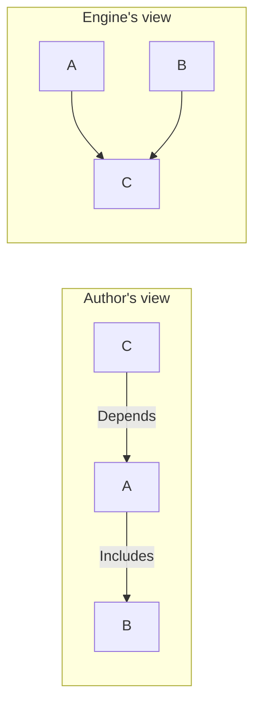
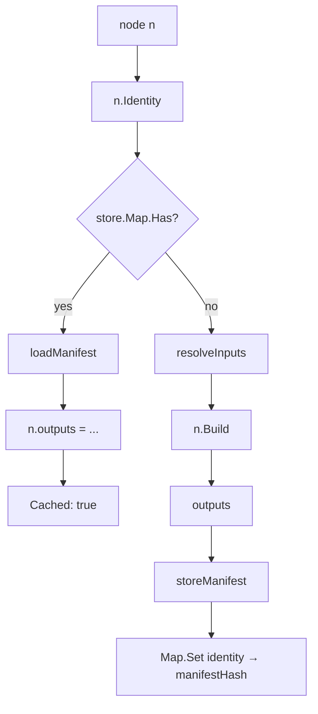
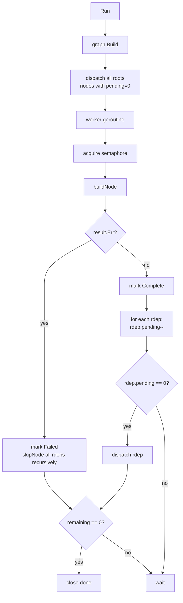
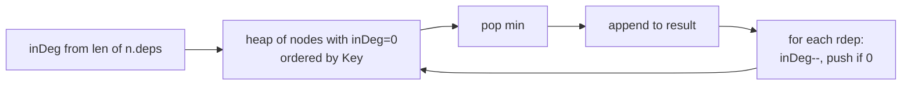

# `artifact` — Graph Engine

The artifact engine is a generic, content-addressed build executor. It knows about hashes, manifests, dependency edges, and parallel dispatch — and **nothing** about Debian. The Debian-specific artifact types live in `internal/build`; the engine just runs whatever satisfies the `Artifact` interface.

```
internal/artifact/
├── artifact.go       # Artifact interface + Output, Input, BuildContext types
├── graph.go          # Graph, node, Discover, topological orders
├── engine.go         # Engine, the run loop, runHooks, Run/RunWithUI
├── manifest.go       # Manifest text format: SerializeManifest, store/loadManifest
├── mermaid.go        # Mermaid flowchart renderer
└── *_test.go
```

Earlier the engine, graph, manifest, and mermaid concerns shared a single 800-line file; they were split because they have orthogonal lifetimes (graph = construction-time, engine = run-time, manifest = persistence, mermaid = output) and the only shared types are `Graph` and `node`.

## The `Artifact` interface

```go
type Artifact interface {
    Key() string
    Identity() (objstore.Hash, error)
    Depends() []Artifact
    Includes() []Artifact
    Inputs() []Input
    Build(ctx BuildContext) ([]Output, error)
    String() string
}
```

Each method earns its place:

| Method | Purpose | When called |
|--------|---------|-------------|
| `Key()` | Stable identifier for graph dedup. Two artifacts with the same Key are the same node — only the first is added. | Graph construction, `Find`, manifest lookups. |
| `Identity()` | Content-derived hash that is the **cache key**. Same identity → same outputs. | Before every build attempt; if `store.Map.Has(identity)`, the build is skipped. |
| `Depends()` | Build-order edges — these artifacts must finish (cache hit or successful build) before this one can start. Cycles forbidden. | Graph wiring (`Build`/`Discover`). |
| `Includes()` | Closure-only edges — for every consumer that `Depends()` on me, the engine also adds an ordering edge to my Includes. I myself don't wait for them. Cycles legal. | Graph wiring; consumer-side closure expansion. |
| `Inputs()` | Concrete output references — "I consume the `control:libc6` output of node N." | After all deps are complete, before `Build()`. |
| `Build(ctx)` | The actual work. Runs in a goroutine. Returns named `Output` blobs, all already stored. | Cache miss only. |
| `String()` | Pretty-printed human label. Used in errors, logs, cycle messages. | Diagnostics. |

The `Output`/`Input` shape:

```go
type Output struct { Name string; Hash objstore.Hash }
type Input  struct { Source Artifact; Name string }
```

Names are opaque to the engine. The Debian artifacts use **stable names** like `libc6.deb`, `control:libc6`, or `rootfs.tar.gz` — the engine doesn't care what's inside. Stable names matter: a consumer asking for `libc6.deb` resolves by exact match, with no fallback to versioned filenames like `libc6_2.41-12+gl~abcdef12_amd64.deb`. Versioned filenames belong inside `.deb` archives and APT indexes, not in the artifact graph's input/output plumbing.

## Graph construction

Two entry points exist:

```go
g := NewGraph()
g.Add(art1); g.Add(art2); ...
g.Build()                          // explicit: caller adds nodes manually
```

```go
g, err := Discover(roots)          // recursive: walks Depends + Includes from roots
```

`Discover` is what `BuildGraph` actually uses — it's given the rootfs artifact as the single root, walks `Depends()` and `Includes()` recursively, deduplicates by `Key()`, and produces a fully wired graph.

Both paths converge on the same wiring algorithm. The interesting part is the **two-pass dance** in `Build()` and the recursive variant in `Discover()`.

### Pass 1: wire Includes

```go
for _, n := range g.nodes {
    for _, inc := range n.artifact.Includes() {
        n.includes = append(n.includes, lookup(inc))
    }
}
```

Just records the includes set. No ordering edges, no `pending` increment, no `rdeps` registration. After this pass, every node knows what it includes — but the engine does not yet treat that as anything dispatchable.

### Pass 2: wire Depends + consumer-side closure

For each node N and each `dep ∈ N.Depends()`:

```go
addEdge(dep)   // dep → N ordering edge
for inc in dep.includes (transitively):
    addEdge(inc)   // also dep.inc → N ordering edge
```

`addEdge` does three things: appends `target` to `n.deps`, appends `n` to `target.rdeps`, and increments `n.pending`. A `seen` map prevents double-adding the same target.

This is the **consumer-side closure rule**: `A.Includes(B)` does NOT make A wait for B, but if `C.Depends(A)`, then C also gets an ordering edge to B (and B's includes, recursively).



Concretely: a Debian source build produces both `libssl3t64` and `openssl-provider-legacy`. Each binary `Includes()` the other to declare "you and I belong together in any consumer's closure." The rootfs `Depends()` on `libssl3t64` only — but transitively gets ordering on `openssl-provider-legacy` too. Crucially, neither binary waits for the other (they're built by the same parent source build, which IS the shared Depends), so the mutual Includes is not a cycle.

### Cycle detection

```go
detectCycles()  // 3-color DFS over deps only (Includes excluded)
```

White → gray (on the stack) → black (done). A gray-revisit is a cycle, reported with the artifact stack:

```
cycle detected: [A B C A]
```

Includes are deliberately excluded — that's the whole point of the consumer-side closure rule.

## Identity and caching

`Identity()` returns a hash derived from everything that affects the artifact's output. Convention in this codebase: build the hash via `objstore.ConcatHash(parts...)`, where each part is a stringified version, dependency identity, source-tree hash, or build configuration knob. Same inputs → same identity → cache hit.

The engine's cache check:

```go
identity, _ := n.artifact.Identity()
if e.store.Map.Has(identity) {
    outputs := e.loadManifest(identity)
    n.outputs = outputs
    return BuildResult{Cached: true}
}
```

The map stores `identity → manifest_hash`. The manifest is itself a blob with a tiny text format:

```
<64-hex-hash> <output-name>
<64-hex-hash> <output-name>
...
```

`SerializeManifest` writes it; `loadManifest` parses it line-by-line. There's intentionally nothing fancy — no JSON, no length prefixes — because the names never contain newlines and the hashes are fixed-width.



### Why a manifest-of-blobs and not a single blob

Because most artifacts produce **multiple outputs** that consumers want individually:

- A `DebianPkgBuild` produces N `.deb` files and N control blobs (one per binary package).
- A binary package validation produces a `.deb` and a `control:<name>` entry pointing into the parent source build.
- A rootfs produces `rootfs.tar.gz` plus possibly intermediate metadata.

Consumers reference outputs by name (`Inputs()`); the engine looks up only the entries they ask for. Without the manifest, every consumer would have to load the full output set or every artifact would have to be its own blob with implicit naming — both worse.

## Resolving Inputs

After all of N's deps complete, the engine calls `resolveInputs(n)`:

```go
for input in n.Inputs():
    sourceNode := graph.nodeMap[input.Source.Key()]
    for out in sourceNode.outputs:
        if out.Name == input.Name { resolved[input.Name] = out.Hash; break }
    if not found:
        return error("output %q not found in %s (available: %v)", ...)
```

Resolution is **exact-match only**. The engine used to fall back to a `.deb` prefix-match for filenames like `libc6_2.41-12+gl~abcdef12_amd64.deb`, but that complicated the contract for one workaround that's no longer needed: source builds now emit stable `<pkg>.deb` names directly (see `internal/build/source.go` and `binary.go`). Versioned filenames live inside the `.deb` archive's control metadata, not in `Output.Name`.

If an input doesn't exact-match any output, `resolveInputs` returns an error listing the available output names — useful when wiring up a new artifact type and getting the names slightly wrong.

Resolved inputs are passed to `Build` as `BuildContext.Inputs map[string]objstore.Hash`.

## The Engine

```go
type Engine struct {
    graph   *Graph
    store   *objstore.Store
    workers int
    results []BuildResult
}

func NewEngine(g *Graph, store *objstore.Store, workers int) *Engine
func (e *Engine) Run(ctx context.Context) ([]BuildResult, error)
func (e *Engine) RunWithUI(ctx context.Context) ([]BuildResult, error)
```

`Run` and `RunWithUI` both delegate to a private `run(ctx, hooks)` method — same scheduler, same worker pool, same skip-on-failure logic — and only differ in the hooks they pass:

```go
type runHooks struct {
    nodeStarted  func(n *node) context.Context
    nodeFinished func(n *node, result BuildResult)
    nodeSkipped  func(n *node, reason string)
}
```

- `nodeStarted` runs **before** `Build()`, **without** the engine mutex held. It returns a context that wraps the parent (`RunWithUI` uses this to attach a per-task log target). Returning nil falls through to the parent ctx.
- `nodeFinished` and `nodeSkipped` run **with** the engine mutex held. They observe state — they do not record results (the engine appends to `e.results` itself) and they must not block or call back into the engine.

`Run` passes a zero-value `runHooks{}` so all three hooks are nil and the engine takes the default path everywhere. Adding new run-time observers (metrics, tracing, structured progress events) is a matter of growing this struct rather than forking the loop.

Run loop, in pseudocode:



Concrete behavior:

- **Worker pool**: a buffered channel `sem := make(chan struct{}, workers)` gates how many `buildNode` calls run concurrently. Each goroutine acquires before `buildNode` and releases after.
- **Roots**: nodes with `pending == 0`. These have no deps (or all deps were already complete in some unusual reentry pattern; in practice, fresh runs).
- **Dispatch on completion**: when a node finishes successfully, every rdep has its `pending` decremented; any rdep that hits zero is dispatched immediately.
- **Skip on failure**: when a node fails, `skipNode(rdep, "dependency X failed")` recursively marks every transitive rdep as `Skipped` with a chained reason. Skipped nodes are recorded in `results` with an error and don't count toward the build success.
- **Termination**: `remaining` counts pending+building. When it hits zero, `done` closes; the outer `<-done` returns. `wg.Wait()` afterwards is paranoia in case any straggler goroutine is mid-cleanup.

The mutex protects all shared state (`results`, `n.state`, `n.pending`, `remaining`). Worker goroutines hold the mutex only briefly — for state transitions and dispatch decisions — never during the actual build.

### `RunWithUI`

`RunWithUI` is the same loop with a `taskui.TaskTracker` overlay supplied via `runHooks`:

- `nodeStarted` flips the task to `InProgress` and returns `log.WithTarget(ctx, task.Log)` so all log output during this node's `Build()` lands in the per-task buffer.
- `nodeFinished` flips the task to `Success` or `Failed` based on `result.Err`.
- `nodeSkipped` flips the task to `Failed` and writes the reason to its log.

When the run finishes, the tracker is serialized to a tempfile and the user is told they can re-inspect logs via:

```
gl build --view-logs /tmp/gl-build-XXXXX.json
```

This is what `gl build` invokes by default; `Run` is for tests and headless callers.

## Topological orderings

Two variants:

```go
func (g *Graph) TopologicalOrder() []Artifact         // depth-first, insertion-order tiebreak
func (g *Graph) StableTopologicalOrder() []Artifact   // Kahn-style, lexicographic tiebreak
```

`StableTopologicalOrder` uses a min-heap keyed by `Key()`:



The TUI uses `StableTopologicalOrder` so the task list comes out in a deterministic, alphabetical-within-rank order — this matters when comparing successive builds or showing two terminals side by side.

## Mermaid rendering

```go
func (g *Graph) Mermaid() string
```

Renders the wired graph (deps only) as a top-down Mermaid flowchart. Used by `gl resolve --graph` and the `gl build --graph` flag. Each node gets a short `n0`, `n1` ID and a `Key()` label; edges go dep → consumer (matching the build-order direction).

## Gotchas

- **Includes must be in the graph.** `Build()` looks up each Include via `g.nodeMap[inc.Key()]`. If you `Add` artifacts manually and forget to add an Include's target, you get `artifact X includes Y which is not in the graph`. `Discover` avoids this by walking Includes recursively.
- **Cycle detection ignores Includes by design.** If you accidentally model a real ordering dependency as an Include, the engine will happily run with the dep missing and you'll get a "dependency not built" panic at `resolveInputs` time. Rule of thumb: if A actually consumes B's output, that's a `Depends`, not an `Includes`.
- **Identity is consulted before Inputs.** A cache hit on identity bypasses `resolveInputs` entirely — your `Identity()` must therefore include everything that would change `Inputs()` resolution. In practice this means folding dependency identities into your own.
- **`Build()` must store all blobs before returning Outputs.** The engine does not store blobs for you — `Output.Hash` must already point at a real blob. If `Build()` returns and the blob is missing, downstream consumers fail at `objstore.Open` with a vague "blob not found."
- **Skipped is final.** A node marked `stateSkipped` due to a dep failure is never retried in this run. Restart `gl build` (the unrelated successful nodes are cached).
- **Worker count of 0 is silently raised to 1.** `NewEngine` clamps; passing 0 means "serial" not "infinite."
