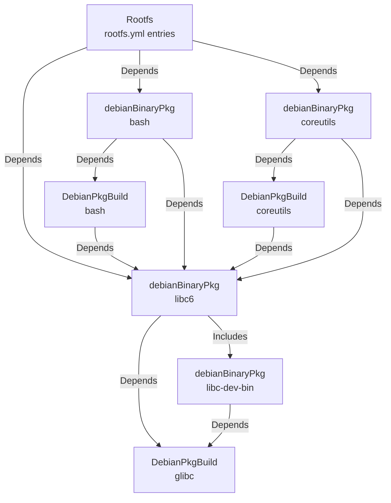
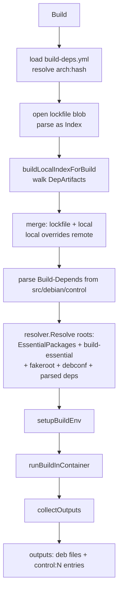
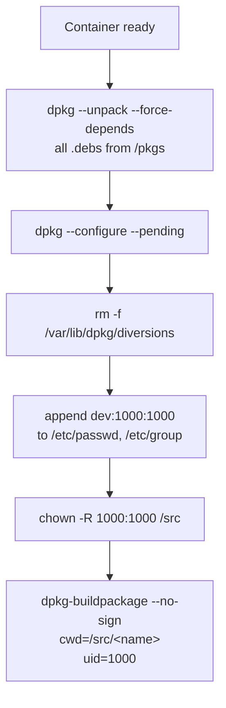
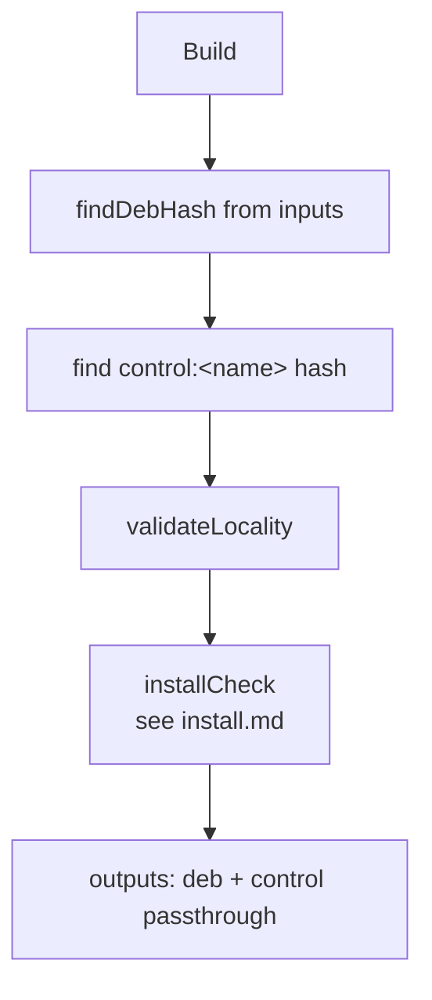
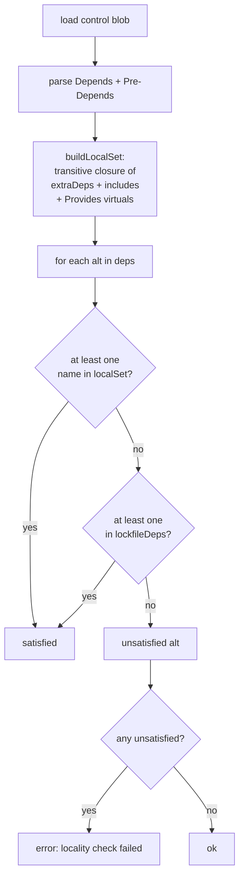
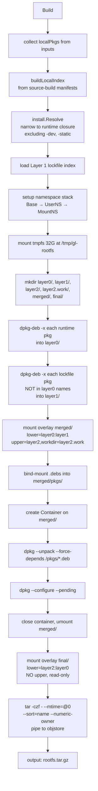
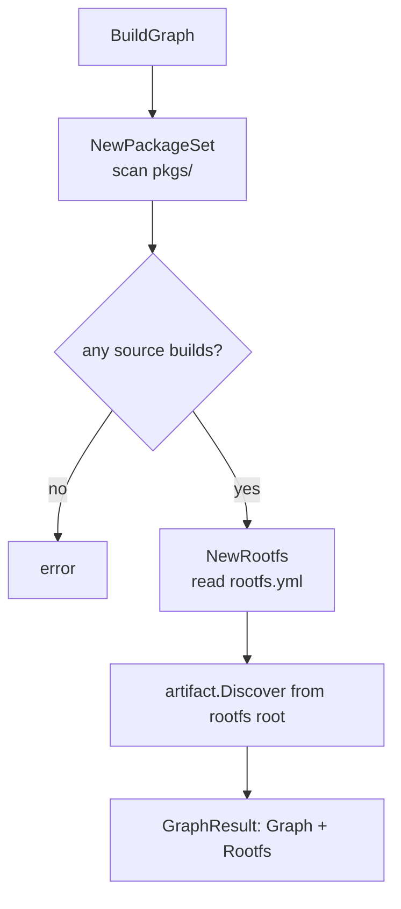

# `build` — Concrete Artifact Types

Three artifact types — `DebianPkgBuild`, `debianBinaryPkg`, `Rootfs` — plus the `PackageSet` registry and the `BuildGraph` entry point.

```
internal/build/
├── source.go         # DebianPkgBuild type + Build orchestration
├── build_phases.go   # setupBuildEnv, runBuildInContainer, collectOutputs,
│                     # buildLocalIndexForBuild, build-deps parsing
├── exec_helpers.go   # execIn/execInMountNS/execCapture/pipeFromContainer:
│                     # thin wrappers over container.Run
├── mount_helpers.go  # setupDirsInMountNS, setupLocalRepoInMountNS
├── walk.go           # walkBinaries closure + makeLocalIndex helper
├── manifest.go       # parsePackageFromManifest (artifact-engine manifest format)
├── binary.go         # debianBinaryPkg — validation gate
├── install_check.go  # debianBinaryPkg.installCheck flow
├── rootfs.go         # Rootfs — three-layer overlay assembly
├── graph.go          # PackageSet, BuildGraph
├── buildyml.go       # build.yml typed loaders + control parsing helpers
├── config.go         # typed YAML structs (BuildYML, SourcesYML, RootfsYML, ArchHash)
└── *_test.go
```

## The shape of the graph



Reading the edges:

- **Source build → no Includes; Depends on the binary packages it lists in `build.yml depends`.** Those binary packages are themselves validation gates over their own source builds, so a `DebianPkgBuild` waits transitively for everything its build-time deps resolve to.
- **Binary package → Depends on its parent source build (always) plus any cross-source `runtime_depends`.** Same-source siblings go into Includes (closure-only).
- **Rootfs → Depends on the binaries listed in `rootfs.yml` directly. The transitive closure (including same-source siblings and other binaries' runtime deps) is reached via Includes propagation in the engine.**

## `DebianPkgBuild`

```go
type DebianPkgBuild struct {
    Name         string
    PkgDir       string                 // absolute path to pkgs/<name>/
    Arch         string
    RepoURL      string                 // upstream apt repo for build-deps
    DepArtifacts []artifact.Artifact    // resolved binary deps
    StubPath     string
    pkgSet       *PackageSet
    binaries     map[string]*debianBinaryPkg
    ...
}
```

Constructed via `NewDebianPkgBuild(cfg)`. Both `PkgDir` and `StubPath` are forced to absolute paths because they cross the MountNS boundary where CWD is `/`.

### Identity

```go
parts := []string{
    dirhash.HashDirectory(s.PkgDir),    // hash of pkgs/<name>/ tree
    s.Arch,
}
for _, dep := range s.DepArtifacts {
    parts = append(parts, dep.Identity().String())
}
return ConcatHash(parts...)
```

So the source build's identity captures: every byte under `pkgs/<name>/` (build.yml, build-deps.yml, src/debian/, sources.yml…), the target architecture, and the identities of every binary dep — which themselves include their parent source builds' identities. Change anything reachable from this node and the cache invalidates.

### Depends, Includes, Inputs

```go
func Depends() []artifact.Artifact { return s.DepArtifacts }   // resolved from build.yml depends
func Includes() []artifact.Artifact { return nil }             // source builds have no closure-only edges
func Inputs() []artifact.Input {
    // For each direct binary dep, ask for its .deb and control:<name>.
    // Crucially: NOT recursive — only DIRECT deps go into the build chroot
    // (transitive closure stays in the validation phase). This avoids
    // version conflicts in the chroot when overrides override overrides.
}
```

The "non-recursive Inputs" is a hard lesson — see the decision log entry from 2026-05-12 about `DebianPkgBuild.Inputs() is NON-RECURSIVE`.

### `Build()` — what actually happens



#### `setupBuildEnv` — the namespace stack

Build wraps four layers, one per call:

```
BaseExecEnv → UserNS → MountNS → Container
```

- `BaseExecEnv`: host `os/exec`. Owns nothing.
- `UserNS`: stub running with the calling user's uid mapped to inner 0, plus 65535 subordinate ids mapped at inner 1+.
- `MountNS`: mounts a 32 GiB tmpfs at `/tmp/gl-build`. Inside it, creates `rootfs/` as the build chroot, extracts every resolved `.deb` via `dpkg-deb -x`, sets up `var/lib/dpkg/{status,available,info,updates,triggers}`, bind-mounts every `.deb` into `rootfs/pkgs/<name>_<ver>_<arch>.deb`, copies the source tree (`pkgs/<name>/src/` → `rootfs/src/<name>/`), bind-mounts orig tarballs from objstore alongside the source, and extracts them with `tar --strip-components=1`.
- `Container`: `pivot_root` into `rootfs/`. The build runs here.

Why the bind-mount for `.debs` instead of copy: a single dpkg-buildpackage chroot can pull in 200–500 packages; copying multi-MB blobs to tmpfs every build chews RAM for no reason. Bind mounts are free.

Why the orig tarballs are bind-mounted *and then extracted*: `dpkg-source -b` (run by `dpkg-buildpackage`) needs the orig tarball at `/src/<pkg>_<ver>.orig.tar.<ext>` (parent of source dir). The bind mount makes the file appear there with zero copy; the extracted tree serves as the actual build directory.

#### `runBuildInContainer` — the dpkg/buildpackage dance



- The two-pass `--unpack --force-depends` then `--configure --pending` is the standard "install a closed set of debs without caring about Pre-Depends ordering, then run maintainer scripts in the right order" pattern. Any dep cycle that would normally break dpkg gets postponed past the unpack.
- `rm -f /var/lib/dpkg/diversions` is a workaround for cases where two packages diverted the same file — dpkg --configure fails on stale diversion entries.
- The `dev:1000:1000` user is appended directly to `/etc/passwd` and `/etc/group` rather than running `useradd` (which requires the `passwd` package). base-passwd, which IS installed, gives us the file format.
- The `gl~` version is computed and stamped onto `debian/changelog` *before* the container is created — `setupBuildEnv`, after copying the source tree and extracting orig tarballs, prepends a fresh changelog entry (`<srcName> (<base>+gl~<srcHash[:8]>) UNRELEASED ...`) authored by `nobody <nobody@localhost>` and dated with the trailer timestamp of the existing top entry. The existing entries (and their version numbers) are left untouched. This is done by opening the in-namespace file via `mountNS.Open` and writing the new content directly through the returned FD — no binary in the chroot is required. dpkg-buildpackage then reads the top entry, so this is the version it stamps onto the produced .debs; mirroring the date keeps `SOURCE_DATE_EPOCH` identical to what an unmodified build would have used.
- `dpkg-buildpackage --no-sign` runs as uid 1000. Build env comes from `build.yml extra_build_env` plus `DEB_BUILD_PROFILES`/`DEB_BUILD_OPTIONS` if set. Stdout/stderr are captured into the per-task log.

#### `collectOutputs` — extracting .debs without leaving the namespace

The .debs are produced inside the container's tmpfs at `/src/*.deb` — invisible to the host. Collecting them:

```
1. find /src -maxdepth 1 -name '*.deb' (capture stdout)
2. for each .deb:
   - cat /src/<name>.deb | <pipe to objstore.Blobs.Store>
   - dpkg-deb -f /src/<name>.deb (capture stdout) → control blob
   - emit Output{Name=<filename>, Hash=<deb hash>}
   - emit Output{Name="control:<pkgname>", Hash=<control hash>}
```

`pipeFromContainer` exec's `cat` inside the container and pipes its stdout directly into `store.Blobs.Store(reader)` — no intermediate temp file, no host-visible bytes. The control blob is small enough to capture into a Go string.

After this, the cleanup defer chain unwinds the namespaces, the tmpfs disappears, and the only persistent artifacts are the blobs and the manifest.

## `debianBinaryPkg`

A validation gate. Does NOT compile anything. Confirms that:

1. The named binary actually came out of the parent source build.
2. Every runtime dependency is satisfiable from the local build set.
3. `dpkg --install` actually works in a freshly-bootstrapped chroot (the install check).

Constructed exclusively via `DebianPkgBuild.Binary(name)`:

```go
glibc := pkgSet.sourceBuilds["glibc"]
libc6 := glibc.Binary("libc6")   // creates or returns cached
```

### Depends and Includes

```go
func Depends() []artifact.Artifact {
    return []{ b.sourceBuild, ...b.extraDeps }   // parent + cross-source rdeps
}
func Includes() []artifact.Artifact {
    return b.includes   // same-source siblings only
}
```

`resolveExtraDeps` reads `build.yml`:

- Per-binary `runtime_depends:` map: each entry is a list of `src:pkg` references for that specific binary's runtime deps.
- Top-level `depends:` list (src:pkg pairs): adds to every binary in this source.
- Each `src:pkg` is looked up in the PackageSet. If it points to a sibling in the same source build, it goes into `includes`; otherwise into `extraDeps`.

This split is the **sibling cycle** fix. Two binaries from the same source build can declare each other as runtime deps without creating a graph cycle, because Includes don't impose ordering on the includer.

### Identity

```go
parts := []string{"binary-pkg", b.name, sourceBuild.Identity().String()}
for _, dep := range b.extraDeps { parts = append(parts, dep.Identity().String()) }
for _, sib := range b.includes { parts = append(parts, "include:"+sib.Key()) }
return ConcatHash(parts...)
```

Note: siblings contribute their **Key()** rather than Identity. Identity-of-sibling would mutually recurse (A's identity includes B's identity which includes A's identity…). Same-source content changes are already reflected via `sourceBuild.Identity()`, so Key suffices to pin which siblings are referenced.

### Inputs

```go
inputs := [
    {sourceBuild, "<name>.deb"},
    {sourceBuild, "control:<name>"},
]
for sib in includes:
    inputs += [
        {sourceBuild, "<sib.name>.deb"},     // siblings come from SAME source
        {sourceBuild, "control:<sib.name>"},
    ]
```

Both `.deb` and `control:` references use the **stable name** `<n>.deb` / `control:<n>`, which exact-matches the source build's outputs (the source build emits stable names, not version-decorated filenames). The artifact engine resolves these by exact name only — see [the artifact chapter](./artifact.md#resolving-inputs) for why prefix matching was removed.

### `Build()` — what actually happens



#### `validateLocality`



The locality check is the **HARD line** that guarantees every binary in the rootfs was built from source by us. A dep is satisfied when:

- One of its alternatives is in the local build set (closure of `extraDeps`, `includes`, and their `Provides`), OR
- One of its alternatives is in this binary's *own* `lockfile_deps:` allow-list — an explicit per-binary escape hatch for leaf packages we can't reasonably build from source (e.g., `linux-libc-dev`, `rpcsvc-proto`) and for shlibs-introduced runtime libs not wired into the explicit graph (e.g., `libgcc-s1`). `lockfile_deps:` entries on other binaries in the closure are not considered.

If neither holds, the build fails with a list of unsatisfied alternatives. There's no quiet fallback.

The output of a successful binary package is just a passthrough of the parent's `.deb` and control:

```go
return []Output{
    {Name: <actual deb filename>, Hash: debHash},
    {Name: "control:<name>",      Hash: controlHash},
}
```

So binary package artifacts add zero blobs to the store — they're pure validation. The engine still caches their identity → manifest mapping, so a successful validation isn't repeated.

## `Rootfs`

```go
type Rootfs struct {
    Name       string
    Arch       string
    DirectDeps []*debianBinaryPkg     // from rootfs.yml
    baseDir    string                  // conf-dir, holds rootfs.yml + rootfs-deps.yml
    stubPath   string
    ...
}
```

Constructed via `NewRootfs(cfg)`, which reads `<baseDir>/rootfs.yml` and resolves each `src:pkg` entry through `PackageSet.Binary`.

### Depends, Includes, Inputs

```go
func Depends() []artifact.Artifact { return DirectDeps as []Artifact }
func Includes() []artifact.Artifact { return nil }
func Inputs() []artifact.Input {
    for bp in allBinaryDeps():    // recursive closure!
        inputs += [{bp, bp.name+".deb"}, {bp, "control:"+bp.name}]
}
```

`allBinaryDeps` walks `DirectDeps` recursively through `extraDeps` and `includes`, dedup by name. This is the **full** runtime closure, dev-packages and all. It delegates to the package-level `walkBinaries` helper in `walk.go`, which is the same closure traversal used by `debianBinaryPkg.buildLocalIndex` and `DebianPkgBuild.buildLocalIndexForBuild`.

### Identity

```go
parts := ["rootfs", Name, Arch, lockfileHash]
for bp in allBinaryDeps():
    parts = append(parts, bp.Identity())
return ConcatHash(parts...)
```

Includes the rootfs lockfile hash so changing `rootfs-deps.yml` invalidates the cached rootfs.

### `Build()` — the three-layer overlay



Layer breakdown:

| Layer | Contents | Fate |
|-------|----------|------|
| **Layer 0** | `dpkg-deb -x` of locally-built `.deb` files, narrowed by `install.Resolve` to the runtime closure (no -dev/-static) | **Kept** — appears in final |
| **Layer 1** | `dpkg-deb -x` of lockfile packages whose names are not in the Layer 0 install set (provides Debian infrastructure: dpkg, perl-base, etc., needed by postinst scripts). Filter is the narrowed install set, not the full build closure — so a sibling-include that we built but did not install (e.g. `libc-bin` cross-pinned from `libc6`) still comes from the lockfile mirror here. | **Discarded** — not in final |
| **Layer 2** | Upper dir of the build overlay; captures all writes from `dpkg --unpack` and `dpkg --configure --pending` (postinst, ldconfig, alternatives, dpkg status DB, etc.) | **Kept** — appears in final |

The first overlay (`merged/`) is `lower=layer0:layer1, upper=layer2`. dpkg writes into the upper; reads cascade through layer0 then layer1.

After dpkg finishes, the build container closes, `merged/` is unmounted, and a **second** overlay is mounted at `final/` with `lower=layer2:layer0` and **no upper** — Layer 1 is excluded from the final view. This is what gets tar'd up.

The tar is invoked with `--mtime=@0 --sort=name --numeric-owner` for byte-stable output, and piped directly to `objstore.Blobs.Store`. No host-visible bytes.

### Why a two-step overlay

You could imagine just `dpkg-deb -x` everything into one directory and skipping the overlay. But that loses two important properties:

1. **The build-time view needs Layer 1 (postinst scripts need perl-base, dpkg, awk, etc.) but the output rootfs must NOT contain them.** Without overlays, you'd have to manually delete every Layer-1-only file after install — fragile and slow. The discard-on-final-overlay approach is structural.
2. **Postinst scripts make modifications across files that already exist in Layer 0.** Those modifications need to survive into the final output. The upper dir captures exactly those mutations.

## `PackageSet` — the registry

```go
type PackageSet struct {
    pkgsDir      string
    arch         string
    repoURL      string
    sourceBuilds map[string]*DebianPkgBuild
    localSet     map[string]bool       // binary names + virtual provides
    providesMap  map[string][]string   // binary → its virtual provides
}
```

`NewPackageSet(pkgsDir, ...)` scans `pkgs/`, creates one `DebianPkgBuild` per directory containing `src/debian/control`, and indexes:

- `localSet`: every binary package name AND every virtual `Provides:` name across all source builds. This is the "is X locally built?" lookup used by `validateLocality`.
- `providesMap`: a per-binary mapping from package name to virtuals it provides — used in `buildLocalSet` so a closure that includes `bash` also accepts `awk` (which `bash` provides? no — but `mawk` does provide `awk`, etc.).

Lookups:

| Method | Returns |
|--------|---------|
| `Binary(src, pkg)` | `*debianBinaryPkg` for `src:pkg`, creating the `DebianPkgBuild` lazily |
| `BinaryByName(name)` | scans all source builds for a binary with that name |
| `LocalSet()` / `ProvidesMap()` | the indexed maps |

## `BuildGraph` — the entry point

```go
func BuildGraph(cfg GraphConfig) (*GraphResult, error)
```



This is what `cmd/gl/build.go` calls before constructing the engine. The discovered graph contains the rootfs, every binary package it transitively reaches, every binary's parent source build, and every transitive build-dep — fully wired with Depends and Includes edges. The engine then runs it.

## Gotchas

- **`DirectDeps` is not enough for the rootfs.** `Inputs()` walks the full closure via `allBinaryDeps()`. If you ever forget to walk includes there, only direct deps' `.debs` go into the rootfs and you ship a broken libc.
- **Sibling Includes must NOT also be in `extraDeps`.** `resolveExtraDeps` partitions: same-source siblings go to `includes`, cross-source go to `extraDeps`. Putting a sibling in `extraDeps` would create a cycle (sibling → parent source → sibling).
- **Glibc packages need each other in `runtime_depends:`.** libc6, libc6-dev, libc-dev-bin, libc-gconv-modules-extra all have `(= version)` deps on each other. The engine doesn't auto-overlay siblings, so the glibc template wires them explicitly via `runtime_depends:` (same-source ⇒ closure-only Includes, no cycle). See [Dependency Locality](../../guidelines/dependency-locality.md).
- **The local index for build chroots merges over the lockfile.** `buildLocalIndexForBuild` (in `build_phases.go`) collects the `*debianBinaryPkg` roots from `DepArtifacts` and hands them to `makeLocalIndex` in `walk.go`. The walk follows `extraDeps`+`includes` and loads exactly the named binary from each visited source's manifest via `DebianPkgBuild.LoadBinaryPkg`. Siblings are only included if they're explicitly named via `depends:` or `runtime_depends:`. Mirror packages with `(= same-version)` cross-pins to a partially-overlaid sibling set will fail to resolve unless the missing siblings are wired explicitly.
- **Rootfs runtime closure is computed via `install.Resolve` against a local-only index.** This is how `-dev` and `-static` packages get filtered out: they're in `allBinaryDeps()` for the build closure, but `install.Resolve` only follows runtime `Depends`/`Pre-Depends`.
- **All paths into the namespace must be absolute.** `PkgDir`, `StubPath`, blob paths from `store.Blobs.Path()` — all forced absolute. CWD inside the namespace is `/`, and a relative path will resolve there, not at the host's CWD.
