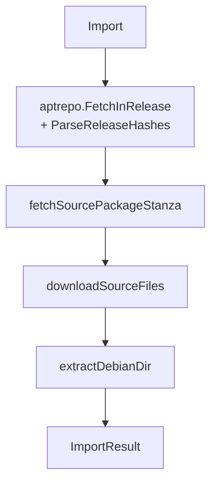
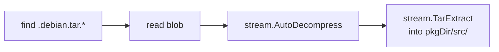
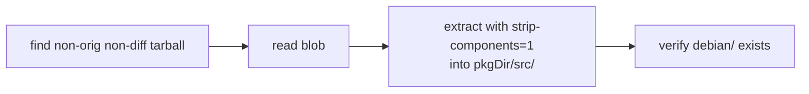
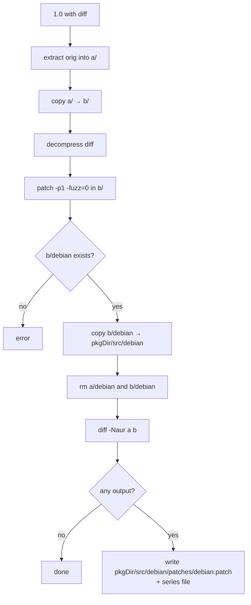

# `importer` — Source Import

Pull a Debian source package from an APT repository, verify it, store its `orig.tar.*` blobs, and lay out `pkgs/<name>/` in the staging tree. The output is a directory ready for the build system to consume — `sources.yml` pointing at orig blobs, plus `src/debian/` (or the full source tree, for native packages) ready for `dpkg-buildpackage`.

```
internal/importer/
├── import.go        # Import() entry point: InRelease → Sources.gz → blobs → extract
├── formats.go       # 3.0 (quilt), 3.0 (native), 1.0 with diff
├── sources_yml.go   # write/parse sources.yml
└── *_test.go
```

The `InRelease` fetch + verify + Release-hash parsing is delegated to [`debian/aptrepo`](../debian/aptrepo.md), which is shared with `lockfile`.

## The `Import` entry point

```go
type ImportConfig struct {
    Ctx       context.Context
    Store     *objstore.Store
    RepoURL   string         // default https://deb.debian.org/debian
    Dist      string         // default "testing"
    Keyring   string         // default /usr/share/keyrings/debian-archive-keyring.gpg
    OutputDir string         // staging repo / conf-dir root
    NoVerify   bool          // skip GPG verification (still strips clearsig envelope)
    Cookie     string        // cache key for InRelease — see below
    HTTPClient *http.Client
}

func Import(cfg ImportConfig, packageName string) (*ImportResult, error)
```

The flow:



`Import` itself is a thin entry point: validate inputs, run the InRelease prelude, then call three named-phase helpers. Each helper owns one "Step N" of the original linear function:

| Helper | Owns |
|--------|------|
| `aptrepo.FetchInRelease` + `ParseReleaseHashes` | Steps 1–3 (InRelease cookie cache, GPG verify/strip, Release SHA256 map) |
| `fetchSourcePackageStanza` | Steps 4–6 (Sources.gz blob cache, decompress, find package by best version) |
| `downloadSourceFiles` | Step 7 (download and store every source file) |
| `extractDebianDir` | Steps 8–9 (mkdir pkgs/&lt;name&gt;/, format-dispatch extract, write sources.yml, build ImportResult) |

After the helpers, `Import` creates one **source pin** naming the orig-tarball blobs (`result.Sources`), so a GC before the first remote push cannot lose them. See [oci-cache-design.md](../../concepts/oci-cache-design.md).

The drilldown of each step:

### Step 1-3: InRelease and the Release SHA256 map

Steps 1 (cookie cache + download), 2 (GPG verify or strip-clearsig), and 3 (parse Release stanza into a path → SHA256 map) are all handled by `aptrepo.FetchInRelease` + `aptrepo.ParseReleaseHashes`. See [`debian/aptrepo`](../debian/aptrepo.md) for details. The cookie pattern lets a CI run pin a snapshot of the apt index (`--cookie 2026-05-12`) and replay imports against the same data weeks later.

After this prelude, the importer has `releaseHashes["main/source/Sources.gz"]` and proceeds to step 4.

### Step 4: Sources.gz — content-addressed cache

(Inside `fetchSourcePackageStanza`.) The Release file gives us an authoritative SHA256 for `Sources.gz`. We use that hash directly as the blob key:

```go
sourcesHash := objstore.NewHash(expectedHash)
if store.Blobs.Has(sourcesHash) { /* load from store */ }
else { fetch, sha-check, store }
```

This means re-imports against the same apt snapshot read Sources.gz from disk, no network. And because the hash *came from a verified InRelease*, the cache is trustworthy.

### Step 5: gzip decompress + parse

(Still inside `fetchSourcePackageStanza`.) Standard deb822 stanza walk via `internal/debian/deb822`. Each stanza is a source package.

### Step 6: best-version match

(Tail of `fetchSourcePackageStanza`, delegated to `findSourcePackage`.)

```go
for stanza in sources:
    if stanza["package"] != name: continue
    if best == nil || version.Compare(stanza.Version, best.Version) > 0:
        best = stanza
```

Testing is a rolling release; multiple versions of the same package can appear in `Sources.gz`. We pick the highest one by deb-version comparison.

### Step 7: download all source files

(`downloadSourceFiles`.) Each file has `{hash, size, name}` from the stanza's `Checksums-Sha256:` field. For each:

- If `store.Blobs.Has(hash)`: skip the download.
- Otherwise GET, verify SHA256, store.

All source files (`.dsc`, `.debian.tar.*`, orig tarballs, detached `.asc`/`.sig`) are stored as blobs, but only the orig tarballs are protected from GC — via a source pin created once at the end of the import (below), not per-file. The `.dsc` and cached indexes are re-fetchable, so they are left unpinned.

### Step 8: extract by format

(`extractDebianDir` calls `extractDebian`.) Format dispatch in `formats.go`:

| Format | Handler |
|--------|---------|
| `3.0 (quilt)` | `extractQuilt` |
| `3.0 (native)` | `extractNative` |
| `1.0` | `extractLegacy` (with or without diff) |

### Step 9: write sources.yml

Filter to just orig tarballs (the build system's `setupBuildEnv` bind-mounts these from blobs). Format:

```yaml
- name: "bash_5.2.37.orig.tar.gz"
  hash: "abc123...64hex"
- name: "bash_5.2.37.orig-doc.tar.gz"
  hash: "def456...64hex"
```

## The format handlers

### `3.0 (quilt)` — the common case



The debian tarball contains a top-level `debian/` directory with all packaging (control, rules, patches, etc.). We extract verbatim.

### `3.0 (native)` — the orig-only case



Native packages put the entire source tree (including `debian/`) in a single tarball. We extract everything — `pkgDir/src/` becomes the build directory, not just `pkgDir/src/debian/`. The build system knows about this distinction and copies the right tree.

### `1.0` — the legacy bridge

If there's no diff file, treat as native. If there's a `.diff.{gz,xz,bz2}`, things get interesting:



The trick: 1.0 diffs can touch files **outside** `debian/` (legacy practice — Debian-specific changes were a single big patch). Our normalized output is quilt-style: `debian/` in tree + a single quilt patch in `debian/patches/debian.patch` carrying the non-debian changes. After this transformation, the source looks indistinguishable from a 3.0 (quilt) package and the rest of the system doesn't have to know about format 1.0.

The `patch -p1 --fuzz=0` invocation is intentional: `--fuzz=0` rejects loose matches, ensuring the patch we generate corresponds exactly to the source we have. `diff -Naur` produces a unified diff that quilt can apply.

The mtime-bearing `\t<timestamp>` suffixes that `diff -Naur` writes onto its `---` / `+++` header lines are stripped before the patch is written to disk. `patch(1)` ignores those timestamps, but they would otherwise be wall-clock-current (the `b/` tree comes from `copyDir`, which doesn't preserve mtimes, and `patch(1)` rewrites mtimes to "now"), making `debian.patch` non-reproducible across runs.

## Compression handling

The decompressors are subprocess pipes (`stream.GzipDecompress`, `stream.XZDecompress`, `stream.Bzip2Decompress`) with an auto-detect helper `stream.AutoDecompress(reader, filename)` that picks the right codec by suffix. Tar extraction is `stream.TarExtract` (extracts already-decompressed) or `stream.TarExtractCompressed` (decompresses on the fly).

## What ends up on disk

After a successful import of `bash`:

```
<OutputDir>/pkgs/bash/
├── sources.yml              # orig tarball list
└── src/
    └── debian/
        ├── control
        ├── rules
        ├── changelog
        ├── patches/
        │   └── ...
        └── ...
```

Plus blobs in the object store:
- `bash_5.2.37.orig.tar.gz` (protected by the source pin)
- `bash_5.2.37-2.debian.tar.xz` (regular, GC-eligible)
- `Sources.gz` (regular, GC-eligible — re-fetchable)
- `InRelease` (cookie-pinned if `--cookie` was set)

## Gotchas

- **Sources.gz hash comes from InRelease.** The whole chain of trust starts at the GPG-verified InRelease. If `--no-verify` is used, the SHA256 still gates the download — but you're trusting the bytes on the wire to deliver an InRelease worth that SHA256.
- **Orig tarballs are "Sources" blobs and survive GC.** Other artifacts (Sources.gz, InRelease without cookie, debian.tar.*) are regular blobs, GC-eligible. Orig tarballs are not re-derivable from anything in the staging tree, so they need pinning.
- **`patch -p1 --fuzz=0` will reject if your blob's bytes don't match exactly.** This is by design — silent fuzzy patching would mean your imported source differs from upstream's. If a 1.0-with-diff fails to import, there is a real mismatch; investigate, don't loosen.
- **The importer doesn't write `build.yml` or `build-deps.yml`.** Those are authored by the conf-dir maintainer; importing is just the source-tree side. After import, run `gl lockfile <pkg>` to generate `build-deps.yml`.
- **No locking on staging-repo writes.** The importer writes into `<OutputDir>/pkgs/<name>/`. Don't run two imports of the same package concurrently — there's no file-locking.
