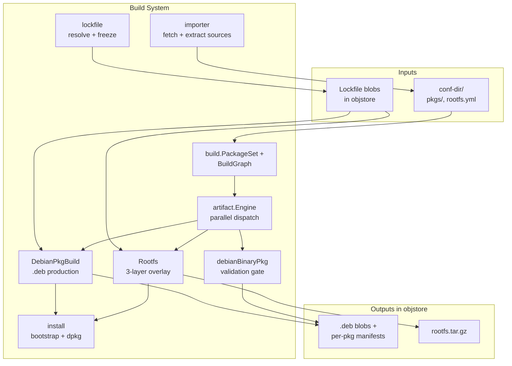

# Build System

The Build System is the heart of gl-ng: it turns a directory of declarative inputs (`pkgs/<name>/build.yml`, `rootfs.yml`, lockfile blobs) into actual `.deb` files and a final root filesystem tar. It sits on top of the Foundations, the Debian Format Layer, and the Build Isolation Runtime — calling into all three.

## What lives here

| Package | Role |
|---------|------|
| `internal/artifact` | The graph engine. Generic — knows nothing about Debian. |
| `internal/build` | Concrete artifact types (`DebianPkgBuild`, `debianBinaryPkg`, `Rootfs`) and the `PackageSet` registry. |
| `internal/importer` | Fetch a Debian source package from an APT repo, extract `debian/`, write `sources.yml`. |
| `internal/lockfile` | Resolve a package's build-deps against a Debian Packages index and freeze the result as a blob. |
| `internal/install` | The bootstrap + `dpkg --unpack`/`--configure --pending` install primitives shared by source builds, install checks, and rootfs assembly. |

## How a build flows through these packages

When the user runs `gl build`:

1. **`build.BuildGraph`** scans `pkgs/`, builds a `PackageSet`, instantiates a `Rootfs` from `rootfs.yml`, and calls **`artifact.Discover`** to walk the dependency tree.
2. **`artifact.Engine.Run`** schedules nodes onto worker goroutines. For each node:
   - Identity is computed → if cached in `objstore.Map`, skip and load the manifest.
   - Otherwise resolve `Inputs()` to concrete blob hashes from upstream outputs and call `Build()`.
3. **`DebianPkgBuild.Build`** — the heaviest node — calls into **`internal/install`** to bootstrap a build chroot from the lockfile, then runs `dpkg-buildpackage` inside a `Container`.
4. **`debianBinaryPkg.Build`** validates the parent's `.deb` against the locality rule and runs an isolated `installCheck`.
5. **`Rootfs.Build`** assembles the three-layer overlay — Layer 0 from local `.debs`, Layer 1 from the rootfs lockfile, Layer 2 captures `dpkg --configure` mutations.

The same `install` primitives are reused at every layer where dpkg has to run.

## Reading order

1. [`artifact`](./artifact.md) — the graph engine. Read first; everything else implements its `Artifact` interface.
2. [`build`](./build.md) — the three concrete artifact types and the `PackageSet` registry.
3. [`importer`](./importer.md) — the source-import pipeline (Sources index → orig tarballs → `pkgs/<name>`).
4. [`lockfile`](./lockfile.md) — the lockfile generator (Packages index → resolved set → blob).
5. [`install`](./install.md) — bootstrap, resolve, install primitives shared across builds.
