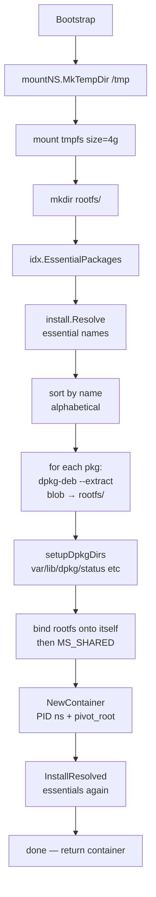
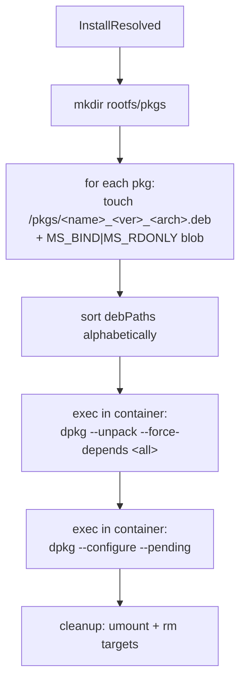
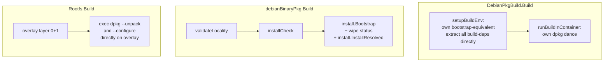
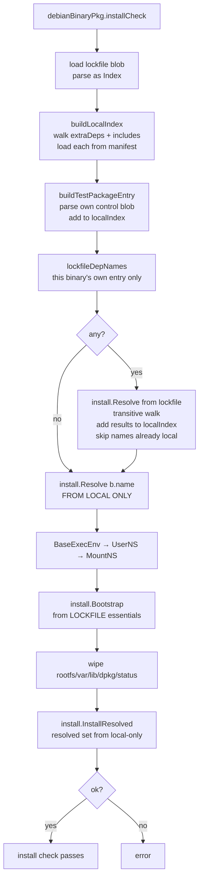

# `install` — Bootstrap and Install Primitives

Three small functions, used everywhere dpkg has to actually install something into a chroot: source builds (build-deps in the build chroot), binary-package install checks, and rootfs assembly all share this code path.

```
internal/install/
├── bootstrap.go    # Bootstrap: from empty rootfs → working dpkg-aware system
├── install.go      # InstallResolved, Install: bind-mount + dpkg --install set
├── resolve.go      # Resolve: thin wrapper over the resolver
└── *_test.go
```

## The three primitives

```go
func Bootstrap(ctx, mountNS, store, idx, arch, stubPath) (*Container, rootfsPath, cleanup, error)
func InstallResolved(ctx, cont, mountNS, store, rootfsPath, pkgs) error
func Resolve(idx, arch, names) ([]*Package, error)
func Install(ctx, cont, mountNS, store, idx, arch, rootfsPath, names) error  // = Resolve + InstallResolved
```

`Resolve` is one screen long: build `[]Requirement` from names, run the resolver, return packages. The actual work lives in `Bootstrap` and `InstallResolved`.

## `Bootstrap` — going from empty to dpkg-ready

The hard part of installing anything Debian-like is the chicken-and-egg: dpkg needs `/var/lib/dpkg/status` to exist before it'll do anything, dpkg itself ships in a deb that has Pre-Depends on libc6, libc6 has Pre-Depends on dpkg's pre-installed scripts… The standard Debian solution (debootstrap) is "raw-extract a closed set of essential packages, then run dpkg in two phases." We do the same.



A few things in this flow earn explanation:

### `dpkg-deb --extract` first, then `dpkg --install` again

Step H rips the file contents of every essential package into `rootfs/` with no metadata bookkeeping — just files in the right places. Step L then runs `dpkg --unpack` + `--configure --pending` over the **same** package set, which populates `/var/lib/dpkg/status` (and runs all the postinst/preinst scripts). Both passes are necessary:

- Without the raw extract first, step L can't run — dpkg itself isn't installed yet.
- Without the dpkg pass, the system has files but no dpkg metadata — installing more packages later would think nothing's there and try to overlay duplicates.

### `MS_SHARED` is the crucial bit

```go
mountNS.Mount(rootfsPath, rootfsPath, "", MS_BIND, "")
mountNS.Mount("",         rootfsPath, "", MS_SHARED, "")
```

The Container created in step K uses `MS_SLAVE` propagation — mounts done in the parent (MountNS) propagate INTO the container, but mounts done in the container don't propagate OUT. For that propagation to work at all, the parent's mount has to be `MS_SHARED`. Without these two lines, every `mountNS.Mount` we do later (in `InstallResolved`, bind-mounting .debs into `/pkgs`) would be invisible to the Container — dpkg would see `/pkgs/` as empty.

### Alphabetical extraction order

```go
sort.Slice(corePkgs, func(i, j int) bool { return corePkgs[i].Name < corePkgs[j].Name })
```

Files from later-extracted debs overwrite files from earlier ones. By sorting by name, two runs over the same input set produce byte-identical rootfs trees. This is one of several layers protecting the cache from non-determinism in Go map iteration.

### `setupDpkgDirs`

```go
mkdir var/lib/dpkg, var/lib/dpkg/info, var/lib/dpkg/updates, var/lib/dpkg/triggers
touch var/lib/dpkg/status, var/lib/dpkg/available
```

Empty status + available files plus the mandatory subdirs is what dpkg needs to start. base-passwd/base-files extracts contributed `/etc/passwd`, `/etc/group`, etc.; we don't touch those.

## `InstallResolved` — the bind-mount + two-phase dpkg



### Why bind-mount instead of copy

A modest installation pulls in 100–200 .debs averaging ~1 MB each — on coreutils' build chroot, that's ~150 MB of copies into tmpfs. Bind-mounting from the objstore costs zero bytes; the kernel just maps the same inode into a second path. The `MS_RDONLY` flag is paranoia — dpkg has no business writing to the deb files, and if it tries we'd rather error than silently corrupt the cache.

### Why `--unpack --force-depends` then `--configure --pending`

This is the **same** trick debootstrap uses. dpkg's normal install order is "configure deps first, then unpack the dependent." But essential packages are tied in cycles (libc6 ↔ libgcc-s1, dpkg ↔ tar ↔ gzip), so no linear ordering exists. The escape:

1. **Unpack everyone with `--force-depends`** — dpkg drops files into place but doesn't run maintainer scripts.
2. **`--configure --pending`** — now that all files are on disk, dpkg can topologically sort the configure step (which is what actually has cycle constraints) using the *staged* state of the dpkg DB.

If a real dependency is missing — i.e., we forgot to include something in `pkgs` — `--configure --pending` will fail loudly. The `--force-depends` only loosens the unpack-time check; configure stays strict.

### Path naming inside the container

The bind-mount target is `<rootfs>/pkgs/<name>_<version>_<arch>.deb`. The path passed to `dpkg --unpack` (running inside the container) is `/pkgs/<name>_<version>_<arch>.deb`. Same naming convention as `setupBuildEnv` uses for source builds — that consistency is intentional, so a future "install one of my own .debs" would be a one-line drop-in.

### Cleanup is explicit

```go
defer cleanupDebMounts(...)  // umounts each, then rm -f the empty target file
```

We could leave the bind-mounts in place — they'd unmount when the MountNS closes — but in long-running scenarios (rootfs build, which does multiple installs), holding 200 idle bind-mounts in the kernel's mount table is sloppy. Tear them down between phases.

## How callers use these



Three slightly different flavors:

- **Source builds** (`internal/build/build_phases.go::setupBuildEnv`+`runBuildInContainer`, with helpers in `mount_helpers.go` and `exec_helpers.go`) **don't use `install.Bootstrap`.** They have their own setup that's structurally similar but tuned for the bind-mount-everything-in-one-pass build chroot. Historical artifact — could be unified, hasn't been.
- **Binary install checks** (`installCheck` in `internal/build/install_check.go`) use the full `install.Bootstrap` + `install.InstallResolved` pair. This is the canonical caller.
- **Rootfs assembly** (`internal/build/rootfs.go`) runs dpkg directly against a pre-built overlay (Layer 0 + Layer 1 already extracted). It bypasses `install.Bootstrap` because the overlay already provides what Bootstrap would have produced; it bypasses `install.InstallResolved`'s bind-mount loop because `.debs` are bind-mounted by `Rootfs.Build` directly. The two-phase dpkg dance is replicated inline.

If you're reading this and thinking "why isn't this all in `install`," you're right — it's an open refactor. The cost is low because the dpkg dance is short and contained.

## The install-check flow in detail

This is the place the `install` primitives are wired together as the architecture intends, so it's worth tracing in full.



Two indices in play:

- `lockfileIndex` — what `Bootstrap` is given. Builds a working dpkg system from upstream Debian packages. This is a *tooling* environment, not the validation surface.
- `localIndex` — built from this binary's `extraDeps` + `includes` closure, with each package's metadata loaded from its parent source build's manifest. Plus the test package itself, plus packages reachable from this binary's *own* `lockfile_deps:` entry (transitively walked through the lockfile, skipping names already present locally so the locally-built version always wins). `lockfile_deps:` from binaries elsewhere in the closure are deliberately *not* consulted — see [the per-binary semantics note in build-yml.md](../../guide/build-yml.md#lockfile_deps).

The local-only `install.Resolve(localIndex, arch, [b.name])` is the **actual test**: if it fails, the binary's runtime closure isn't satisfiable from locally-built sources. The subsequent dpkg install confirms the closure is also actually *installable* (correct file layouts, no postinst-script crashes, etc.).

The dpkg-status wipe is the trick that lets us reuse the bootstrapped container. Files from essential packages stay (so dpkg itself works); the database is empty (so dpkg won't object to "reinstalling" things). It's the cheapest way to get a clean slate without re-bootstrapping.

### Walking via source-build manifests, not binary manifests

```go
// Note: walks extraDeps/includes, but loads from sourceBuild manifest,
// not from each binary's own validated manifest.
pkg := bp.sourceBuild.LoadBinaryPkg(bp.name, store)
```

The reason is timing. A sibling Include (`B` includes `A`, both children of source build `S`) doesn't impose ordering — they can be validated in either order or in parallel. So when `B`'s install check runs, `A`'s validation may not have completed, and `A`'s own manifest doesn't exist yet. But `S` is a `Depends` of both `A` and `B` (they all wait on it), so `S`'s manifest is guaranteed to exist by the time `B` runs.

`LoadBinaryPkg` is a thin wrapper around `parsePackageFromManifest` (in `internal/build/manifest.go`), which is the only place that knows the artifact-engine manifest format. Both call sites — `debianBinaryPkg.buildLocalIndex` and `DebianPkgBuild.buildLocalIndexForBuild` — go through `makeLocalIndex` in `walk.go`, which DFS-walks `extraDeps`+`includes` and calls `LoadBinaryPkg` per node.

`parsePackageFromManifest` looks for two entry kinds in the source-build manifest:

```
<hash> control:<binary-name>          → controlHash
<hash> <binary-name>_<ver>_<arch>.deb → debHash
<hash> <binary-name>.deb              → debHash (synthetic, from validation manifests)
```

The `.deb` and `control:` references together give us a complete `index.Package` we can hand to the resolver.

## Gotchas

- **Tmpfs size is hardcoded to 4G.** This is enough for binary install checks (~150–300 MB rootfs), but if you ever try to run `Bootstrap` with a much larger essential set, bump it. Source builds — which have their own tmpfs at 32G — don't use this code path.
- **`MS_SHARED` on the rootfs is what makes bind-mounted .debs visible inside the container.** If you change `Container` to use `MS_PRIVATE` propagation, the `dpkg --unpack /pkgs/foo.deb` line will fail with "no such file or directory" — the bind-mount happened, but the container can't see it. This is non-obvious and easy to break.
- **Sort, sort, sort.** Both essential extraction (alphabetical) and the unpack invocation (`sort.Strings(debPaths)`) are sorted. Without this, two bootstrap runs over the same input set diverge: file overwrite order changes (when two debs ship the same file), and dpkg's internal staging order changes too. Cache-buster.
- **`Install` (the helper) is rarely the right primitive.** It does `Resolve(names) → InstallResolved`. Almost every caller has a reason to handle resolve failure differently from install failure (or has already resolved against a custom index), so they call the two parts directly. `Install` exists for completeness; tests use it.
- **The container returned by `Bootstrap` owns the rootfs lifetime.** The cleanup function `cont.Close()`s it; the caller is responsible for the surrounding namespace stack (UserNS, MountNS, BaseExecEnv). `installCheck` shows the full nesting — you need that template if you write a new caller.
- **dpkg's exit codes are coarse.** Both `--unpack --force-depends` and `--configure --pending` either succeed (0) or print a multi-line failure to stderr and exit 1/2. We capture stderr and append the last 2 KB to the error. If you're debugging an install-check failure, that tail is your starting point — actual error context (which package, which file, which postinst) is buried in there.
