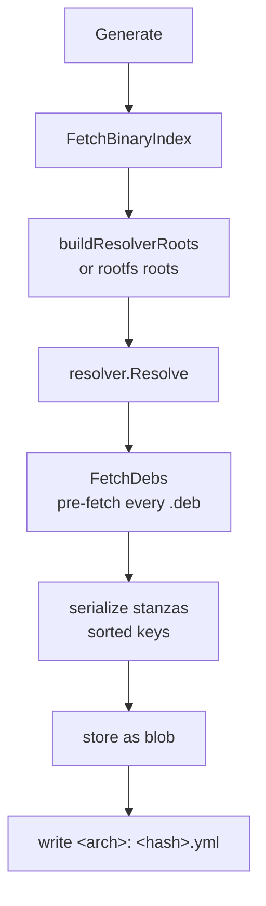
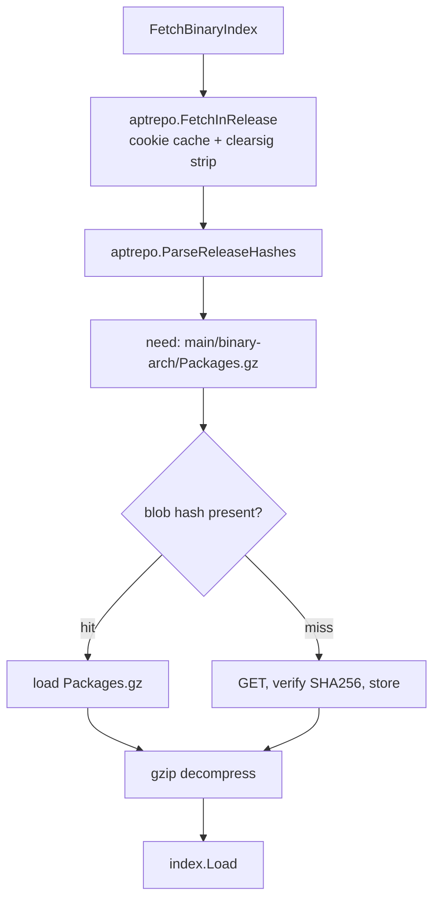
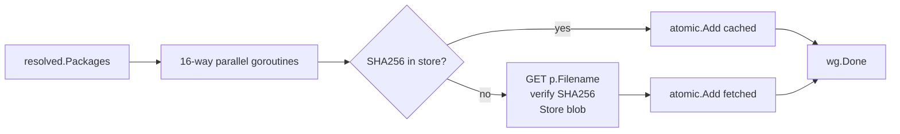

# `lockfile` — Lockfile Generation

Resolve a package's build-dependencies (or a rootfs's Layer-1 infrastructure deps) against the upstream Debian Packages index, freeze the result as a blob, write a tiny `<arch>:<hash>` pointer file, and pre-fetch every resolved `.deb` into the object store.

```
internal/lockfile/
├── generate.go      # Generate, GenerateRootfs, FetchBinaryIndex, FetchDebs
└── *_test.go
```

## Two entry points

```go
func Generate(cfg Config) (*Result, error)         // per-package: writes pkgs/<n>/build-deps.yml
func GenerateRootfs(cfg RootfsConfig) (*Result, error)  // rootfs-wide: writes rootfs-deps.yml
```

Both follow the same skeleton:



The difference is what goes into `roots`:

- `Generate`: Essential packages + `build-essential`/`fakeroot`/`debconf` + the parsed `Build-Depends`/`-Arch`/`-Indep` from `<pkg>/src/debian/control`, filtered by arch and active build profiles from `build.yml`.
- `GenerateRootfs`: Essential packages + `perl-base` + `mawk`. Just enough to run postinst scripts in Layer 1. **`apt` is intentionally excluded** — rootfs assembly is dpkg-only.

## `FetchBinaryIndex` — the apt-side cache chain

The InRelease fetch + cookie cache + Release-hash parsing is delegated to [`debian/aptrepo`](../debian/aptrepo.md), shared with the importer. `FetchBinaryIndex` calls `aptrepo.FetchInRelease` (with `NoVerify: true`, see note below) followed by `aptrepo.ParseReleaseHashes`, then handles the `Packages.gz` step itself:



Worth noting:

- **No GPG verification in the lockfile path.** `FetchBinaryIndex` passes `NoVerify: true` to `aptrepo.FetchInRelease`, which strips the cleartext envelope without verifying. The `importer` package does GPG-verify the InRelease used for source downloads, and lockfile resolution is parameterized by the same upstream — but we trust the cached SHA256 chain rather than re-verifying on every lockfile generation. If you want strict verification, run an import first.
- **The blob cache key for `Packages.gz` is the SHA256 from Release.** Same content-addressed trick as the importer uses for `Sources.gz`. Re-running `gl lockfile` against an unchanged apt snapshot is purely local I/O after the first hit.
- **Cookies pin InRelease.** Without cookies, every lockfile run downloads InRelease (small, ~100 KB). With `--cookie 2026-05-12`, the InRelease is fixed for that label — useful for reproducibility weeks after the run.

## `buildResolverRoots`

Per-package roots are assembled from three sources:

```go
roots := []
// 1. Every Essential: yes package — these MUST be present in any Debian environment
for pkg in idx.EssentialPackages():
    roots += {Name: pkg.Name}
// 2. Implicit build tooling — always present
for name in {"build-essential", "fakeroot", "debconf"}:
    roots += {Name: name}
// 3. Parsed build-deps from control, filtered by arch + profiles
for alt in buildDeps:
    pick first dep in alt that:
        - matches arch (no [arch] / [!arch] exclusion)
        - is not excluded by active build profiles
    if matched: roots += {Name, VersionOp, Version, VirtualEligible: true}
```

`VirtualEligible: true` lets the resolver satisfy a build-dep with a `Provides:` virtual (e.g., `awk` is provided by `mawk` and `gawk`).

The arch and profile filters apply at the alternative level — they do NOT propagate into the resolver. This is correct for build-deps (where the `[!arch]` syntax means "not this dep on this arch"), but means the resolver itself doesn't see arch-restricted alternatives. The `depends.Dependency.MatchesArch` and `ExcludedByProfiles` helpers do the filtering.

### Active profiles

```go
activeProfiles := buildcfg.LoadBuildYML(pkgDir).BuildProfiles
```

`build.yml` controls which profiles the resolver sees as active (via the neutral [`buildcfg`](../../glossary.md) loader, shared with `internal/build`). A dep restricted by `<!nobiarch>` or `<stage1>` is included only when those profiles are (or aren't) in the active list. See the gotcha section for the exact semantics.

## Resolver call

```go
r := resolver.New(idx, cfg.Arch)
result, err := r.Resolve(roots)
```

This is the backtracking DPLL solver from `internal/resolver`. It returns a fully closed set of `*index.Package` — every transitive Depends and Pre-Depends satisfied. Conflicts are honored. If unsatisfiable, the error includes the exploration tree.

## `FetchDebs` — parallel pre-fetch



- 16 concurrent fetches gated by a buffered semaphore. Network-bound; more parallelism mostly hits Debian mirrors with no benefit.
- Cache hit on `store.Blobs.Has(SHA256)` — every package in apt has a SHA256 in `Packages.gz`, so the blob key is just that hash.
- Verify SHA256 after download. Mismatch is a hard error.
- Errors are collected per-package; `FetchDebs` returns the first as the wrapped error and aggregates a count.

This pre-fetch is what makes the build chroot setup fast: when `DebianPkgBuild.Build` runs, it can `dpkg-deb -x` blobs straight from the local store with zero network.

## Stanza serialization — the lockfile blob

```go
for pkg in resolved.Packages:
    keys := pkg.Stanza keys, EXCEPT "filename" and "size"
    slices.Sort(keys)
    for k in keys:
        write "<Capitalized-Field>: <value>\n"
    write "\n"   // stanza separator
```

Three deliberate choices:

1. **Sorted keys.** Go map iteration is random; without sorting, the blob hash would change every run, defeating the cache. `slices.Sort` makes generation deterministic.
2. **Exclude `filename` and `size`.** These would tie the lockfile to mirror layout. The blob is keyed by SHA256, so consumers don't need the apt path or size.
3. **Capitalize the field names.** `package` → `Package`, `pre-depends` → `Pre-Depends`. The deb822 reader internally lowercases on parse; we re-capitalize on write because `index.Load` checks for `Package:` etc. — but really the format is case-insensitive; this is just for human readability.

The serialized text becomes a blob. The blob's hash is the lockfile identity.

## `<arch>:<hash>` pointer files

```go
// pkgs/<name>/build-deps.yml  or  rootfs-deps.yml
amd64: <64-hex-hash>
```

Per-arch — eventually multi-arch, today only amd64 lines exist. The build system reads this to find the lockfile blob:

```go
// in DebianPkgBuild.loadLockfileHash():
for line in build-deps.yml:
    if startsWith(arch + ":"):
        return parseHash(after the colon)
```

Tiny format, intentionally human-readable so you can `git diff` it and see the lockfile churn.

## What the lockfile blob looks like

```
Package: libc6
Version: 2.41-12
Architecture: amd64
SHA256: abc123...
Depends: libgcc-s1 (>= 4.2), libcrypt1 (>= 1:4.1.0)
Pre-Depends: ...
... 50+ more lines per stanza
                              <- blank line separator
Package: bash
Version: 5.2.37-2
...
```

Identical format to `Packages.gz` minus `Filename:` and `Size:`. `index.Load` parses it just like any deb822 stanza file. This means the same `*index.Index` types are used for the upstream apt index and the lockfile — no special parser.

## How `Generate` is invoked

```go
cfg := lockfile.Config{
    Ctx:       ctx,
    Store:     store,
    RepoURL:   "https://deb.debian.org/debian",
    Dist:      "testing",
    Arch:      "amd64",
    OutputDir: confDir,
    PkgName:   "bash",
    Cookie:    "2026-05-12",   // optional
}
result, err := lockfile.Generate(cfg)
// result.BlobHash, result.Arch, result.Packages
```

This is what `gl lockfile <pkg>` calls. After it returns, `confDir/pkgs/bash/build-deps.yml` exists and every resolved `.deb` is in the store.

## Gotchas

- **Profile filtering is non-trivial.** A dep with `<foo>` is included if profile `foo` IS active. A dep with `<!foo>` is included if profile `foo` is NOT active. Multiple groups: include if any group's terms all evaluate true. The lockfile generator and the source build BOTH have to apply this filter consistently — see decision-log entries on `<!nobiarch>` if behavior surprises you.
- **`detectArch` is host-derived and cached.** It shells out to `dpkg --print-architecture` once (via `sync.Once`) and falls back to `amd64` if dpkg is absent. The actual arch usually comes from `Config.Arch` or the CLI flag — auto-detection is the empty-string default.
- **`FetchDebs` is best-effort on log noise.** It logs every 10th success or the final tally. With ~500 packages and 16-way parallelism, expect ~50 log lines. The progress isn't a TaskTracker because lockfile gen runs outside the artifact engine.
- **No retry on download failure.** A flaky mirror means a failed lockfile run; rerun. The cache means the second run only retries the misses.
- **Removing `filename`/`size` is load-bearing.** If you ever need to add fields back, audit consumers — the build system's `setupBuildEnv` synthesizes the deb filename from `<name>_<version>_<arch>.deb`, not from the stanza's `Filename`. If you reintroduce `Filename`, the bind-mount target paths change and chroot setup breaks subtly.
- **InRelease isn't GPG-verified in the lockfile path.** This is a deliberate trade-off: the import path verifies, the lockfile path trusts the SHA256 chain. If you need verified lockfiles, do an `gl import` first (which pins the InRelease via cookie); subsequent lockfile runs reading that same cookie reuse the verified blob.
