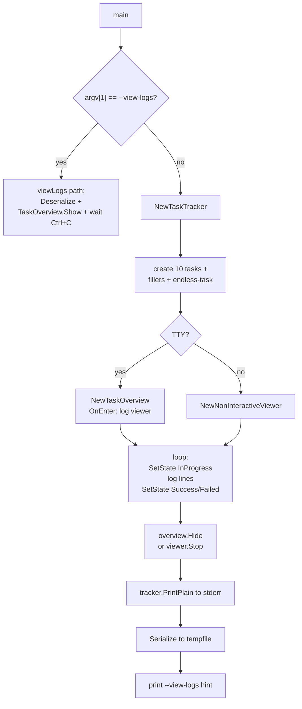

# Demo Programs

`cmd/logdemo` and `cmd/taskdemo` are tiny standalone binaries that exercise the foundation packages without touching the build system. They exist for two reasons: hand-testing the log + taskui packages while developing them, and serving as readable examples of the API.

## `logdemo` — log targets and the exec writer

```go
buf := log.NewBufferTarget()
ctx := log.WithTarget(context.Background(), buf)
logger := log.From(ctx, log.Engine)

base := container.NewBaseExecEnv()
stdout, stderr, closeFn := log.NewExecWriters(ctx, log.Exec)

base.Exec(&container.ExecRequest{
    Argv: []string{"/bin/bash", scriptPath},
    FDs:  []*os.File{devNull, stdout, stderr},
})
stdout.Close()
stderr.Close()

printer := log.NewLogPrinter(buf)
printer.Run()
base.Wait(pid)
closeFn()
printer.Stop()
```

72 lines total. Demonstrates:

- **`BufferTarget`** as the in-memory sink for log entries.
- **`WithTarget` + `From`** as the standard way to thread a logger through context.
- **`NewExecWriters`** turning subprocess stdout/stderr pipes into log entries (one per line).
- **`NewLogPrinter`** as the renderer that drains a buffer to stderr in real time.

The script `cmd/logdemo/test_script.sh` (sibling file) prints alternating stdout/stderr lines so the demo's per-line tagging is visible.

## `taskdemo` — TaskTracker + UI modes

A more elaborate ~190-line program that:



What this demonstrates:

- **Two UI modes — TTY and non-TTY.** `term.IsTerminal` decides between `TaskOverview` (curses-style) and `NonInteractiveViewer` (line-by-line). The build engine's `RunWithUI` does the same check.
- **Per-task log buffers.** Each `Task` has a `Log` field that is itself a log target. Routing the per-task logger through `log.WithTarget(ctx, t.Log)` directs logs from that task's goroutine into its own buffer, which the TUI can then display when the user presses Enter on the task line.
- **`OnEnter` log viewer.** The closure `taskdemo` installs is identical to the one `cmd/gl/cache.go::cmdBuildViewLogs` uses — open `LogPrinter` on the task's buffer, wait for `q`, stop. This is the canonical pattern.
- **Serialize / Deserialize round trip.** Final block writes the tracker to a tempfile; `--view-logs` deserializes and re-shows. This is what makes `gl build --view-logs` work after the build process exits — all task state and per-task logs survive in JSON.

## Running them

```
go run ./cmd/logdemo                       # captures the script's output
go run ./cmd/taskdemo                      # 10 + 1 tasks, TTY mode
go run ./cmd/taskdemo 50                   # 10 real + 50 filler tasks
go run ./cmd/taskdemo --view-logs <path>   # replay mode
```

`taskdemo` with no TTY (e.g., piped to `cat`) drops to `NonInteractiveViewer` — useful for CI logs of CI logs.

## Why bother

The demos are not glamorous. But:

1. They run in seconds with no external dependencies (no Debian, no apt). Useful smoke tests when refactoring `log` or `taskui`.
2. They're the shortest path from "I want to use the log package in my own code" to a working example.
3. They predate the `gl build` integration and document the original API contract — if `RunWithUI` ever drifts, the demos are a sanity check.

If you're adding a feature to `log` or `taskui`, add a third demo rather than wedging it into one of these. They're meant to stay focused.
