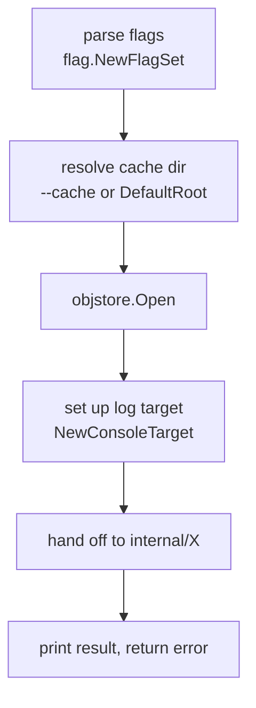
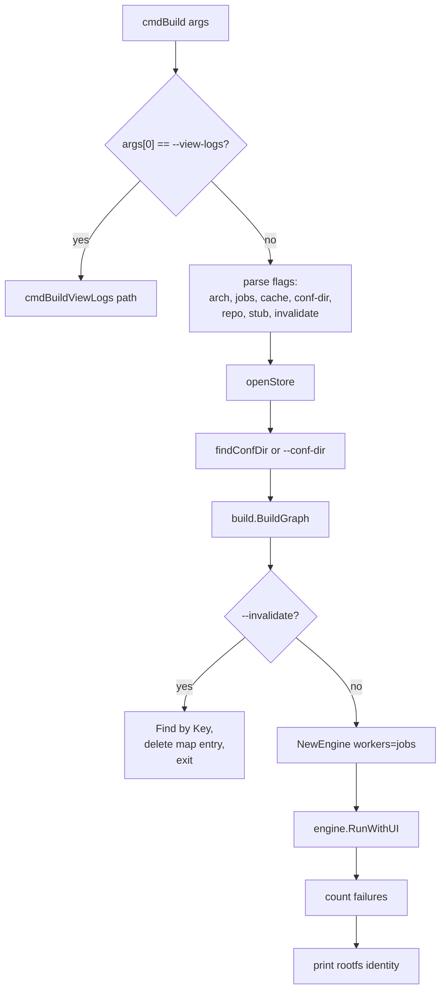
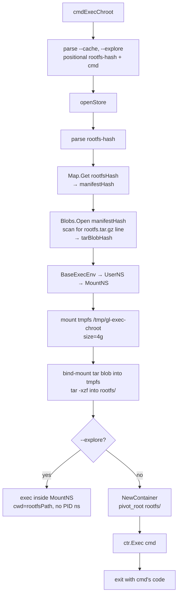
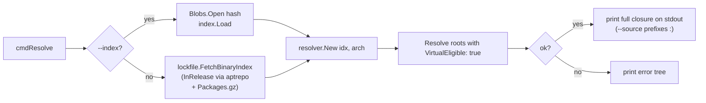

# `cmd/gl` — Subcommand Dispatch

A 60-line `main.go` and a handful of sibling files. No `cobra`, no `urfave/cli`, no global config — every subcommand parses its own flags with `flag.NewFlagSet` and exits on error.

```go
func main() {
    cmd := os.Args[1]
    args := os.Args[2:]
    switch cmd {
    case "build":           err = cmdBuild(args)
    case "graph":           err = cmdGraph(args)
    case "cache":           err = cmdCache(args)
    case "import":          err = cmdImport(args)
    case "lockfile":        err = cmdLockfile(args)
    case "lockfile-rootfs": err = cmdLockfileRootfs(args)
    case "status":          err = cmdStatus(args)
    case "exec-chroot":     err = cmdExecChroot(args)
    case "resolve":         err = cmdResolve(args)
    case "help", "--help", "-h": usage(); return
    }
    if err != nil { os.Exit(1) }
}
```

That's the whole entry point. Each `cmdX` function is independent — they share helpers (`openStore`, `findConfDir`) but no mutable state.

## The shared scaffolding

Every subcommand follows the same skeleton:



Two helpers do most of the dull work:

```go
// cache.go
func openStore(dir string) (*objstore.Store, error) {
    if dir == "" { dir = objstore.DefaultRoot() }
    return objstore.Open(dir)
}

// cache.go — finds nearest ancestor with both pkgs/ and rootfs.yml
func findConfDir() string {
    dir, _ := os.Getwd()
    for {
        if _, err := os.Stat(filepath.Join(dir, "pkgs")); err == nil {
            if _, err := os.Stat(filepath.Join(dir, "rootfs.yml")); err == nil {
                return dir
            }
        }
        parent := filepath.Dir(dir)
        if parent == dir { break }
        dir = parent
    }
    return ""
}
```

`findConfDir` is the same heuristic git uses to find the repo root — walk up looking for a marker. The marker here is "directory containing both `pkgs/` and `rootfs.yml`" because either alone is a false positive.

## `gl build` — the heavyweight



A few details worth flagging:

### Default job count

```go
defaultJobs := int(math.Sqrt(float64(runtime.NumCPU())))
```

On a 64-core box, that's 8 workers. Build artifacts are heavy (each can saturate dozens of cores via `make -j`), so over-subscribing the artifact engine just causes contention. Square-root-of-cores is a rough heuristic that scales reasonably from laptops (4 → 2 workers) to the dev VM (64 → 8).

### `--invalidate` as a surgical cache clear

```go
a := graphResult.Graph.Find(*invalidate)
identity, _ := a.Identity()
store.Map.Delete(identity)
```

Looks up an artifact by `Key()` (e.g., `rootfs:gl-rootfs:amd64`, `src:bash`, `bin:bash:bash`), computes its identity, and deletes that one map entry. The blobs stay; only the identity → manifest pointer is wiped. Next `gl build` rebuilds *just* that artifact and its descendants. Beats `cache gc` for "I know exactly what to rebuild."

### `--view-logs <path>` reuses the build's tracker

After every `gl build`, the TUI dumps a JSON snapshot of all task states (with full per-task log buffers) to a tempfile (or to `--logs-output <path>` if specified — useful for persisting the snapshot alongside a checked-out tree, e.g. the `replay-results/<ts>` workflow). `gl build --view-logs <path>` deserializes it and re-shows the overview without re-running. `OnEnter` opens a per-task log viewer driven by `log.NewLogPrinter`, exits on `q`. If stdout isn't a TTY, falls back to `tracker.PrintPlain()`.

## `gl graph` — same construction, different output

```go
graphResult, _ := build.BuildGraph(...)  // same as build
mermaid := graphResult.Graph.Mermaid()
content := "# Build Dependency Graph\n\n" + ...
write to --output or stdout
```

`graph` is `build` with the engine swapped for a Mermaid renderer. Same flag set, same conf-dir discovery, same store. Useful for "what would `gl build` actually do here?" without running anything.

## `gl cache` — store inspection

`cmdCache` is a multiplexer over four subcommands:

| Subcommand | What it does | Notes |
|------------|--------------|-------|
| `cache status` | Count blobs, map entries, pins | One-liner summary |
| `cache gc [--dry-run] [--conf-dir/--arch/--stub]` | Delete blobs neither graph-reachable nor pinned | Builds the conf-dir graph for reachability; unions with pin roots |
| `cache blobs <get/store/list/delete/check/path>` | Direct blob ops | Mostly debug/scripting |
| `cache map <get/set/list/delete/check>` | Direct map ops | `map set` is dangerous — easy to corrupt cache invariants |
| `cache pin <list/show/drop>` | Inspect/remove GC-root pins | Pins auto-created by import/lockfile; `drop` warns about unrecoverable local-only blobs |

### The GC keep-set

```go
keep := make(map[Hash]struct{})
// (a) graph reachability: manifest + leaf blobs of every built node
for _, key := range graph.Keys() {
    manifest, leaves, err := graph.Find(key).OutputRefs(store)
    if err != nil {
        continue // not built — contributes nothing
    }
    keep[manifest] = struct{}{}
    for _, h := range leaves {
        keep[h] = struct{}{}
    }
}
// (b) pins: every blob named by any local pin
for h := range store.Pins.ReachableBlobs() {
    keep[h] = struct{}{}
}
```

Reachability follows manifest **contents**: `OutputRefs` resolves each built
artifact's identity → map → manifest blob and keeps both the manifest and every
leaf blob it lists. Unbuilt nodes return an error and contribute nothing. This is
why GC needs the conf-dir — it reconstructs the artifact graph to know which
identities exist. Local-only inputs (orig tarballs, lockfile `.deb`s) are not in
the graph; they are kept by pins instead. A blob in neither set is a stale
rebuildable output or a re-fetchable input, and is deleted. Deleting a map entry
without rebuilding no longer risks eating live `.deb`s: any `.deb` a rootfs needs
is a leaf of some still-built node's manifest, or is pinned.

## `gl import` — thin wrapper over `internal/importer`

```go
cfg := importer.ImportConfig{
    Ctx, Store, RepoURL, Dist, Keyring, OutputDir,
    NoVerify, Cookie,
}
result, err := importer.Import(cfg, pkgName)
l.Info("imported %s %s (format: %s)", result.Name, result.Version, result.Format)
```

About 20 lines of CLI scaffolding wrapping the actual import. Flags map 1:1 to `ImportConfig` fields. See [importer](../build/importer.md) for the actual work.

## `gl lockfile` and `gl lockfile-rootfs` — equally thin

Same pattern: parse flags into `lockfile.Config` or `lockfile.RootfsConfig`, call `lockfile.Generate` / `GenerateRootfs`, print the result hash. See [lockfile](../build/lockfile.md).

## `gl exec-chroot` — extract a rootfs and run a command in it



A few things this teaches:

### Manifests are text — parse them inline

```go
manifestData, _ := io.ReadAll(manifestReader)
for line := range strings.Split(string(manifestData), "\n") {
    parts := strings.SplitN(line, " ", 2)
    if parts[1] == "rootfs.tar.gz" {
        tarBlobHash, _ = NewHash(parts[0])
    }
}
```

`exec-chroot` doesn't depend on `internal/artifact`'s manifest helpers — it just reads the format directly. This is a reminder that the manifest format is so simple it doesn't *need* a library, and a sign the format probably won't change soon (no consumer would tolerate a breaking change).

### Two modes: container vs. explore

- **Default** — `NewContainer` does `pivot_root` into the rootfs. The command runs in a true chroot, with PID namespace and no host visibility.
- **`--explore`** — exec runs in the MountNS only, with `cwd=rootfsPath`. This is "browse the rootfs from the host's perspective with a tmpfs view." Useful for `find`, `ls -lR`, comparing two builds without entering the chroot. The host's binaries are still on PATH (PATH is unchanged), so you can use host `tree`, `grep`, etc., on the extracted contents.

### Hash → manifest → tar blob

The map stores `rootfs identity → manifest hash`. The manifest contains a line `<tarHash> rootfs.tar.gz`. The tar blob is what we actually want to extract. Three lookups, no shortcuts. (See [the artifact engine](../build/artifact.md) for why outputs go through manifests.)

## `gl resolve` — the standalone resolver



Originally a debug tool, still the cleanest way to test the resolver against a real Debian Packages index. `--index <hash>` resolves against a stored blob (e.g., a lockfile); `--repo` fetches via the same `aptrepo.FetchInRelease` path the importer and lockfile generator use, so a shared `--cookie` reuses the InRelease blob across calls. Roots default to `VirtualEligible: true`, so passing `awk` resolves fine even though no package literally named `awk` exists.

The closure is always printed in full — there is no `-v` flag. Logs go to stderr (via `rootContextStderr`); stdout carries only `<binary> <version>` lines (or `<source>:<binary> <version>` with `--source`), so it is safe to pipe into `awk` / `grep` / `sort` without filtering log noise.

When resolution fails, `resolver.New` prints the full backtracking-exploration tree — every alternative tried, every conflict that ruled it out, every dead end. That tree is the most actionable debugging output the system produces; if the resolver hates your inputs, run `gl resolve` and read the tree.

## Gotchas

- **No subcommand framework means no shared flag state.** Each `cmd*` re-declares `--cache`, `--arch`, etc. They're consistent today, but adding a new flag means hunting through every file.
- **`flag.ExitOnError` everywhere.** Pass an unknown flag and the process exits before your code sees the error. Fine for a CLI; surprising in tests.
- **`exec-chroot` flag parsing is hand-rolled.** Because the command can take its *own* flags after the rootfs hash, the loop in `cmdExecChroot` recognizes known flags before positionals, then stops parsing. Don't try to add a flag that needs `flag.FlagSet` semantics — it'll fight with the inner command's flags.
- **`gl resolve --index` requires the blob to already be in the store.** If you want to resolve against today's Debian testing without going through the importer/lockfile, use the `--repo` form — it fetches over HTTP into ephemeral memory.
- **`os.Exit` is called for non-zero subprocess exit codes** (in `exec-chroot`). This is the only place in the CLI that doesn't return an error and let `main` handle exit — be careful when refactoring.
