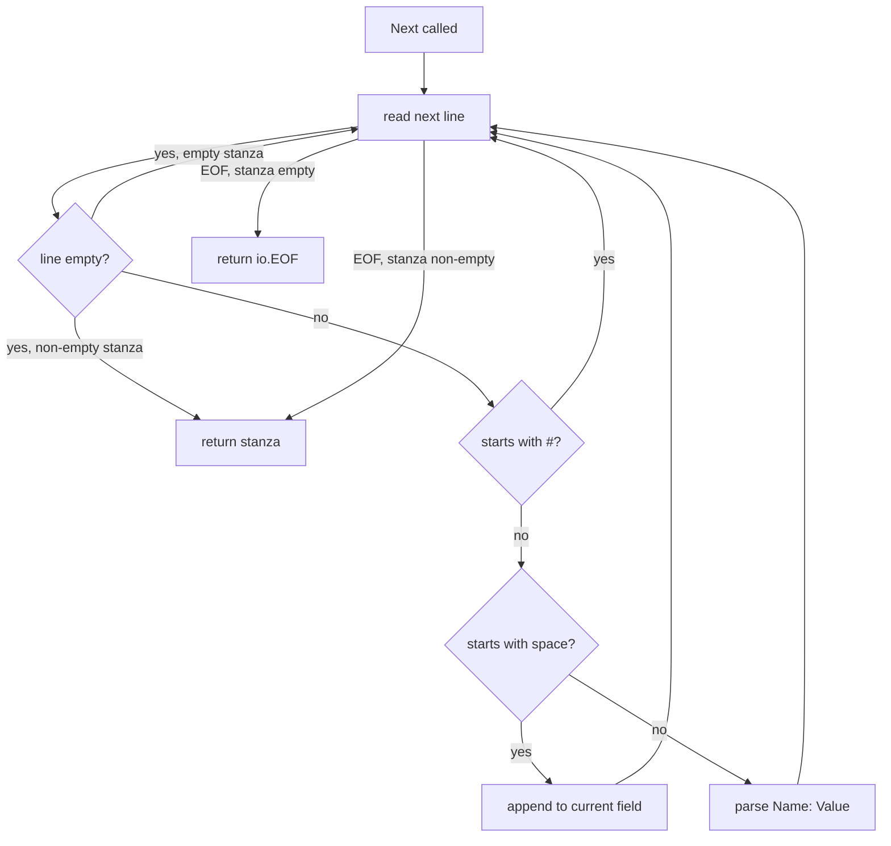

# `debian/deb822` — Stanza Parser

A streaming parser for [deb822 format](https://manpages.debian.org/bookworm/dpkg-dev/deb822.5.en.html) — RFC 822-like control files used everywhere in Debian: `Packages`, `Sources`, `Release`, `.dsc`, `debian/control`. Single file, ~150 lines.

```
internal/debian/deb822/
├── parser.go
└── parser_test.go
```

## Public surface

```go
type Stanza map[string]string

type Reader struct { ... }
func NewReader(r io.Reader) *Reader
func (r *Reader) Next() (Stanza, error)   // returns io.EOF when done
```

A `Stanza` is just a `map[string]string`. Field names are normalized to lowercase. Multi-line values are concatenated with literal `\n` separators preserving the leading whitespace of continuation lines.

## What it accepts

```
# A leading comment is fine
Package: foo
Version: 1.2.3-1
Description: Single-line value
 with continuation lines
 .
 multiple paragraphs
Multi-Line:
 first line
 second line

Package: bar
...
```

Rules:

- A blank line separates stanzas.
- A line starting with `#` is a comment (entire line skipped). Comments inside values are *not* supported — only at line start.
- A line starting with space or tab is a continuation of the previous field's value, appended verbatim (including the leading whitespace).
- A field line is `Name: Value` or `Name:Value`. The single space after `:` is stripped if present; further leading spaces are preserved.
- Field names are validated: printable ASCII excluding colon and whitespace.

## How `Next()` works



Internal state is a `currentField` pointer (the most recently set field name). Continuation lines append to that field. The trailing `\n` from the *last* continuation is trimmed when the stanza closes.

## Buffer size

```go
scanner := bufio.NewScanner(r)
scanner.Buffer(make([]byte, 1024*1024), 1024*1024)
```

`bufio.Scanner` defaults to a 64 KiB max line size. Some Debian stanzas have very long single-line `Description:` values or huge `Files:` lists — 1 MiB is generous and avoids `bufio.ErrTooLong` in practice.

## Error cases

- Continuation line before any field: `deb822: continuation line before any field: %q`.
- Line without colon and not a continuation: `deb822: line without colon and not a continuation: %q`.
- Field name with whitespace or invalid characters: rejected at parse.

The reader is "fail-fast" — once `Next` returns an error, the reader is in an undefined state. Callers should stop iterating.

## What it does *not* do

- No type-aware parsing — every value is a raw string. Callers split lists, parse versions, or convert to integers themselves. (`debian/index` is the closest thing to a type-aware layer.)
- No re-emitting / round-tripping. There's no `Write` companion. The build system does write `Packages`-format output by hand-iterating maps, but that lives in `lockfile/generate.go`.
- No support for the deb822-specific quoting rules used in some signed contexts. The cleartext-signed envelope is stripped by `stream.GPGVerifyClearSigned` before this parser sees the bytes.

## Tests

`parser_test.go` (~400 lines) covers: simple stanzas, multiple stanzas, continuation lines, blank values, comments, leading/trailing whitespace, malformed input (no colon, unexpected continuation), large values, mixed CR/LF endings, real-world examples (debian-installer Release, full Packages snippet).

## Gotchas

- **Field name lookups are lowercase.** `stanza["Package"]` is always empty — use `stanza["package"]`.
- **Continuation values include the leading space.** A value like `"Description"\n " with continuation"` literally retains the leading space on the second line. Most callers either ignore it or strip via TrimSpace.
- **Empty values are valid.** `Field:\n` produces `stanza["field"] = ""`, which is different from the field being absent.
- **Comments aren't preserved.** A round-trip parse-then-write would lose all `#` lines.
