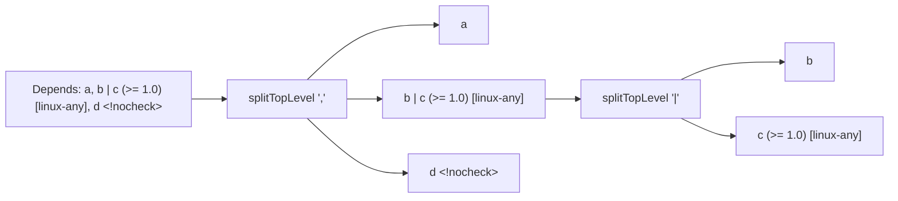

# `debian/depends` — Dependency Expression Parser

Parses Debian dependency strings (the values of `Depends:`, `Build-Depends:`, `Conflicts:`, `Provides:`, `Pre-Depends:`, `Breaks:`) into a structured representation. Plus filters for architecture restrictions and build profiles.

```
internal/debian/depends/
├── depends.go         # Parse + types
├── filter.go          # MatchesArch, ExcludedByProfiles, ArchMatches
└── depends_test.go
```

## The data model

```go
type VersionConstraint struct {
    Op      string // ">>", ">=", "=", "<=", "<<"
    Version string
}

type Dependency struct {
    Name        string             // package name
    Arch        string             // arch qualifier after colon (e.g., "amd64" in pkg:amd64)
    Version     *VersionConstraint // (op version) parenthesized, optional
    ArchList    []string           // [amd64 arm64] or [!i386]
    ArchExclude bool               // true if list is [!arch1 ...]
    Profiles    [][]string         // <prof1 prof2> <prof3> — multiple groups
}

type Alternative    []Dependency        // "a | b | c"
type DependencyList []Alternative       // "a | b, c, d (>= 1.0) [linux-any]"
```

The two-level nesting reflects the syntax: a `DependencyList` is a comma-separated set of clauses; each clause is a pipe-separated `Alternative` group.

## `Parse(input)`

```go
func Parse(input string) (DependencyList, error)
```

Top-level: strip whitespace, split by `,` (respecting parens/brackets/angles), for each clause split by `|`, parse each atom.



`splitTopLevel` is a hand-rolled bracket-aware splitter: tracks `(` `)`, `[` `]`, `<` `>` depth and only splits when at depth zero. Crucially, this means a comma inside `(>= ...)` doesn't terminate a clause — important for version constraints that contain commas (rare but legal).

### `parseSingleDep`

For a single atom, the parser is position-based:

1. Consume the package name (`a-zA-Z0-9+-.`, must start with alnum).
2. If the next byte is `:`, consume the architecture qualifier (e.g., `:amd64`, `:any`, `:native`).
3. If the next byte is `(`, parse a version constraint: operator (`>>` `>=` `=` `<=` `<<`), version string up to `)`.
4. If the next byte is `[`, parse the architecture restriction list. The list is "inclusive" by default; if the *first* token starts with `!`, the whole list is treated as exclusion.
5. While the next byte is `<`, parse a build-profile group; each group is space-separated tokens, possibly negated with `!`. Multiple groups are independent (OR semantics, see filter.go).

## `MatchesArch(arch)`

```go
func (dep *Dependency) MatchesArch(arch string) bool
```

Implements Debian's arch-restriction filter:

- No `[...]` list ⇒ matches every arch.
- Inclusive list ⇒ matches if any pattern matches `arch`.
- Exclusive list (`[!a !b]`) ⇒ matches if no pattern matches `arch`.

Pattern matching (`ArchMatches(pattern, arch)`) handles:
- `any` ⇒ always matches.
- exact match ⇒ matches.
- `linux-any` ⇒ matches (linux is the only OS we target).
- `<other>-any` ⇒ does *not* match (e.g., `hurd-any`, `kfreebsd-any`).
- `any-<cpu>` ⇒ matches (we don't distinguish CPU sub-families at this level).

The lockfile generator and source builder use this to filter out `[hurd-any]`-only deps when building for `amd64`.

## `ExcludedByProfiles(activeProfiles)`

```go
func (dep *Dependency) ExcludedByProfiles(activeProfiles []string) bool
```

Per Debian policy: a dep with build-profile restrictions is *included* iff at least one restriction *group* is satisfied. A group is satisfied when *all* its terms match:

- `foo` is satisfied if `foo` is active.
- `!foo` is satisfied if `foo` is *not* active.

```
Build-Depends: pkg <!nocheck> <stage1>
```

Excluded if neither group passes. With `activeProfiles=["nocheck"]`: the first group `<!nocheck>` requires `nocheck` to NOT be active — fails. The second group `<stage1>` requires `stage1` active — fails. So the dep is excluded.

With `activeProfiles=["stage1"]`: `<!nocheck>` passes, dep is included.

A dep with no `<...>` groups is never excluded by profiles.

## What gets stripped before resolver consumption

Both `MatchesArch` and `ExcludedByProfiles` are applied by `lockfile/generate.go` and `build/source.go` *before* deps reach the resolver. The resolver itself is profile/arch-agnostic — it just sees the surviving atoms.

## Tests

`depends_test.go` covers (~440 lines): empty input, simple names, version constraints, alternatives, multiple clauses, arch qualifiers, arch restrictions (inclusive and exclusive), profiles (single group, multiple groups, negation), real-world fixtures from `coreutils.Depends`, malformed inputs (mismatched brackets, unknown operators), `MatchesArch` edge cases, `ExcludedByProfiles` truth table.

## Gotchas

- **Foreign-arch atoms are not filtered here.** A dep like `lib:i386` survives parsing with `Arch="i386"`. The *resolver* (`expandAtom`) is what skips it when it doesn't match the build arch.
- **`Provides:` parses through the same machinery.** A `Provides:` value can have version constraints (since dpkg 1.17.11) — parsed identically.
- **`Conflicts:` and `Breaks:` parse identically too.** They use the same syntax; the *meaning* (different from Depends) is interpreted at the resolver level.
- **Build profiles inside `Depends:` are legal but unusual.** They're far more common in `Build-Depends`. The parser doesn't care which field it's parsing.
