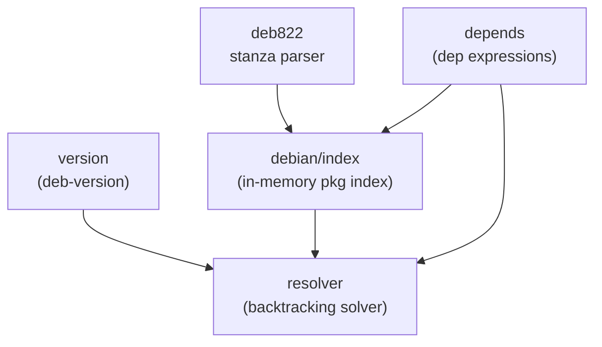

# Debian Format Layer

Everything that parses or reasons about Debian package format. These five packages have one shared concern — the Debian source/binary control file syntax — but no other domain knowledge.

| Package | Purpose |
|---------|---------|
| [`deb822`](./deb822.md) | Streaming parser for stanza-format control files |
| [`depends`](./depends.md) | Dependency expression parser + arch/profile filters |
| [`version`](./version.md) | `deb-version(7)` parsing and comparison |
| [`debian/index`](./index.md) | In-memory index built from a Packages file |
| [`resolver`](./resolver.md) | Backtracking SAT-style dependency solver |

The three foundational parsers (`deb822`, `depends`, `version`) are pure — they don't touch the filesystem, don't make HTTP calls, don't depend on any other internal package. `index` composes them. `resolver` consumes everything.
