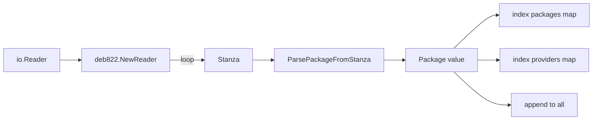

# `debian/index` — Binary Package Index

In-memory representation of a `Packages` file. Built from a deb822 stream with all dependency fields pre-parsed. Used by the resolver to look up packages, by lockfile generation to enrich stanzas, and by source builds to construct merged indexes (lockfile + locally-built outputs).

```
internal/debian/index/
├── index.go
└── index_test.go
```

## The `Package` value

```go
type Package struct {
    Name         string
    Version      string
    Architecture string
    Essential    bool
    Priority     string
    Depends      depends.DependencyList
    PreDepends   depends.DependencyList
    Conflicts    depends.DependencyList
    Provides     depends.DependencyList
    Breaks       depends.DependencyList
    Stanza       deb822.Stanza   // the original raw stanza (preserved)
    SHA256       string          // checksum of the .deb file
    Filename     string          // mirror-relative path of the .deb
    Size         int64
}
```

`Stanza` is preserved verbatim so that downstream code (lockfile generation, install check) can re-emit the package's full record. The pre-parsed dependency fields are an optimisation — every resolver iteration would otherwise re-parse the same strings.

## The `Index` type

```go
type Index struct { ... }

func New() *Index
func Load(r io.Reader) (*Index, error)

func (idx *Index) Get(name string) *Package
func (idx *Index) Has(name string) bool
func (idx *Index) Providers(name string) []*Package
func (idx *Index) EssentialPackages() []*Package
func (idx *Index) All() []*Package
func (idx *Index) Len() int
func (idx *Index) Add(pkg *Package)
func (idx *Index) Merge(other *Index) *Index
func (idx *Index) Sub(names []string) *Index
```

Internal storage:

```go
packages  map[string]*Package    // name -> package
providers map[string][]*Package  // virtual name -> providers
all       []*Package             // insertion order
```

Three views of the same data: O(1) name lookup, O(1) virtual lookup, ordered iteration.

## `Load` — parse a Packages file

```go
func Load(r io.Reader) (*Index, error)
```

Workflow:



Each stanza becomes one `Package`. Duplicate names are an error (`"duplicate package %q (versions %s and %s)"`) — Debian Packages files don't normally contain duplicates within a single section, and tolerating them would mask upstream merge bugs.

## `ParsePackageFromStanza`

```go
func ParsePackageFromStanza(stanza deb822.Stanza) (*Package, error)
```

Extracts and pre-parses:

- `Package` (required, errors if missing).
- `Version`, `Architecture`, `Priority`, `Filename`.
- `Essential` (yes/no).
- `SHA256` — prefers `sha256` field, falls back to `checksums-sha256`.
- `Size` — int64 parse, ignored on parse failure.
- All dependency fields via `depends.Parse`. Errors are wrapped with the package name for context.

## `Add` and `Merge` — the locally-built override path

`Add(pkg)` overrides any existing entry with the same name. The `all` slice is updated in place at the original position (preserving insertion order).

`Merge(other)` returns a new index where `other`'s entries override `idx`'s entries on name collision. Used by `DebianPkgBuild.buildLocalIndexForBuild()`:

```
Lockfile (remote, unmodified) ──┐
                                ├── Merge ──> build chroot index
Locally-built outputs ──────────┘             (local overrides remote)
```

`Merge` rebuilds the providers map from scratch — necessary because `Add`'s incremental provider update would leave dangling references to the old version of an overridden package.

## `Sub` — restrict to a name list

```go
func (idx *Index) Sub(names []string) *Index
```

Returns a new index containing only the named packages, silently skipping names not in the original. Used when the install-check phase wants to feed the resolver "just the locally built things plus their close neighbors".

## Virtual packages and `Providers`

When a package declares `Provides: foo (= 1.2)`, it is registered as a provider of `foo` (with version `1.2`). `Providers("foo")` returns all such packages.

This is used by:
- The resolver's `expandAtom` to consider providers as candidates for a virtual dependency.
- The install-check's locality enforcement to recognise that a binary package's runtime dep on `awk` is satisfied by `mawk` providing it.

## What's *not* here

- **No HTTP fetching.** Reading happens via `io.Reader` only. The CLI commands and the importer call `Load` after they've fetched bytes.
- **No persistence.** An `Index` is rebuilt from bytes every time. Lockfiles are stored as the *bytes* of a Packages file (via objstore); when reused, they're parsed fresh.
- **No GPG/signature checking.** The signed Release file points at Packages files; verification happens upstream of `Load` (in the importer, via `stream.GPGVerify`).
- **No version selection.** Packages files contain at most one entry per name in practice. Multi-version selection (`apt-cache madison`-style) would be the importer's job — but Phase 1 imports the latest version found in the index unconditionally.

## Tests

`index_test.go` (~640 lines): basic load, providers, essential, all/len, get/has, parse error path, merge with overrides, sub-index, virtual package edge cases (Provides with version, multiple providers), duplicate-name error, malformed stanzas, large index (smoke test).

## Gotchas

- **Field name lookups are lowercase** because that's what `deb822.Stanza` returns. The internal access pattern is `stanza["package"]`, never `stanza["Package"]`.
- **`Merge` does not mutate either input.** Both old indexes can keep being used.
- **`Add` mutates the receiver.** It modifies `all`, `packages`, and `providers` in place.
- **`Stanza` is shared by reference, not copied.** Mutating a stanza after parse will propagate. Callers should treat them as read-only.
