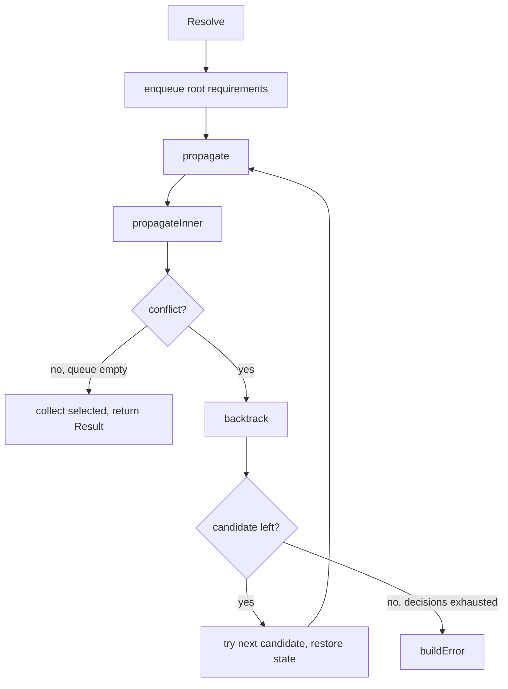

# `resolver` — Backtracking Dependency Solver

A SAT-style backtracking solver that, given a binary package index and a set of root requirements, returns a closed install set satisfying all `Depends`, `Pre-Depends`, and `Conflicts` (and no broken `Breaks`). When no solution exists, it returns a structured error tree explaining what was tried at each decision point.

```
internal/resolver/
├── resolver.go        # The solver (~735 lines)
├── error.go           # ResolutionError + Attempt
└── resolver_test.go   # ~710 lines
```

## Why a custom solver

For lockfile generation we need:

1. **Deterministic results.** Same index + same roots → same install set. APT doesn't guarantee this across runs, so we built our own.
2. **Explainable failure.** When the resolver fails, the output must tell the user *which* alternatives were tried and *why* each one failed — otherwise debugging unsatisfiable build-deps is a nightmare.
3. **Architecture awareness.** Atoms qualified for foreign architectures should be silently skipped, not treated as missing packages.

## Public surface

```go
type Requirement struct {
    Name            string
    VersionOp       string  // "", ">=", ">>", "=", "<=", "<<"
    Version         string
    VirtualEligible bool    // can be satisfied by Provides
}

type Result struct {
    Packages []*index.Package
}

type Resolver struct { ... }

func New(idx *index.Index, arch string) *Resolver
func (r *Resolver) Resolve(roots []Requirement) (*Result, error)
```

The `arch` argument scopes architecture-restricted dependencies during pre-expansion. All callers pass an explicit arch (`amd64` for tests with arch-neutral fixtures, `cfg.Arch` for production callers).

## Pre-expansion at construction

`New(idx, arch)` immediately walks every package in the index and pre-expands its dependency relations:

```go
expandedDepends    map[string][]depGroup
expandedPreDepends map[string][]depGroup
expandedConflicts  map[string][]conflictEntry
providedBy         map[string][]string  // virtual -> concrete
```

A `depGroup` is one alternatives clause (`a | b | c`) with its `candidates` already resolved — i.e., the concrete package names that can satisfy any atom in the clause, deduplicated and sorted.

`expandAtom` does the heavy lifting: for an atom, return all concrete package names that match (direct match by name and version, plus matching `Provides:`). Foreign-arch atoms (e.g., `pkg:i386` on `amd64`) return `nil` — they're treated as if the dependency didn't exist.

This pre-expansion is what makes the solver fast — the inner loop touches only string comparisons and map lookups, never re-parses dependencies.

## The solver state

```go
type solverState struct {
    resolver  *Resolver
    trail     []string             // selection order
    selected  map[string][]string  // name -> reason chain
    excluded  map[string]string    // name -> exclusion reason
    decisions []*decision          // active decision stack
    exhausted []*decision          // for error reporting
    queue     []workItem           // pending work
}

type decision struct {
    depender         string
    atoms            depends.Alternative
    candidates       []string
    chosenIdx        int
    trailLen         int
    excludedSnapshot map[string]string
    queueSnapshot    []workItem
    branchFailures   []branchFailure
    chain            []string
}
```

A `decision` records a choice point — the candidates considered, the index of the one currently chosen, and snapshots needed to backtrack. `branchFailures` accumulates one record per candidate that was tried and failed; the entire decision is moved to `exhausted` when all candidates have been tried.

## The main loop



### `propagateInner`

For each item in the queue:

- **Direct package**: if already selected, continue. If excluded, conflict. Otherwise:
  - Add to `selected`.
  - For each `Conflicts` entry, mark conflicting packages as excluded (or signal conflict if already selected).
  - For each `Pre-Depends` then `Depends` group, call `processDepGroups`.
- **Virtual choice**: filter excluded candidates, if exactly one viable, enqueue it directly; if multiple, create a decision.

### `processDepGroups`

For each dependency group:

- If the group has zero candidates, conflict — call `explainNoCandidates` to construct a human-readable reason.
- Filter out excluded candidates.
- If a viable candidate is already selected, skip (already satisfied).
- If exactly one viable candidate, enqueue it.
- Otherwise, create a decision via `makeDecision`.

### `rankCandidates`

When multiple candidates can satisfy an alternatives group, the order matters — wrong choice leads to backtracking. The heuristic:

1. Already-selected candidates first (no new addition needed).
2. Direct-name matches before Provides matches (less indirection).
3. Fewer dependencies first (smaller install set heuristic).
4. Alphabetical for determinism.

This is `sort.SliceStable` so equal-priority candidates retain their input order.

## Backtracking

When a conflict bubbles up to `propagate`:

```go
for len(s.decisions) > 0 {
    d := top of decisions
    record this candidate as a failure
    nextIdx := d.chosenIdx + 1
    if nextIdx < len(d.candidates):
        d.chosenIdx = nextIdx
        restore(d)        // undo selections, restore excluded snapshot, restore queue
        enqueue next candidate
        return true
    // exhausted — pop decision, append to exhausted list
    pop decision
}
return false
```

`restore` is the rewind primitive: trim the selection trail back to `d.trailLen`, deep-copy the excluded snapshot back over the live one, deep-copy the queue snapshot back over the live one. `decisions` itself is not snapshotted because backtracking always pops from the top, never mid-stack.

## Error construction

When backtracking exhausts all decisions, `buildError` walks `exhausted` (and any still-active decisions with branch failures) and constructs a tree of `Attempt` records. Each `Attempt` carries:

- `Package` — what was being satisfied.
- `Reason` — what we tried (e.g., `"depends on libfoo"`).
- `Chain` — the dependency chain that brought us here, formatted as `"requested: bash -> bash depends on libtinfo6"`.
- `SubErrors` — one per candidate that was tried and failed, with its own message.

`ResolutionError.Error()` renders this tree with two-space indentation. Output looks like:

```
dependency resolution failed
  bash depends on libtinfo6:
    libtinfo6: libtinfo6 has version 6.4 but needs >= 6.5 (via requested: bash -> bash depends on libtinfo6)
  bash depends on libreadline8:
    libreadline8: not in index (via requested: bash -> bash depends on libreadline8)
```

## Architecture filtering

`expandAtom` skips atoms whose `Arch` qualifier is set to a foreign architecture:

```go
if atom.Arch != "" && atom.Arch != "any" && atom.Arch != "native" && atom.Arch != r.arch {
    return nil
}
```

This makes `lib:i386` invisible on an `amd64` build — neither satisfied nor unsatisfiable, just absent.

## Tests

`resolver_test.go` (~710 lines):

- **Trivial cases**: single package no deps, simple chain.
- **Alternatives**: `a | b`, picks the right one.
- **Virtual packages**: `Depends: awk` satisfied by `mawk` providing `awk`.
- **Virtual with multiple providers**: backtracking picks one that doesn't conflict.
- **Conflicts**: `a Conflicts b` excludes `b` if `a` is selected.
- **Pre-Depends**: ordering relative to Depends.
- **Version constraints**: `>=`, `<<`, `=`, etc. against the index.
- **Unsatisfiable**: missing package, version constraint not satisfiable, all alternatives excluded.
- **Error messages**: full attempt tree contains the right packages and reasons.
- **Architecture filtering**: foreign-arch atoms are skipped.
- **Determinism**: same input gives same output across runs.
- **Stress**: large random graphs.

## Gotchas

- **Determinism depends on map iteration order.** The solver sorts everywhere it iterates a map (provider lists, candidates, results). Don't assume `map[string]X` iteration is stable elsewhere in the package.
- **`Resolve` is not safe for concurrent use** even on the same `Resolver`. The pre-expanded data is read-only and shareable, but each `Resolve` call needs its own state. Construct fresh state per call.
- **Conflicts are not symmetric.** `a Conflicts b` excludes `b` when `a` is selected, but `b Conflicts a` is *also* needed for the symmetric exclusion. Real Debian packages typically declare it both ways; the solver doesn't fix it for you.
- **The result's `Packages` order is alphabetical**, not selection order. `state.trail` carries the selection order but isn't exposed.
- **Architecture must be passed explicitly.** `New(idx, arch)` takes a non-optional `arch string`. Tests pass `"amd64"` since fixtures are arch-neutral; production callers pass `cfg.Arch` / `s.Arch`.
