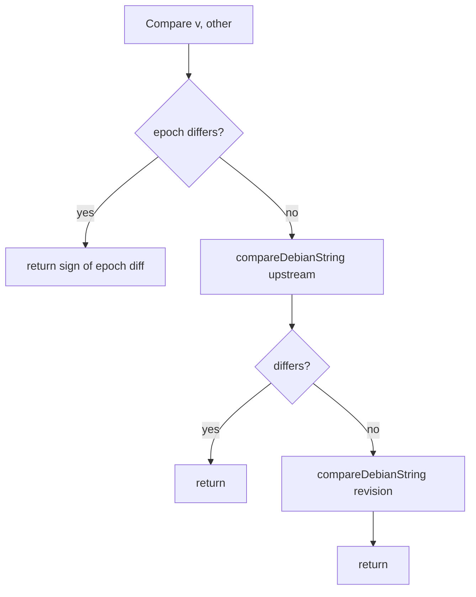

# `debian/version` — `deb-version(7)` Comparison

Parses Debian version strings and compares them according to [`deb-version(7)`](https://manpages.debian.org/bookworm/dpkg-dev/deb-version.7.en.html).

```
internal/debian/version/
├── version.go
├── version_test.go
└── ascii_test.go
```

## Public surface

```go
type Version struct {
    Epoch    int
    Upstream string
    Revision string
}

func Parse(s string) (Version, error)
func (v Version) String() string
func (v Version) Compare(other Version) int

func Compare(a, b string) int
func CheckConstraint(version string, op string, constraint string) (bool, error)
```

`Compare` returns `-1`, `0`, or `+1`.

`CheckConstraint` accepts the five Debian operators (`<<`, `<=`, `=`, `>=`, `>>`) and applies them to the result of `Compare`.

## The format

```
[epoch:]upstream_version[-debian_revision]
```

- **Epoch** — optional integer before the first `:`. Default 0.
- **Debian revision** — everything after the *last* `-`. Empty if no `-` is present.
- **Upstream version** — everything between epoch and revision.

`Parse("1:2.5.2-2+deb13u1")` returns `{Epoch: 1, Upstream: "2.5.2", Revision: "2+deb13u1"}`.

If parse fails (in the `Compare(string, string)` form), the function falls back to lexicographic string comparison so callers don't need to error-check version strings that come from external indexes.

## The comparison algorithm



Both `upstream_version` and `debian_revision` are compared with the same "debian-string" algorithm: alternate between non-digit and digit segments.

### Non-digit segments

Compare character-by-character with this order:

```
~  <  (empty)  <  letters (a-zA-Z)  <  everything else
```

Encoded as integer ordering values:

```go
case c == '~':           return -1
case present == false:   return 0       // end of segment
case isLetter(c):        return int(c)  // 65..122
default:                 return int(c) + 256  // sort after letters
```

The tilde is the famous "less than empty" character — used for upstream pre-releases like `1.0~beta1` (sorts before `1.0`).

### Digit segments

Numeric comparison with leading-zero stripping. Empty digit segment (no digits where one was expected) is treated as zero.

```go
"10" > "9"     // length first
"100" > "99"
"010" == "10"  // leading zeros stripped
"" == "0"      // empty segment is zero
```

## `String()`

Canonical form: epoch only emitted if non-zero, revision only if non-empty.

```go
Version{0, "1.2.3", ""}.String()       // "1.2.3"
Version{1, "1.2.3", "2"}.String()      // "1:1.2.3-2"
Version{0, "1.2.3", "1+gl~abcd1234"}.String() // "1.2.3-1+gl~abcd1234"
```

The third example is gl-ng's synthetic versioning scheme — the `+gl~<8hex>` suffix sorts above any plausible Debian revision because `+` outranks letters and digits, while `~` keeps the hash-suffix from outranking a hypothetical `+gl1` etc.

## `CheckConstraint`

```go
func CheckConstraint(version, op, constraint string) (bool, error)
```

Drops `Compare(version, constraint)` into a switch over `op`. Unknown operators return `false, error("unknown version operator")`. Used heavily by the resolver and by the binary-package install check.

## Tests

`version_test.go` (~480 lines) covers the canonical examples from `deb-version(7)`:

- Epoch comparison (`1:1.0` > `2.0`).
- Upstream comparison (`1.0` < `1.1`, `1.0a` < `1.0b`, `1.0~beta` < `1.0`).
- Revision comparison (`-1` < `-2`, `-1` < `-1.1`).
- Tilde edge cases (`1.0~~` < `1.0~~a` < `1.0~`).
- Length-vs-lexical numeric (`9` < `10`, `9a` < `10` is *not* tested directly because `9a` is "9" then "a" — the digit segment is the leading 9).
- Digit-numeric vs string-lexical (`100` > `99`).
- Round-trip parse/format on hundreds of fixtures.

`ascii_test.go` enumerates every ASCII character pair against the `~ < empty < letters < other` rule, ensuring the integer encoding matches the spec.

## Gotchas

- **Empty string passed to `Parse` is an error.** But `Compare("", "")` returns 0 because both are equally unparseable and the lexical fallback says they're equal.
- **Embedded `:` in upstream is the epoch separator.** A version like `2:1.0-1` cannot have a `:` in the upstream part.
- **Embedded `-` in upstream is fine** as long as there's a *later* `-`. The split is `LastIndexByte('-')` — the last hyphen, not the first.
- **Negative epochs are rejected at Parse.** The spec forbids them.
- **Whitespace in versions is not stripped.** `Compare(" 1.0", "1.0")` parses as `Upstream=" 1.0"` vs `Upstream="1.0"` — different. Trim before passing in.
