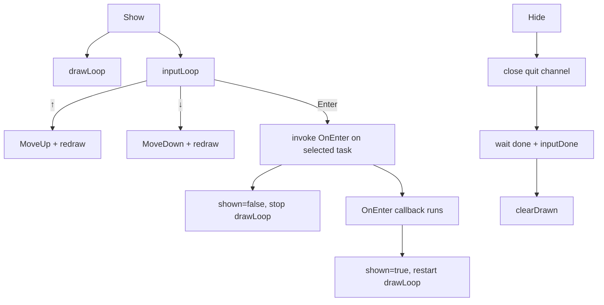
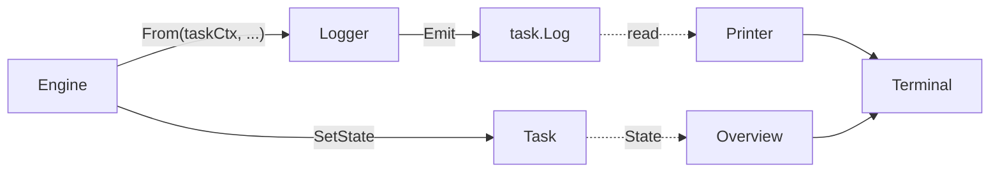

# `taskui` — Interactive Task Progress UI

A small terminal UI that renders the per-task state of a build run. Three files, ~600 lines total.

```
internal/taskui/
├── tracker.go       # Task, TaskTracker — the data model
├── overview.go      # TaskOverview (interactive) + NonInteractiveViewer + PrintPlain
└── serialize.go     # JSON marshal/unmarshal of a tracker
```

## Data model

```go
type TaskState int
const ( Pending TaskState = iota; InProgress; Success; Failed )

func (s TaskState) String() string                 // "pending" | "in_progress" | "success" | "failed"
func (s TaskState) MarshalJSON() ([]byte, error)   // emits the String() form
func (s *TaskState) UnmarshalJSON([]byte) error    // accepts the same strings

type Task struct {
    Name string
    Log  *log.BufferTarget
    // private state field
}

func (t *Task) State() TaskState
func (t *Task) SetState(s TaskState)

type TaskTracker struct { ... }
func NewTaskTracker() *TaskTracker
func (tt *TaskTracker) Add(name string) *Task
func (tt *TaskTracker) Tasks() []*Task
```

A task is a name plus a state plus a log buffer. `TaskState` round-trips through JSON as the four lowercase strings rather than as integers — so a serialized tracker (used by `gl build --view-logs`) is human-readable and immune to enum-renumber breakage. Each task gets its own `BufferTarget` at construction — log records emitted under that task's context land in its buffer, separate from every other task's. This is the basis for "press Enter to view the logs of *that* task" navigation.

`Tasks()` returns a defensive copy of the slice — the underlying mutex is held only during the copy.

## TaskOverview — the interactive view

```go
type TaskOverview struct { ... }
func NewTaskOverview(tracker *TaskTracker) *TaskOverview

// Lifecycle
func (o *TaskOverview) Show()
func (o *TaskOverview) Hide()

// Public movement (also driven internally by arrow keys)
func (o *TaskOverview) MoveUp()
func (o *TaskOverview) MoveDown()
func (o *TaskOverview) Selected() int

// Callback
o.OnEnter = func(task *Task, stop <-chan struct{}) { ... }
```

`Show()` enters terminal raw mode (clears `ICANON | ECHO`, sets `VMIN=1`/`VTIME=0`) and starts two goroutines:

- **`drawLoop`** — redraws the task list every 500ms (for the spinner blink) or on demand via the `redraw` channel.
- **`inputLoop`** — polls stdin for arrow keys (`ESC [ A` / `ESC [ B`) and Enter.



`OnEnter` is the hook that powers "view this task's logs". The CLI installs a callback that drains the selected task's log buffer to the terminal until the user presses 'q' or the build completes (signaled by `stop` being closed).

### Drawing

`draw()` redraws over the previous frame using ANSI cursor-up + clear-line escapes. It computes how many lines fit in the terminal (`term.GetSize`), and if there are more tasks than rows, scrolls the selected task into view with `▲ (N more)` / `▼ (N more)` indicators on the edges.

Icons:
- `○` Pending
- `●` (blinking) InProgress — toggles with the 500ms ticker
- `●` (green) Success
- `●` (red) Failed

The selected task's name is rendered in cyan.

### Concurrent safety

`shown`, `selected`, and `linesLast` are protected by `o.mu`. The `done`, `inputDone`, `redraw`, and `quit` channels coordinate between the goroutines. `Hide` closes `quit` (idempotent via select-default), waits for both loops to finish, and only then clears the drawn area.

`OnEnter` runs *outside* the draw loop — `inputLoop` first sets `shown=false`, waits for `drawLoop` to finish, clears the area, runs the callback, then restarts `drawLoop`. This guarantees the callback has the entire screen to itself.

## NonInteractiveViewer

```go
type NonInteractiveViewer struct { ... }
func NewNonInteractiveViewer(tracker *TaskTracker) *NonInteractiveViewer
func (v *NonInteractiveViewer) Start()
func (v *NonInteractiveViewer) Stop()
```

Used when stdin is not a terminal. Polls task counts every second; emits one stdout line each time the counts change:

```
tasks: 3 pending, 5 in progress, 12 success, 0 failed
```

Stop() closes `done` and waits on `stopped`.

## PrintPlain

```go
func (tt *TaskTracker) PrintPlain()
```

One-shot dump of the tracker to stderr — same icons as the interactive view, no animation. Used after a build completes to print a final summary.

## Serialization

```go
func (tt *TaskTracker) Serialize(w io.Writer) error
func Deserialize(r io.Reader) (*TaskTracker, error)
```

JSON form: array of `{name, state, log}` where `log` is the `BufferTarget`'s own JSON form (see [`log`](./log.md)). This is how `gl build` persists task state to a file at the end of a run, so `gl build --view-logs` can replay it.

## How `taskui` and `log` cooperate



Each task has its own `BufferTarget` and its own context with that target installed. When build code logs via `log.From(ctx, ...)`, the message lands in the right task's buffer. `OnEnter` spawns a `LogPrinter` against the selected task's buffer and lets the user watch live output until they hit 'q'.

## Tests

No `_test.go` in the package — the UI is exercised via the `cmd/taskdemo` binary (a standalone manual driver) and through `gl build`'s end-to-end run.

## Gotchas

- **Raw terminal mode is restored in a `defer` inside `inputLoop`.** If the goroutine panics before restoring, the user's terminal is left without echo. Don't introduce panics in the input handling.
- **`Show()` is idempotent.** Calling it twice is a no-op (the second call sees `shown=true` and returns).
- **`OnEnter` must respect the `stop` channel.** When the build completes or the user hits `Ctrl-C`, `Hide()` closes `quit`; the callback receives that channel as `stop` and must return promptly. Otherwise `Hide()` blocks forever waiting for `inputDone`.
- **The 500ms blink ticker keeps the screen redrawing even when nothing has changed.** This is fine for typical terminals but means a passive build still produces output. There's no "low-traffic" mode.
