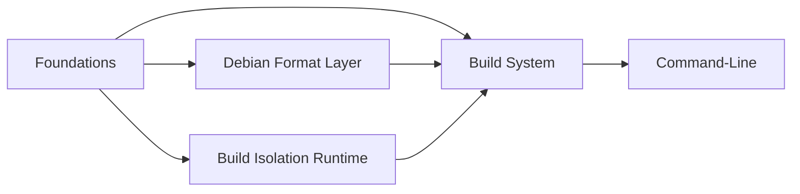

# How to Read This Chapter

The internals chapter is the implementation companion to the concepts and guide. Reading the docs and the code in parallel is the intended mode.

## Audience

You are about to modify gl-ng. You know Go. You've read the [Concepts chapter](../concepts/overview.md) and understand the artifact model and the build pipeline at a conceptual level. What you need now is *what's implemented where*, *what the public Go interface to each package looks like*, and *what subtleties to watch for*.

## How the chapter is organised

The chapter mirrors the directory layout of `internal/` and `cmd/`. Each Go package gets its own page:

| Group | Contents | Why grouped |
|-------|----------|-------------|
| **Foundations** | `objstore`, `dirhash`, `stream`, `log`, `taskui` | Domain-agnostic primitives |
| **Debian Format Layer** | `debian/{deb822,depends,version,index}`, `resolver` | Anything that parses or reasons about Debian package format |
| **Build Isolation Runtime** | `ipc`, `container`, `cmd/exec_env_stub` | Linux namespaces, RPC, the stub binary |
| **Build System** | `artifact`, `build`, `importer`, `lockfile`, `install` | Phase 1's actual build logic |
| **CLI** | `cmd/gl`, `cmd/logdemo`, `cmd/taskdemo` | Subcommand dispatch and demo binaries |

The arrows are dependency direction: foundations don't depend on anything; the CLI depends on everything.

## Conventions

### Page structure

Each package page tries to answer, in order:

1. **What it is** — one-paragraph summary.
2. **Public surface** — the types, interfaces, and functions other packages call into.
3. **How it works** — algorithm or data-flow explanation, with diagrams where useful.
4. **Things to know** — edge cases, performance characteristics, design choices that aren't obvious from the code.
5. **Tests** — what's exercised, what's mocked.

When a page is brief, fields collapse. When a page is dense (resolver, container), they're prominent.

### Symbol references

We use the form `package.Symbol` for cross-package references and `Symbol` (unqualified) within a page that is about that package. We use file:line citations only when pinpointing a specific implementation detail; the package page is otherwise about *what the API does*, not *what each line does*.

### Diagrams

Most packages get at least one Mermaid diagram. The expectation is that the diagram should help you skim — if a sequence is identical to "function A calls function B then C", we don't draw it.

## Reading order

If you're new to the codebase, the recommended path:

1. [Repository Layout](./layout.md) — orient yourself.
2. [`objstore`](./foundations/objstore.md) — every other page references content-addressing.
3. [`artifact`](./build/artifact.md) — the engine that drives everything.
4. [`container`](./runtime/container.md) — how isolation actually works.
5. [`build`](./build/build.md) — the concrete artifact types.

After that, drill into whatever you're modifying.

## When the docs and the code disagree

Code wins, docs are wrong. File a fix:

- If the change is small, edit the affected page.
- If the architecture has shifted, update the [Concept](../concepts/overview.md) page first, then the internals page.

If you are uncertain whether implementation or design intent is wrong, raise the question in a Pull Request rather than papering over the gap in prose.
