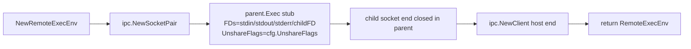
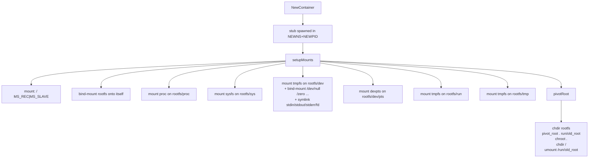
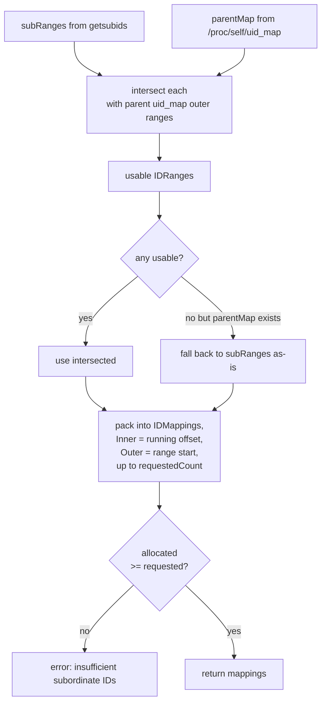

# `container` — ExecEnv Layers

The four layers (BaseExecEnv, UserNS, MountNS, Container), their wrapping helper `RemoteExecEnv`, and the ID-mapping helper that turns subordinate UID/GID ranges into kernel-acceptable `uid_map`/`gid_map` writes.

```
internal/container/
├── execenv.go     # ExecEnv interface + ExecRequest, Credentials types
├── fscontext.go   # FsContext interface + BaseFsContext implementation
├── base.go        # BaseExecEnv (host-level os/exec wrapper)
├── remote.go      # RemoteExecEnv (one stub over IPC) + UserNS
├── mountns.go     # MountNS layer
├── container.go   # Container layer (mounts + pivot_root)
├── stack.go       # Stack: bundles BaseExecEnv → UserNS → MountNS
├── idmap.go       # IDRange/IDMapping + getsubids/newuidmap helpers
└── *_test.go
```

## `ExecEnv` — the contract

```go
type ExecEnv interface {
    Exec(req *ExecRequest) (int, error)
    Wait(pid int) (int, error)
    Close() error
}

type ExecRequest struct {
    Argv         []string
    Cwd          string
    // Env entries overlay onto the inherited base env (host's os.Environ()
    // for BaseExecEnv, the stub's os.Environ() for stub-backed layers): keys
    // present in the base are overridden in place, new keys are appended.
    Env          []string
    // ResetEnv replaces the inherited base with a single-entry minimal env
    // (PATH = ipc.DefaultPATH = /usr/sbin:/usr/bin:/sbin:/bin) before applying
    // Env. Use to start a child with a clean slate.
    ResetEnv     bool
    Credentials  *Credentials  // optional UID/GID switch (setuid in stub)
    UnshareFlags uintptr       // CLONE_NEWUSER, CLONE_NEWNS, ... if non-zero
    FDs          []*os.File    // [stdin, stdout, stderr, extras...]
}

type Credentials struct{ UID, GID uint32 }
```

Layers compose because every layer is itself an `ExecEnv` whose `Exec` does the same thing — start a child — only it does it inside whatever isolation the layer provides.

## `FsContext` — the filesystem contract

Filesystem operations are separated into a second interface so that callers that only need filesystem access (not process execution) can accept `FsContext` directly, and so a host-only implementation (`BaseFsContext`) exists without requiring a stub.

```go
type FsContext interface {
    // creation
    Mkdir(path string, mode uint32) error
    CreateFile(path string, mode uint32) error
    Symlink(target, linkpath string) error
    // deletion
    Rmdir(path string) error
    Unlink(path string) error
    // mounts
    Mount(source, target, fsType string, flags uintptr, data string) error
    Umount(target string, flags int) error
    // file I/O — mirrors os.OpenFile(name, flag, perm)
    Open(path string, flag int, perm uint32) (*os.File, error)
    // temp dirs — creates dir/prefix+8hex, retries on EEXIST
    MkTempDir(dir, prefix string) (string, error)
}
```

`Open` returns `*os.File`, giving Read/Write/Seek/Close in one object. Kernel access-mode enforcement (EBADF on wrong direction) substitutes for a read-only vs. write-only type distinction.

**`BaseFsContext`** implements `FsContext` with direct `os` and `syscall` calls on the host filesystem — no stub needed. Useful for build phases that operate on host paths before any namespace is set up.

**`RemoteExecEnv`** (and its wrappers `MountNS`, `Container`) also implements `FsContext`. All operations proxy to the stub via IPC, executing in the stub's namespace. `Open` works by having the stub call `os.OpenFile` and return the resulting FD via SCM_RIGHTS in the IPC response — no I/O is proxied over the socket; after the initial open request, all reads/writes/seeks go directly through the kernel FD in the host process. See [ipc.md](ipc.md) for the FD-passing protocol.

`MkTempDir` is implemented by both `BaseFsContext` and `RemoteExecEnv` using the same `doMkTempDir` helper, which generates a random suffix and calls `Mkdir` in a retry loop — no `mktemp` binary, no process spawn.

`PivotRoot` is **not** in `FsContext` — it is a one-time container-setup operation specific to `RemoteExecEnv`.


## `BaseExecEnv`

The leaf. No isolation, no IPC, no namespaces.

```go
func NewBaseExecEnv() *BaseExecEnv
```

Internally maps `pid → *exec.Cmd` so `Wait(pid)` can find the right `cmd.Wait()` to call.

`Exec` translates the request to `os/exec` straight:

- `cmd.Dir = req.Cwd`, `cmd.Env = ipc.ResolveEnv(req.ResetEnv, req.Env, os.Environ())` (overlay merge — see [Env propagation](#env-propagation)).
- `cmd.SysProcAttr.Cloneflags = req.UnshareFlags` (used to launch a stub in a new namespace).
- `cmd.SysProcAttr.Credential = ...` if `Credentials != nil`.
- `cmd.SysProcAttr.AmbientCaps = allCaps()` whenever `CLONE_NEWUSER` is in the flags. This is critical: the freshly-created user namespace gives all caps within it, but ambient caps must be set explicitly so they survive across `execve` into the stub.
- `req.FDs` are mapped to stdin/stdout/stderr/ExtraFiles. Stub-launching requests pass `[Stdin, Stdout, Stderr, childSocketFD]` so the stub gets the IPC socket as FD 3.

`Close()` is a no-op for the base — it owns no resources.

## `RemoteExecEnv` — the wrapping primitive

This is the actual work-horse used by `UserNS`, `MountNS`, and `Container`. It encapsulates "spawn a stub through a parent ExecEnv with these unshare flags, then talk to it over IPC."

```go
type RemoteExecEnvConfig struct {
    Parent       ExecEnv
    StubPath     string
    UnshareFlags uintptr
    Credentials  *Credentials
    // ResetEnv: launch the stub with ResetEnv:true so its os.Environ() (which
    // children inherit when they don't override) is the minimal PATH-only env
    // rather than the host's. Container opts in; UserNS/MountNS leave it false
    // so the stub inherits whatever its parent ExecEnv inherits.
    ResetEnv     bool
}

func NewRemoteExecEnv(cfg RemoteExecEnvConfig) (*RemoteExecEnv, error)
```

Construction:



`Exec` and `Wait` on a `RemoteExecEnv` translate into `Client.Call(FuncExec, ...)` / `Client.Call(FuncWait, ...)`. So when a `Container` (which embeds a `RemoteExecEnv`) does `c.Exec(req)`, the request travels: `Container → IPC → stub-3 → fork+exec → child process`. From the host's perspective, it's still just `Exec(req) → pid`.

`Close()` closes the IPC client (which closes the socket — the stub sees `n == 0` and exits) and then `Wait`s the stub PID via the parent. Done correctly, you get a clean shutdown chain bottom-up.

### Env propagation

`ExecRequest.Env` is an **overlay** on top of an inherited base, not a full replacement. The merge is performed by `ipc.ResolveEnv(reset, overlay, inherited)` in `internal/ipc/env.go`:

- For `BaseExecEnv`, the inherited base is the host's `os.Environ()` — so the child sees the gl process's environment merged with whatever overrides the caller passes.
- For stub-backed layers (`UserNS`, `MountNS`, `Container`), the inherited base is the *stub's* `os.Environ()` at the moment the stub handles the `Exec` request. The stub itself inherited *its* environment from its parent at spawn time (and chained through the same `ResolveEnv` call).
- When `ResetEnv == true`, the inherited base is discarded and replaced with a single-entry minimal env: `PATH=/usr/sbin:/usr/bin:/sbin:/bin` (`ipc.DefaultPATH`). The overlay is then applied on top.
- An empty (`nil`) overlay returns the base unchanged.
- Order policy: base entries first (in their original order), then overlay-only keys appended in overlay order; overrides update in place. Entries without an `=` are silently skipped.

Only **`Container`** opts into `ResetEnv: true` at stub-launch time. `UserNS` and `MountNS` leave it false so the stub continues to inherit whatever its parent ExecEnv had — typically the host's full env, which is fine for build tooling that expects normal `LANG`, `TERM`, etc.

Why: when the user spawns a process inside a freshly-pivoted rootfs, the host's interactive `PATH` (with `~/bin`, `.cargo/bin`, …) leaking through would be both surprising and unsafe. Resetting the container's stub to `ipc.DefaultPATH` means container children inherit a clean minimal env by default — and callers that want extra keys (e.g. `HOME`, `TERM`, `DEBIAN_FRONTEND`) just list them in `Env`. They no longer have to re-list `PATH` to keep it set.

On the wire, `ipc.ExecPayload` carries `ResetEnv bool` alongside `Env`, and the stub's `handleExec` calls the same `ResolveEnv` against its own `os.Environ()`.

## `UserNS`

```go
func NewUserNS(cfg UserNSConfig) (*UserNS, error)
```

Built on top of a `RemoteExecEnv` with `UnshareFlags = CLONE_NEWUSER` and no credentials (the stub gets uid 0 inside the new userns automatically).

Construction sequence:

1. Spawn the stub via `RemoteExecEnv` (already in a fresh user namespace).
2. Read **subordinate ranges** for the host user from `getsubids -u` (and `-g`), falling back to `/etc/subuid`/`/etc/subgid` if `getsubids` isn't available.
3. Read **parent uid/gid map** from `/proc/self/uid_map` to know which subordinate IDs are actually accessible (matters when the host is itself in a userns, e.g. CI containers).
4. **Compute** the inner→outer mapping with `ComputeIDMappings` (see below).
5. **Prepend** the special "uid 0 inside ↔ host uid outside" entry: this lets root inside the userns become *the calling user* outside, which is what makes mount/pivot operations possible. Without this, the stub runs as `nobody` and can't do anything.
6. Apply the maps via `newuidmap`/`newgidmap` (helpers from the `uidmap` package).

```go
uidMappings := append(
    []IDMapping{{Inner: 0, Outer: currentUID, Count: 1}},  // 0 ↔ host_uid
    subUIDMappings...,                                      // 1..65535 ↔ sub IDs
)
ApplyIDMappings(stubPID, uidMappings, gidMappings)
```

This produces a map like:

```
/proc/<stubpid>/uid_map:
  0     1000      1
  1   100000  65535
```

Inside: uid 0 (root) ↔ outside uid 1000. Inside: uid 1..65535 ↔ outside 100000..165534. Bash inside the container sees itself as root and as uid 1000 the user normally maps to whoever owned the host process.

### Why the +1 inner shift

```go
for i := range subUIDMappings {
    subUIDMappings[i].Inner += 1
}
```

Because inner uid 0 is reserved for the host user. Subordinate ranges start at inner=1.

## `MountNS`

```go
func NewMountNS(cfg MountNSConfig) (*MountNS, error)

type MountNS struct {
    *RemoteExecEnv  // embedded — FsContext methods (Mount/Mkdir/Symlink/Umount/CreateFile/Rmdir/Unlink/Open) live here
}
```

A `RemoteExecEnv` with `UnshareFlags = CLONE_NEWNS` and `Credentials = {UID:0, GID:0}`. (The credentials only take effect when the parent is a `UserNS` — root in the userns means root in the mountns.)

The methods that route through IPC are defined on `RemoteExecEnv` itself, so they're inherited by both `MountNS` and `Container`:

| Method | FuncID |
|--------|--------|
| `Mount(source, target, fsType, flags, data)` | `FuncMount` |
| `Mkdir(path, mode)` | `FuncMkdir` |
| `CreateFile(path, mode)` | `FuncCreateFile` |
| `Symlink(target, linkpath)` | `FuncSymlink` |
| `Umount(target, flags)` | `FuncUmount` |
| `PivotRoot(rootfs)` | `FuncPivotRoot` (not in `FsContext`) |
| `Rmdir(path)` | `FuncRmdir` |
| `Unlink(path)` | `FuncUnlink` |
| `Open(path, flag, perm)` | `FuncOpen` (returns FD via SCM_RIGHTS) |

## `Stack` — the canonical bundle

Most callers want exactly the same triple: BaseExecEnv → UserNS → MountNS. Building it by hand is four lines of error-handling boilerplate that gets it subtly wrong (missing close on partial failure, wrong tear-down order, drift between sites). `stack.go` collapses it into one constructor.

```go
type Stack struct {
    Base    *BaseExecEnv
    UserNS  *UserNS
    MountNS *MountNS
}

type StackConfig struct {
    Ctx      context.Context
    StubPath string  // empty → container.StubPath()
    IDCount  uint32  // zero → 65536
}

func NewStack(cfg StackConfig) (*Stack, error)
func (s *Stack) Close()  // MountNS → UserNS → Base, in that order
```

`NewStack` is what `internal/build/build_phases.go::setupBuildEnv`, `internal/build/install_check.go`, `internal/build/rootfs.go::createWorkspace`, and `cmd/gl/exec_chroot.go` all use. If a caller needs the *full* container (PID NS + pivot_root), it constructs a `Container` on top of `stack.MountNS` separately — `Stack` deliberately stops at MountNS because not every caller pivots (the source-build setup, for instance, prepares a rootfs in MountNS first and only *then* pivots).

If construction fails partway through (UserNS spawns but MountNS fails), `NewStack` tears down what it built before returning the error — callers don't have to defer-cleanup themselves. On success the caller defers `stack.Close()`.

## `Container`

```go
func NewContainer(cfg ContainerConfig) (*Container, error)

type Container struct {
    *RemoteExecEnv  // same embedding pattern as MountNS
    // plus the configured rootfs path
}
```

The full container: `RemoteExecEnv` with `UnshareFlags = CLONE_NEWNS | CLONE_NEWPID` and `Credentials = {0, 0}`. `CLONE_NEWPID` means the stub becomes PID 1 inside the new pid namespace — and so do its children. Inheriting `RemoteExecEnv` means `c.Mount(...)`, `c.Mkdir(...)`, etc. are available — but in practice mount work happens *before* `setupMounts()`/`pivotRoot()` lock the rootfs in place, in the parent `MountNS`.

Once created, `setupMounts()` and `pivotRoot()` run in sequence:



### Why MS_SLAVE on /

```go
c.mount("", "/", "", syscall.MS_REC|syscall.MS_SLAVE, "")
```

Makes the entire mount tree inside the container *receive* propagation from the parent (host) but never send any back. This means a bind-mount the parent `MountNS` does into the rootfs path (e.g., bind-mounting a .deb blob into `/pkgs/`) will appear inside the container too — but mounts the container itself does won't leak out. Without this the container mounts would be entirely private and bind-mounts from outside would be invisible.

If `MS_SLAVE` fails (some kernels in some configs reject it), the code falls back to `MS_PRIVATE` — but bind-mount-injection from outside stops working. This is logged but not fatal because not all callers use that pattern.

### `/proc` is mounted in full

```go
c.mount("proc", procPath, "proc", 0, "")
```

Specifically *not* `subset=pid`. Build systems like GCC read `/proc/meminfo` to size their thread pool; restricting the subset breaks them.

### `/dev` is a tmpfs with bind-mounted nodes

We can't `mknod` inside an unprivileged userns. So `/dev` becomes a tmpfs, and the canonical character devices are `touch`-then-bind-mounted from the host's `/dev/null`, `/dev/zero`, etc. Symlinks for stdin/stdout/stderr/fd point into `/proc/self/fd/...` (which works because we just mounted /proc).

### `pivotRoot` (FuncPivotRoot)

The stub-side handler is:

```go
oldRoot := rootfs + "/run/old_root"
os.MkdirAll(oldRoot, 0755)
syscall.Chdir(rootfs)
syscall.PivotRoot(".", "run/old_root")
syscall.Chroot(".")
syscall.Chdir("/")
syscall.Unmount("/run/old_root", syscall.MNT_DETACH)
os.Remove("/run/old_root")
```

Order matters: pivot, then chroot to clear references to the old fs, then chdir to /, then detach the old root (now visible at /run/old_root). After this point the stub has no path to anything outside the new rootfs.

## `idmap.go` — subordinate ID logic

The host doesn't have permission to write `uid_map` directly when the user is unprivileged. Instead it shells out to `newuidmap` / `newgidmap`, which are setuid-root and consult `/etc/subuid` / `/etc/subgid` for the calling user's allocated subordinate ranges.

### `GetSubordinateRanges(uid bool) ([]IDRange, error)`

Tries `getsubids -u <user>` first (it accounts for nested userns properly when set up), falls back to parsing `/etc/subuid` / `/etc/subgid` directly:

```
USER:START:COUNT
```

Returns a slice of `IDRange{Start, Count}`.

### `ReadProcIDMap(pid int, uid bool) ([]IDMapping, error)`

Parses `/proc/<pid>/uid_map` (or `gid_map`) as a slice of `{Inner, Outer, Count}` triples. Used to know what the *parent's* mapping looks like — necessary when nested.

### `ComputeIDMappings(subRanges, parentMap, requestedCount) ([]IDMapping, error)`

This is the only non-trivial bit:



The intersection is necessary when nested in another userns: the parent map gives us the outer IDs that are actually usable; subordinate ranges may extend beyond them.

The pack step assigns inner IDs starting at 0 and walking up. The caller (`UserNS`) then bumps every inner by 1 to make room for the special host-user mapping.

### `ApplyIDMappings(pid, uidMappings, gidMappings) error`

Builds the argv for `newuidmap` / `newgidmap`:

```
newuidmap <pid> <inner> <outer> <count> [<inner> <outer> <count> ...]
```

Runs each. The stub continues to be uid `nobody` until this returns successfully — which is why `UserNS` can't do anything else until ID mapping is applied.

## Tests

Per-layer tests:

- `base_test.go`: spawn a child, capture stdout, assert exit code.
- `remote_test.go`: ping the stub via `FuncExec` for `/bin/true` and `/bin/false`, assert PIDs and exit codes.
- `userns_test.go`: assert uid 0 inside, original uid outside; assert id maps written.
- `mountns_test.go`: mount tmpfs, write a file, umount, assert host doesn't see the file.
- `container_test.go`: full pivot-root into a tiny rootfs (busybox), assert `/proc/self/exe` resolves under the new root.
- `idmap_test.go`: golden-file tests for `parseSubIDFile`, `parseGetSubidsOutput`, `ComputeIDMappings` with synthetic ranges and parent maps.

Skips: any test that needs `getsubids` or `newuidmap` is gated by detecting the binary at startup; without `uidmap` installed, those tests are skipped rather than failing.

## Gotchas

- **`AmbientCaps` is necessary across `execve`.** Newly-created user namespaces grant all caps to the creating process, but those are dropped on exec unless explicitly set as ambient. `BaseExecEnv` sets `allCaps()` whenever `CLONE_NEWUSER` is in the flags. Removing this breaks every `mount` call inside the namespace.
- **Don't pass nil in `ExecRequest.FDs` or as an `FsContext.Open` result.** The IPC layer's SCM_RIGHTS encoding crashes on nil file pointers. If a stdio slot is unused, open `/dev/null`.
- **`Open` returns a live FD into the namespace.** After `RemoteExecEnv.Open` returns, the caller owns the `*os.File` and must close it. The stub has already closed its copy. The FD remains valid even after `Close()` of the exec env — FDs are independent of the namespace that opened them.
- **`Env` is overlay, not replace.** Listing `Env: []string{"DEBIAN_FRONTEND=noninteractive"}` no longer wipes the rest of the env — `PATH`, `LANG`, etc. survive from the inherited base. If you need a clean slate, set `ResetEnv: true` (or rely on the fact that `Container`'s stub already did, and let your child Exec leave both `Env: nil, ResetEnv: false` to inherit `PATH=ipc.DefaultPATH` and nothing else).
- **`Close()` is bottom-up.** A `Container.Close` closes the inner client, the parent (`MountNS`) Close fires next when the caller hits its `Close`, and so on. Skipping a Close leaks the stub process (and its file descriptors).
- **`MountNS` and `Container` both embed `*RemoteExecEnv`.** Their `Exec`/`Wait` and all `FsContext` methods (`Mount`/`Mkdir`/`Symlink`/`Umount`/`CreateFile`/`Rmdir`/`Unlink`/`Open`) are all inherited from `RemoteExecEnv` directly — there are no per-layer wrapper methods. `PivotRoot` is also inherited but is not part of `FsContext`. The layers differ only in the unshare flags and credentials they pass at construction.
