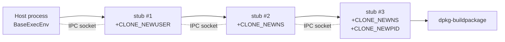

# Build Isolation Runtime

This chapter covers everything that puts a build inside a Linux namespace and keeps it there. Three packages work together:

```
internal/ipc/         # The wire protocol between host and namespaced helper.
internal/container/   # Layered ExecEnv types: BaseExecEnv, UserNS, MountNS, Container.
cmd/exec_env_stub/    # The stub binary that runs inside namespaces and serves IPC.
```

Plus the host-side ID-mapping logic (`internal/container/idmap.go`) which talks to `newuidmap` / `newgidmap`.

## The layered ExecEnv model

Every isolation step is an `ExecEnv`. The interface is tiny:

```go
type ExecEnv interface {
    Exec(req *ExecRequest) (int, error)   // start a process, return pid
    Wait(pid int) (int, error)             // wait for it, return exit code
    Close() error                          // tear down
}
```

Layers compose by wrapping: each layer is an `ExecEnv` whose constructor takes a `Parent ExecEnv` and `Exec`s a stub binary inside a freshly-unshared namespace. The stub then becomes that layer's IPC backend.



Each arrow on the left is a `cmd.Start()` (or rather, a remote `Exec` request to the parent layer). Each dotted line is a `SOCK_SEQPACKET` socket pair sharing FD 3 with the stub.

The standard build stack used by `DebianPkgBuild`:

| Layer | Constructor | Unshare flags | Purpose |
|------|-------------|---------------|---------|
| `BaseExecEnv` | `NewBaseExecEnv()` | none | direct `os/exec` on host |
| `UserNS` | `NewUserNS(...)` | `CLONE_NEWUSER` | become uid 0 inside, real uid 1000 outside |
| `MountNS` | `NewMountNS(...)` | `CLONE_NEWNS` | mount/extract things on a tmpfs without affecting host |
| `Container` | `NewContainer(...)` | `CLONE_NEWNS \| CLONE_NEWPID` | pivot_root + private proc/dev/sys/tmp |

`MountNS` exists as a separate layer (rather than folded into `Container`) because source build wants to **prepare** a rootfs (extract debs, bind-mount blobs) on a host-visible tmpfs *before* containerizing. The mount work happens in `MountNS`; once the rootfs is ready, `Container` is created from it.

## Why a separate stub binary

The Go runtime is hostile to anything between `clone()` and the entry to user code: spawning goroutines, allocating, doing syscalls — all of these can deadlock or misbehave when only one thread of a multi-threaded process is in a fresh namespace. The standard fix is to do a `fork+exec` so a fresh process enters the namespace cleanly, then talks to the parent via a socket. That fresh process is `cmd/exec_env_stub`.

The stub is intentionally minimal — ~260 lines, no dependencies beyond `gl-ng/internal/ipc`. Its only job is to receive IPC requests over FD 3 and call the corresponding syscall.

## The IPC protocol

The host-stub channel is a `socketpair(AF_UNIX, SOCK_SEQPACKET|SOCK_CLOEXEC, 0)` — message-oriented (no framing required), bidirectional, with FD passing via `SCM_RIGHTS`.

Eleven function IDs are defined:

| ID | Name | What the stub does |
|----|------|---------------------|
| 1 | `FuncExec` | start a child process |
| 2 | `FuncWait` | wait for a previously-started child |
| 3 | `FuncMount` | `mount(2)` |
| 4 | `FuncMkdir` | `os.MkdirAll` |
| 5 | `FuncCreateFile` | `OpenFile(O_CREATE)` then close (empty bind-mount target) |
| 6 | `FuncSymlink` | `os.Symlink` (replaces if exists) |
| 7 | `FuncPivotRoot` | `chdir + pivot_root + chroot + umount old_root` |
| 8 | `FuncUmount` | `umount2(2)` |
| 9 | `FuncRmdir` | `os.Remove` |
| 10 | `FuncUnlink` | `os.Remove` |
| 11 | `FuncOpen` | `os.OpenFile`; returns FD to host via SCM_RIGHTS in response |

Every request carries an 8-byte cookie generated from `crypto/rand`; responses must echo it back. Mismatched cookie → fatal error on the host side. This is paranoid but cheap: it means a future change adding pipelining or multiplexing can't accidentally cross-deliver responses.

## Reading order

1. [`ipc`](./ipc.md) — the protocol itself: messages, cookies, FD passing.
2. [`container`](./container.md) — the four layers plus ID mapping.
3. [`cmd/exec_env_stub`](./stub.md) — the stub binary's responsibilities.
