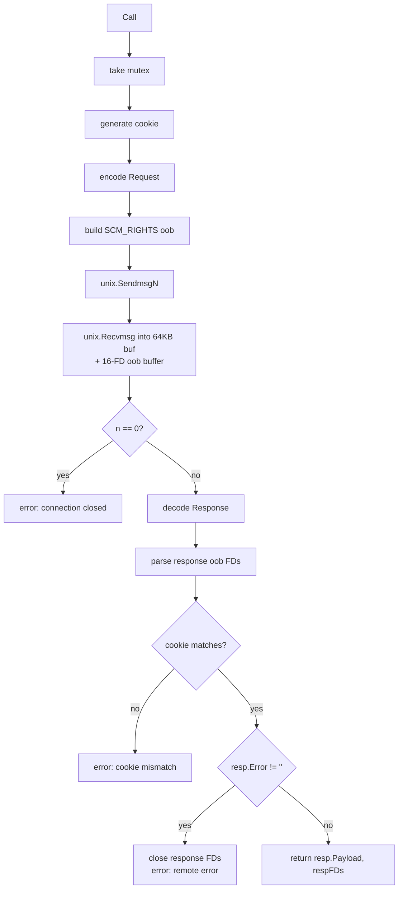

# `ipc` — Parent ↔ Stub Protocol

A tiny RPC over `SOCK_SEQPACKET` Unix sockets, used by every `RemoteExecEnv` to talk to the stub running in its namespaces.

```
internal/ipc/
├── protocol.go    # Request/Response, gob framing, NewSocketPair, MaxMessageSize
├── encoding.go    # Per-FuncID gob payload structs + encodePayload/decodePayload
├── client.go      # Host-side Client (Call)
├── server.go      # Stub-side Server (Serve, Register, dispatch)
└── *_test.go
```

## Wire format

```go
type Request struct {
    Cookie  uint64
    FuncID  uint32
    Payload []byte
}

type Response struct {
    Cookie  uint64
    Error   string
    Payload []byte
}
```

Both are gob-encoded and capped at `MaxMessageSize = 64 KiB`. `EncodeRequest`/`DecodeRequest`/`EncodeResponse`/`DecodeResponse` enforce the size on encode.

64 KiB is enough because:
- the largest single payload is an `ExecRequest` (argv + env + cwd + creds + flags), which in practice tops out around a few KiB;
- file descriptors are passed *out of band* via `SCM_RIGHTS`, not in the payload.

## Cookies

Every `Client.Call` generates a fresh 8-byte cookie from `crypto/rand`:

```go
cookie, _ := randomCookie()
req := &Request{Cookie: cookie, FuncID: ..., Payload: ...}
// send req
// recv resp
if resp.Cookie != cookie {
    return error("cookie mismatch")
}
```

Today this is overkill — the client is mutex-serialized so requests never overlap — but it keeps the protocol future-proof. A misordered or duplicated message can never be silently consumed.

## Sockets and FD passing

```go
func NewSocketPair() (host *os.File, child *os.File, err error)
```

Wraps `socketpair(AF_UNIX, SOCK_SEQPACKET|SOCK_CLOEXEC, 0)`. Returns the two ends as `*os.File` (so they survive into `cmd.ExtraFiles`).

Why `SOCK_SEQPACKET`?

- **Message-preserving**: each `sendmsg`/`recvmsg` is one record. No framing on top.
- **Reliable + ordered**: like SOCK_STREAM, no datagram drops.
- **Bidirectional**: both peers can send.

Why not gRPC, JSON-RPC, or capnproto? Because it has to work *before* PID 1 is set up, with no DNS, no TLS, no allocator pressure, and it has to pass file descriptors. Hand-rolled is small enough.

### `SCM_RIGHTS`

`Client.Call(funcID, payload, fds)` accepts an optional `[]*os.File`. Each file's `Fd()` is collected into a `[]int` and wrapped with `unix.UnixRights(...)` into an ancillary control buffer:

```go
oob := unix.UnixRights(rawFds...)
unix.SendmsgN(connFd, data, oob, nil, 0)
```

On the server side:

```go
oob := make([]byte, unix.CmsgSpace(253*4))   // up to 253 fds
n, oobn, _, _, _ := unix.Recvmsg(connFd, buf, oob, 0)

scms, _ := unix.ParseSocketControlMessage(oob[:oobn])
for _, scm := range scms {
    fds, _ := unix.ParseUnixRights(&scm)
    for _, fd := range fds {
        receivedFds = append(receivedFds, os.NewFile(uintptr(fd), ...))
    }
}
```

The kernel limit is 253 FDs per message. Beyond that the message is silently truncated; we allocate exactly enough OOB buffer for that limit.

FD passing is **bidirectional**: handlers can also return FDs in their response. The server sends them via SCM_RIGHTS in the response message; the client receives them with a 16-FD OOB buffer. This is used by `FuncOpen`: the stub opens the file in its namespace and returns the open FD to the host via the response. After the send, the stub closes its copy — the kernel has already duplicated it for the receiver.

**Ownership rules:**
- *Request FDs (client → server)*: once the stub has accepted FDs in its handler, the host's copies have been duplicated in the kernel — the host should `Close()` its end. The stub becomes responsible for closing the FDs it received once the spawned child has them duped to its stdio (this is what `closeFDs` after `cmd.Start()` does in the stub).
- *Response FDs (server → client)*: the stub closes its copies immediately after `SendmsgN` — the kernel has already duplicated them for the host. The caller of `Client.Call` takes ownership of the returned `[]*os.File` slice and must close them.

### Why `nil` FDs are forbidden

The IPC layer iterates `fds` and calls `f.Fd()` on each. A nil entry crashes with `sendmsg: bad file descriptor` (or panics on the dereference). The convention in `ExecRequest.FDs` is: **never put nil in the slice**. If a stdio slot is unused, pass `/dev/null`. `BaseExecEnv` and `RemoteExecEnv` both follow this.

## `Client.Call`

```go
func (c *Client) Call(funcID uint32, payload []byte, fds []*os.File) ([]byte, []*os.File, error)
```

Steps:



The mutex is per-Client. Nothing about the protocol prevents pipelining — but the client serializes for simplicity. Per-layer parallelism comes from running multiple builds with multiple stack-of-`ExecEnv` instances, not from concurrent calls on one stack.

## `Server.Serve`

```go
func (s *Server) Register(funcID uint32, handler Handler)
func (s *Server) Serve() error

type Handler func(payload []byte, fds []*os.File) ([]byte, []*os.File, error)
```

The serve loop:

1. `Recvmsg` into a 64 KiB buffer plus 253-FD OOB buffer.
2. If `n == 0`, the parent closed the socket — return nil (graceful shutdown).
3. Parse FDs out of the control message into `[]*os.File`.
4. Decode the request; on decode failure, drop the FDs and continue (no cookie to respond with).
5. Look up the handler by `FuncID`. If unregistered, respond with `Error = "unknown function ID: %d"`.
6. Call the handler; package its return into a `Response` echoing the cookie.
7. If the handler returned response FDs, build SCM_RIGHTS ancillary data for the response `SendmsgN`, then close the stub's copies (kernel has duplicated them for the host).

**Ownership of received FDs is transferred to the handler.** The dispatcher does *not* close them — the handler must either close them (most do) or pass them to a child via `cmd.Stdin` etc. (the `Exec` handler does this). If a handler forgets, FDs leak in the stub process.

## Per-FuncID payload encoding

Both the request envelope and each FuncID's payload are gob-encoded — payloads are an inner gob blob carried inside the outer envelope's `Payload []byte`. The wire never carries a gob type record for the payload itself: the payload's struct type is inferred entirely from `Request.FuncID`. That keeps cross-version compatibility tight (changing the payload struct for an existing FuncID is a breaking change by convention).

The mapping is fixed by FuncID:

| FuncID | Request payload | Reply payload |
|--------|-----------------|---------------|
| `FuncExec` | `ExecPayload` (argv, cwd, env, creds, unshareFlags) | `IntPayload` (pid) |
| `FuncWait` | `IntPayload` (pid) | `IntPayload` (exit code) |
| `FuncMount` | `MountPayload` (source, target, fstype, flags, data) | empty |
| `FuncUmount` | `UmountPayload` (target, flags) | empty |
| `FuncMkdir` | `PathModePayload` | empty |
| `FuncCreateFile` | `PathModePayload` | empty |
| `FuncSymlink` | `SymlinkPayload` (target, linkpath) | empty |
| `FuncPivotRoot` | `PathPayload` | empty |
| `FuncRmdir` | `PathPayload` | empty |
| `FuncUnlink` | `PathPayload` | empty |
| `FuncOpen` | `OpenFilePayload` (path, flags, mode) | empty payload; FD returned via SCM_RIGHTS in response |

Encode/decode is done via two generic helpers:

```go
func encodePayload[T any](p T) ([]byte, error)
func decodePayload[T any](data []byte) (T, error)
```

Each FuncID gets one encode/decode pair around those helpers — `EncodeMountRequest` / `DecodeMountRequest`, `EncodePathRequest` / `DecodePathRequest`, etc. The pairs are symmetric; there are no hand-rolled length-prefixed paths anywhere. Adding a new file op is: define a payload struct, add a `FuncFoo` constant, add an Encode/Decode pair, register a handler in the stub. If the operation needs to return a file descriptor (like `FuncOpen`), the handler returns it in the `[]*os.File` slice and the server sends it via SCM_RIGHTS in the response.

## Errors and shutdown

- The host closing its socket end gracefully shuts down the stub: `Recvmsg` returns `n == 0`, and `Serve()` returns nil.
- If the stub crashes (panic, signal), the host's next `Call` errors out with `EOF` or `connection reset` from `Recvmsg`.
- `RemoteExecEnv.Close` closes its IPC client and then `Wait`s the stub PID — so a stub crash surfaces both as the failed call *and* as a non-zero exit code from `Wait`.

## Gotchas

- **Nested gob means payload version-skew is silent until decode.** If host and stub disagree on a payload struct's field set (e.g., one was rebuilt with a new field), gob will tolerate added/missing fields but values for renamed fields silently disappear. Treat each FuncID's struct as a frozen contract — bump a new FuncID rather than mutating an existing payload.
- **64 KiB cap is on the gob-encoded envelope, including the payload.** A large `Env []string` can push an Exec request close to the limit. If you ever exec with a multi-MB env block, raise `MaxMessageSize` here and in the OOB buffer math.
- **Cookies are unique per Call, not monotonic.** Don't rely on order. The mutex enforces order; cookies just guard against accidents.
