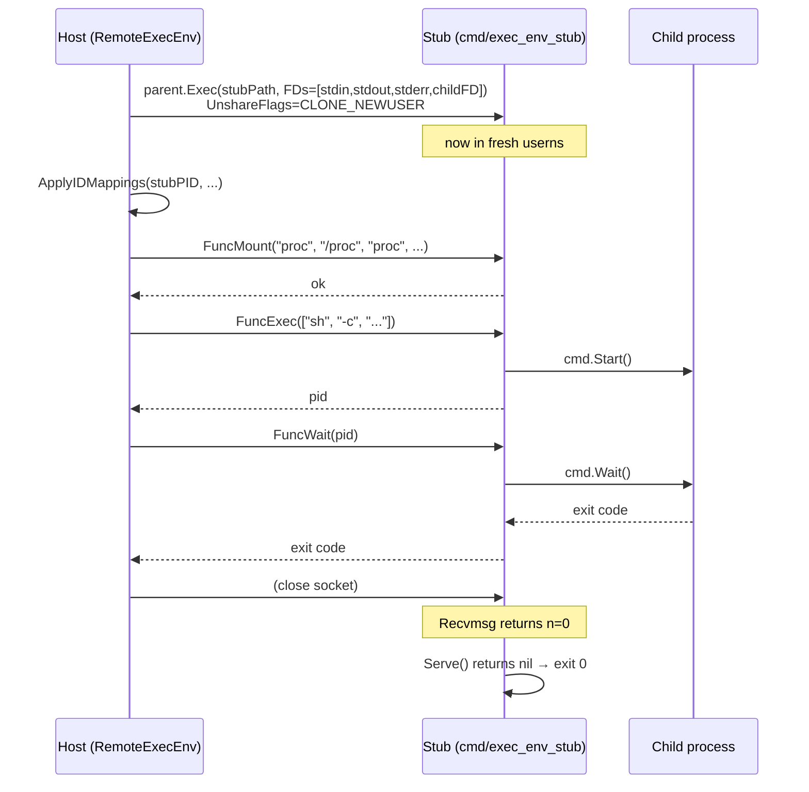

# `cmd/exec_env_stub` — The Stub Binary

A ~260-line standalone binary whose only job is to run inside a freshly-unshared namespace and serve IPC requests over file descriptor 3.

```
cmd/exec_env_stub/
└── main.go
```

The binary is built alongside `gl` and lives in the same directory. Every `RemoteExecEnv` resolves the stub via:

```go
func defaultStubPath() string {
    exe, err := os.Executable()
    if err != nil { return "exec_env_stub" }
    return filepath.Join(filepath.Dir(exe), "exec_env_stub")
}
```

So if the `gl` binary is at `/usr/local/bin/gl`, the stub is at `/usr/local/bin/exec_env_stub`. Override with `RemoteExecEnvConfig.StubPath` for tests.

## Why a separate binary

Three reasons, in order of importance:

1. **Clean namespace entry.** A multi-threaded Go process can't safely call `unshare` and have the new namespace apply to all threads — only the calling thread enters the namespace. `fork+exec` of a fresh single-threaded binary side-steps the whole problem.
2. **Predictable PATH lookup.** The host binary may have been linked statically or live in some odd place; the stub is a known sibling file with no PATH ambiguity.
3. **Minimum surface.** The stub depends only on `gl-ng/internal/ipc` and the standard library. No artifact engine, no objstore, no logging — failure modes are tiny.

## Lifetime



The stub never initiates anything. It is purely reactive. The host drives the whole conversation; the stub only replies.

## Anatomy of `main`

```go
func main() {
    sockFile := os.NewFile(3, "ipc-socket")
    server := ipc.NewServer(sockFile)

    stub := &stubServer{
        procs: make(map[int]*exec.Cmd),
    }

    server.Register(ipc.FuncExec, stub.handleExec)
    server.Register(ipc.FuncWait, stub.handleWait)
    server.Register(ipc.FuncMount, stub.handleMount)
    server.Register(ipc.FuncMkdir, stub.handleMkdir)
    server.Register(ipc.FuncCreateFile, stub.handleCreateFile)
    server.Register(ipc.FuncSymlink, stub.handleSymlink)
    server.Register(ipc.FuncPivotRoot, stub.handlePivotRoot)
    server.Register(ipc.FuncUmount, stub.handleUmount)
    server.Register(ipc.FuncRmdir, stub.handleRmdir)
    server.Register(ipc.FuncUnlink, stub.handleUnlink)
    server.Register(ipc.FuncOpen, stub.handleOpen)

    server.Serve()
}
```

`fd 3` is the agreed-on slot — the host puts the socket pair's child end at `ExtraFiles[0]` (which becomes FD 3 in the child after Go's internal FD passing).

## State

```go
type stubServer struct {
    mu    sync.Mutex
    procs map[int]*exec.Cmd
}
```

`procs` tracks running children so `handleWait(pid)` can find the right `cmd.Wait()` to call. The mutex is to allow concurrent dispatch — the IPC server is single-threaded today, but adding goroutine-per-call would only need this map to be safe.

## The handlers

### `handleExec`

The most complex handler. It:

1. Decodes argv/cwd/env/credentials/unshareFlags from the payload.
2. Builds an `exec.Cmd` mirroring `BaseExecEnv.Exec` exactly:
   - `cmd.Dir = cwd` if non-empty.
   - `cmd.Env = env` if non-empty.
   - `cmd.SysProcAttr.Cloneflags = unshareFlags`.
   - `cmd.SysProcAttr.Credential = {uid, gid}` if creds set.
3. Maps received FDs to stdio:

   ```go
   if len(fds) > 0 {
       cmd.Stdin = fds[0]
       if len(fds) > 1 { cmd.Stdout = fds[1] }
       if len(fds) > 2 { cmd.Stderr = fds[2] }
       if len(fds) > 3 { cmd.ExtraFiles = fds[3:] }
   } else {
       cmd.Stdin = os.Stdin
       cmd.Stdout = os.Stdout
       cmd.Stderr = os.Stderr
   }
   ```

4. Calls `cmd.Start()`.
5. **Closes received FDs after Start** — this is critical:

   ```go
   if err := cmd.Start(); err != nil {
       closeFDs(fds)
       return nil, fmt.Errorf("start: %w", err)
   }
   closeFDs(fds)
   ```

   The forked child has its own duplicates of these FDs by now. If the stub holds onto its copies, pipe write-ends never close from the reader's perspective and any reader (a `Wait` on a hash compute, a captured stderr) will block forever on EOF.

6. Stores `pid → cmd` in the map and returns the pid.

### `handleWait`

```go
func (s *stubServer) handleWait(payload []byte, fds []*os.File) ([]byte, []*os.File, error) {
    closeFDs(fds)
    p, _ := ipc.DecodeIntRequest(payload)
    pid := int(p.Value)

    s.mu.Lock(); cmd := s.procs[pid]; s.mu.Unlock()
    werr := cmd.Wait()
    s.mu.Lock(); delete(s.procs, pid); s.mu.Unlock()

    if exitErr, ok := werr.(*exec.ExitError); ok {
        b, err := ipc.EncodeIntRequest(ipc.IntPayload{Value: int64(exitErr.ExitCode())})
        return b, nil, err
    }
    if werr != nil { return nil, nil, werr }
    b, err := ipc.EncodeIntRequest(ipc.IntPayload{Value: 0})
    return b, nil, err
}
```

`Wait` is blocking by design. The host's `Client.Call` is mutex-serialized so a wait blocks the entire IPC channel — but each `RemoteExecEnv` corresponds to exactly one stub, and concurrency comes from running multiple stacks in parallel.

A non-`ExitError` failure (signal, runtime error in `Wait` itself) is propagated as the IPC error string.

### `handleMount` / `handleUmount`

```go
syscall.Mount(source, target, fsType, flags, data)
syscall.Unmount(target, flags)
```

Direct passthrough. Errors are wrapped with the source/target/type for context:

```go
return nil, fmt.Errorf("mount %s on %s type %s: %w", source, target, fsType, err)
```

### `handleMkdir` / `handleCreateFile` / `handleSymlink`

```go
os.MkdirAll(path, mode)
os.OpenFile(path, O_CREATE|O_WRONLY, mode); f.Close()  // touch
os.Remove(linkpath); os.Symlink(target, linkpath)      // replaces if exists
```

`createFile` is essentially `touch` — the resulting empty file is the bind-mount target for `/dev/null`-style nodes (you can't bind-mount onto a non-existent path).

`symlink` removes the existing link first because the container setup may re-create `/dev/stdin → /proc/self/fd/0` etc., and symlink fails if the target exists.

### `handlePivotRoot`

The most syscall-heavy handler:

```go
oldRoot := rootfs + "/run/old_root"
os.MkdirAll(oldRoot, 0755)

syscall.Chdir(rootfs)                        // 1. cd into new root
syscall.PivotRoot(".", "run/old_root")        // 2. swap
syscall.Chroot(".")                           // 3. clear all old-root references
syscall.Chdir("/")                            // 4. canonical /
syscall.Unmount("/run/old_root", MNT_DETACH)  // 5. detach old root
os.Remove("/run/old_root")                    // 6. clean up
```

Each step is essential:

1. `Chdir(rootfs)` — `pivot_root` accepts paths relative to cwd.
2. `PivotRoot(".", "run/old_root")` — kernel swap: `.` becomes `/`, old `/` becomes `/run/old_root`.
3. `Chroot(".")` — by itself `pivot_root` doesn't update the process's root pointer in some configurations. `chroot` makes it canonical.
4. `Chdir("/")` — without this the cwd is some now-stale dirent on the old fs.
5. `Unmount("/run/old_root", MNT_DETACH)` — `MNT_DETACH` ensures the umount succeeds even if there are stale references.
6. Remove the empty mount point.

After this, no path under the old root is reachable from the stub or its children.

### `handleRmdir` / `handleUnlink`

```go
p, _ := ipc.DecodePathRequest(payload)
return nil, nil, os.Remove(p.Path)
```

Both call `os.Remove` (which works for both files and empty directories) after gob-decoding a `PathPayload` — same encoding as every other path-bearing handler, no asymmetry.

### `handleOpen`

```go
p, _ := ipc.DecodeOpenFileRequest(payload)
f, err := os.OpenFile(p.Path, int(p.Flags), os.FileMode(p.Mode))
if err != nil { return nil, nil, err }
return nil, []*os.File{f}, nil
```

Opens the file inside the stub's namespace and returns the resulting FD via SCM_RIGHTS in the response. The stub does not perform any I/O — it just opens and returns the FD. After the response is sent the stub closes its copy; the kernel has already duplicated the FD for the host. The host's `Client.Call` unwraps the response FDs and returns them as `[]*os.File`.

## Error handling

The stub never panics. Every error from a syscall is wrapped and returned as an IPC `Response.Error` string. The host translates that into a Go error in `Client.Call`.

The only fatal condition is the IPC socket itself failing — e.g., the host crashed and closed it. `Serve` returns an error, `main` writes it to stderr, exit 1.

## Testing the stub

The stub is exercised end-to-end by every container test (running `/bin/true`, `/bin/false`, `/bin/sh -c ...` inside namespaces). There are no direct unit tests for the stub binary because the IPC contract is what gets tested — the stub is just the production server implementation of that contract.

## Gotchas

- **Stub binary must be built.** `go build ./cmd/exec_env_stub` is part of the Makefile; if you only `go build ./cmd/gl`, runtime layers fail with `exec: "exec_env_stub": executable file not found`.
- **Stub doesn't reset signal handlers.** Children inherit whatever signal disposition Go's runtime provides. In practice this is fine for build commands but might surprise callers running interactive shells.
- **No timeouts.** A wedged child blocks the entire IPC channel for that stub. If you need to kill a stuck build, the host must `Close()` the `RemoteExecEnv` (which closes the socket and the stub exits, taking the stuck child's parent with it).
- **`PivotRoot` requires the rootfs and the parent of `/run/old_root` to be on different mounts.** The container setup ensures this by bind-mounting `rootfs` onto itself first, before mounting tmpfses on subdirectories. Skipping the bind step makes `pivot_root` fail with `EBUSY`.
- **fd 3 must be a SOCK_SEQPACKET socket.** If you launch the stub manually for debugging, give it a real socketpair — a regular pipe will see message-boundary issues.
