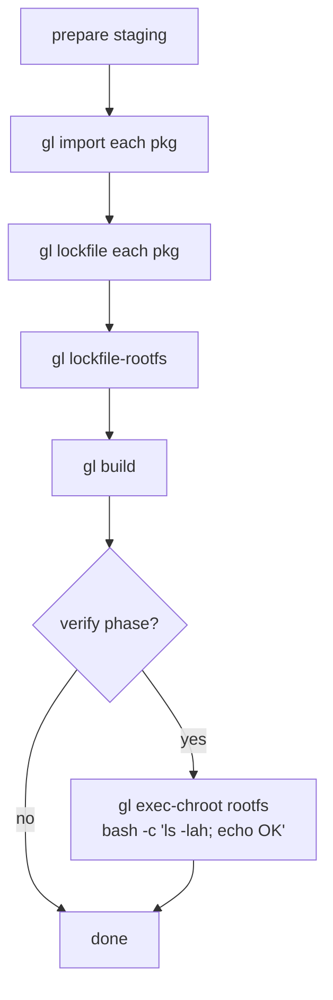

# Testing

The test suite is bottom-up: every internal package has unit tests, the heavy artifact types have integration tests with mocks, and a single end-to-end shell script drives a real Debian-into-rootfs build. There are no build tags or `GL_E2E` env guards — convention is location-based.

## Where tests live

```
internal/<pkg>/*_test.go    # unit tests for that package
internal/build/integration_test.go    # graph-engine + artifact integration with mocks
tests/full_build_test.sh    # the e2e Debian build (NOT run by go test ./...)
tests/templates/<pkg>/build.yml    # build.yml fixtures for the e2e test
testdata/                   # tiny fixtures (debian Sources stanzas, etc.)
```

Convention: anything in `internal/` is run by `go test ./...`. The `tests/` directory is a *separate world* — shell scripts and template fixtures, not Go code. This is the agreed split (see decision log entry from 2026-05-11): no `GL_E2E=1` env guards, no build tags. If you can't run a test in `go test ./...`, it lives in `tests/`.

## What's covered

There are 32 `*_test.go` files in `internal/`. Coverage by package:

| Package | What's tested |
|---------|---------------|
| `objstore` | Hash validation, blob store CRUD + iterate + sweep, map atomicity, pins (create/list/drop, shared-blob protection, auto-pin shape), ConcatHash determinism |
| `dirhash` | Symlink containment via `os.OpenRoot`, byte-exact hash stability across reorders/permission noise |
| `stream` | Each decompressor (gzip, xz, bzip2, zstd), tar extract + tar determinism, gpg verify, hash readers |
| `debian/deb822` | Stanza parser edge cases (continuation lines, comments, multi-stanza files) |
| `debian/depends` | Alternatives, version constraints, arch restrictions, profile restrictions |
| `debian/index` | Load + lookup, EssentialPackages filter |
| `resolver` | Backtracking with conflicts, virtual packages via Provides, unsatisfiable inputs (error tree shape), version-constrained roots |
| `container` | ExecEnv chain construction, FD passing through SCM_RIGHTS, namespace teardown |
| `ipc` | Protocol round-trips, unexpected disconnect handling |
| `artifact` | Graph wiring (Includes closure rule), cycle detection, engine cache hit/miss, manifest format |
| `build` | DebianPkgBuild identity stability, mock-artifact integration scenarios, install-check end-to-end with mock packages |
| `importer` | Source format dispatch (3.0 quilt / native / 1.0 with diff), Sources.gz hash chain |
| `lockfile` | Resolver-roots construction, FetchDebs concurrency, stanza serialization determinism |
| `install` | Bootstrap from a tiny mock package set |
| `log` | Target multiplexing, buffer ring semantics |

## How tests are run

```bash
cd the repository root
go test ./...                       # everything in internal/
go test -v ./internal/resolver/     # single package, verbose
go test -run TestSpecificName ./... # single test by name
go test -race ./...                 # race detector — meaningful for engine + IPC
```

The e2e script is invoked separately:

```bash
./tests/full_build_test.sh              # all phases
./tests/full_build_test.sh import       # prepare staging only
./tests/full_build_test.sh graph        # prepare + show graph
./tests/full_build_test.sh build        # prepare + build
./tests/full_build_test.sh verify       # everything + exec-chroot smoke test
```

## The e2e script

`tests/full_build_test.sh` is the closest thing to a system-level acceptance test. It:



Templates in `tests/templates/` are the per-package `build.yml` files — handcrafted to express the right `depends:` / `runtime_depends:` / `lockfile_deps:` / `extra_build_env:` for each package in the e2e set:

```
acl, attr, base-files, base-passwd, bash, bzip2, cdebconf,
coreutils, debianutils, dpkg, gcc-16, glibc, gmp, libcap2,
libmd, libselinux, libzstd, mawk, ncurses, openssl, pcre2,
systemd, tar, xz-utils, zlib
```

A successful e2e run proves end-to-end:

1. Source import (with cookie pinning, GPG verification optional)
2. Lockfile generation (build-deps + rootfs-deps)
3. Source builds (each package compiled in a fresh container chroot)
4. Binary install checks (locality + dpkg installability)
5. Rootfs assembly (3-layer overlay, runtime-only closure)
6. The resulting rootfs runs (`bash`, `ls`, `coreutils` all work inside `gl exec-chroot`)

### Caching across runs

```bash
GL_CACHE_DIR="${GL_CACHE_DIR:-/tmp/gl-e2e-cache}"
rm -rf "$CACHE_DIR/map"
```

The script wipes the **map** but keeps blobs. This forces every artifact to re-evaluate its identity, but lets the resolver-fetched .debs and orig tarballs survive across runs. Net effect: the script always rebuilds, the network round-trips don't repeat.

If you want a *fast* re-run, comment out the `rm -rf "$CACHE_DIR/map"` line. If you want a clean slate, `rm -rf /tmp/gl-e2e-cache`.

### `GL_KEEP_WORK=1`

Without this, the script `rm -rf`s the entire work tree on exit (including the conf-dir it built up from `tests/templates/`). With it, the conf-dir survives — useful when a build fails and you want to poke at the staging tree.

## Test types in detail

### Determinism tests

Several packages have explicit determinism tests. Examples:

- `internal/dirhash` — hash a directory, shuffle the read order via filesystem operations, hash again, expect equality.
- `internal/stream/tar_determinism_test.go` — tar a directory twice, expect byte-identical archives.
- `internal/objstore/concat_hash_test.go` — exercise ConcatHash composition; same inputs always produce same hash.

These are the bulwark against the cache-busting class of bugs. Whenever you change a hashing or serialization path, expect to update one of these.

### Mock-artifact tests

`internal/build/integration_test.go` defines `mockBuildArtifact` — a lightweight `Artifact` impl that records build invocations and stores a blob. The whole graph engine, cache, dispatch, includes-closure, and skip-on-failure logic is exercised against this without ever touching dpkg.

This is the right pattern when adding a new graph feature: write the mock-artifact test first, get it passing, then plumb the change through the real artifacts.

### Privilege requirements

`container/`, `ipc/`, and `install/` tests require user namespaces. On Debian-derived distros they typically work without changes (kernel.unprivileged_userns_clone defaults to 1). On distros with `unprivileged_userns_clone=0` (e.g., some hardened profiles), they fail with cryptic clone errors — set the sysctl or run as root.

The full e2e script needs:

- working user namespaces
- network access to deb.debian.org (for import + lockfile)
- ~10 GB free disk for the cache (built packages + blobs)
- ~30 GB tmpfs headroom (each source build is up to 32G tmpfs + multiple builds in parallel)

## What isn't tested

A few intentional gaps:

- **No fuzzing** of the deb822 parser, dependency-expression parser, or Sources/Release parsers. The test corpus is hand-crafted edge cases. These formats rarely change but a fuzzer would still be cheap insurance.
- **No long-running stress tests** for the resolver. The backtracking solver has known pathological cases (highly cyclic alternates with version constraints); the test suite probes a few but doesn't try to find new ones.
- **No tests of `--no-verify` import.** The unit tests use real GPG verification via `gpgv` against a fixture keyring. `--no-verify` is only exercised end-to-end.
- **No tests that the build is byte-reproducible.** dpkg-buildpackage is not byte-stable across runs (timestamps, parallel make, etc.) and chasing reproducibility is out of scope. The artifact identity is byte-stable — but the artifact contents are not.

## Adding a new test

The rule of thumb:

| Test scope | Where it goes |
|------------|---------------|
| Single function, no I/O | `internal/<pkg>/<feature>_test.go`, white-box |
| Single function, needs tmpdir | Same, use `t.TempDir()` |
| Two packages collaborating | The downstream package's `_test.go`, mock the upstream |
| Whole graph engine | `internal/build/integration_test.go` style — mock artifacts |
| Real Debian package | `tests/templates/<pkg>/build.yml` and rerun the e2e script |

Adding a new package to the e2e set is non-trivial — every transitive build-dep has to either be in the set or available from the lockfile. If a package has unbuilt-from-source runtime deps (linux-libc-dev, etc.) or shlibs-introduced runtime libs not in the explicit graph (libgcc-s1 is the typical case for any C/C++ binary), use `lockfile_deps:` to whitelist them on **each affected binary individually** — `lockfile_deps:` does not cascade from dependencies to consumers.

## Gotchas

- **`go test ./...` does NOT run the e2e script.** That's deliberate — it takes ~30 minutes on the dev VM and needs network access. CI must invoke `tests/full_build_test.sh` separately.
- **`testdata/` is a sibling of `internal/`, not nested.** Some tests reference `../../testdata/...` from within `internal/<pkg>/`. Keep the path consistent if you move things.
- **Race detector matters for `artifact.Engine` and `ipc`.** Both have goroutine-heavy code paths. Routine: run `go test -race ./internal/artifact/ ./internal/ipc/` after touching either.
- **`tests/full_build_test.sh` clears the map by default.** If you set up an expensive cache state and forget, the script will wipe it. Use `GL_CACHE_DIR=/some/other/path` to isolate.
- **No `GL_E2E=1` env guard.** Don't add one. The split is "go test = unit, tests/ = system." Keep it.
